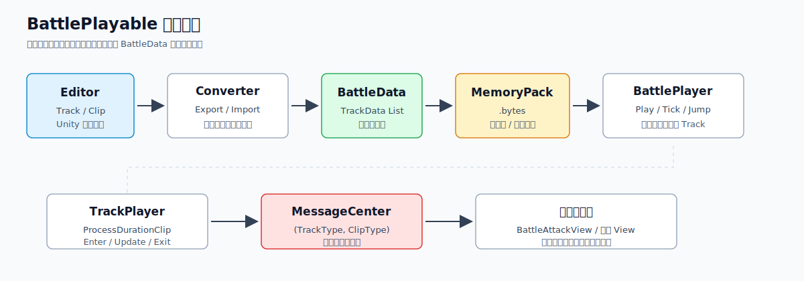
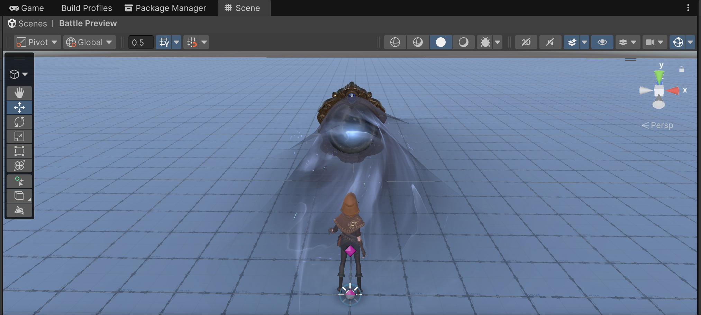
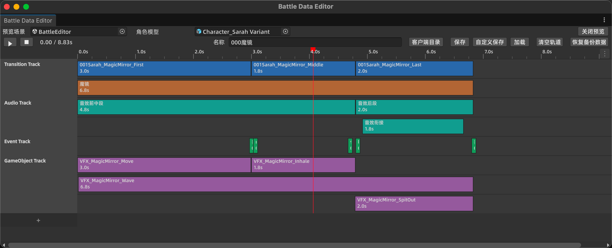
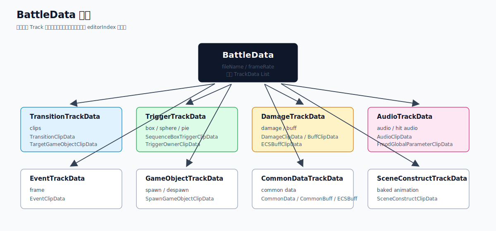
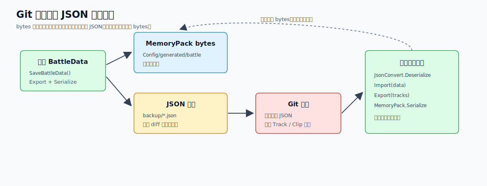
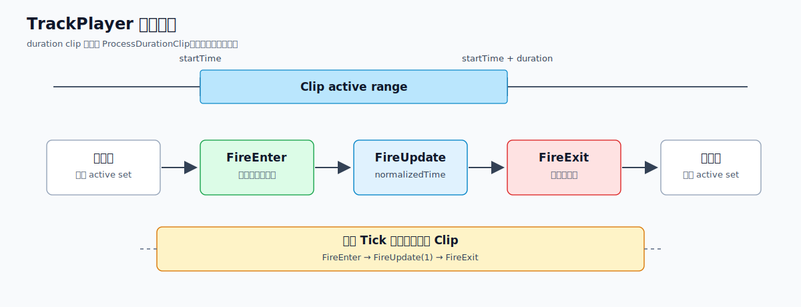
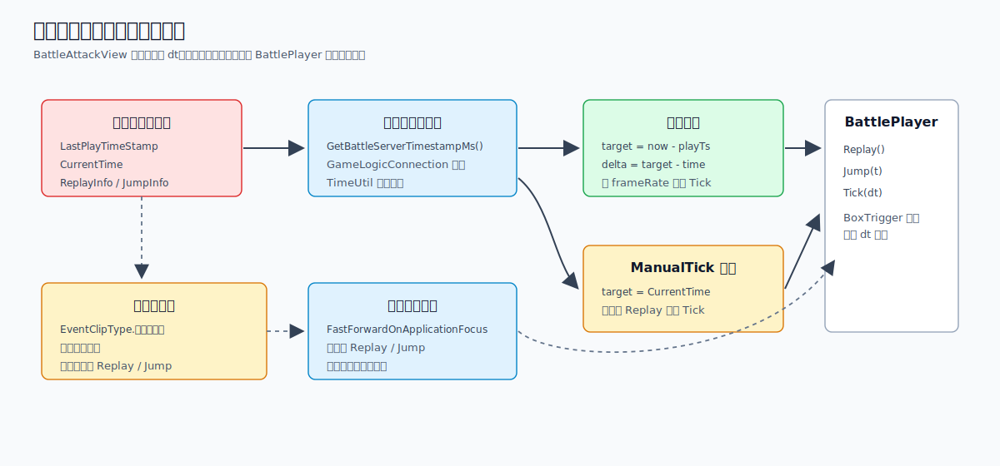

# BattlePlayable 战斗时间轴

这里记录一下 `BattlePlayable`。

先说结论：`BattlePlayable` 是一套战斗时间轴工具。

它解决的问题不是战斗公式怎么写，而是把一次攻击、技能或者战斗表现拆成可以编辑、保存、预览、回放的数据。

核心链路是：

```text
Editor Track/Clip
  -> BattleDataConverter.Export
  -> BattleData
  -> MemoryPack bytes
  -> BattlePlayer
  -> TrackPlayer.Tick
  -> BattleMessageCenter
```

也就是说，编辑器里看到的是时间轴，保存后得到的是 `BattleData`，运行时只关心 `BattleData` 和一组 `TrackPlayer`。





上图是预览场景。编辑器会打开一个独立的 `PreviewSceneStage`，把预览场景和角色模型放进去，然后在拖动时间轴或者点击播放时采样各条 Track。



上图是 `Battle Data Editor`。

左边是 Track，右边是 Clip。比如 Transition、Audio、Event、GameObject 都是独立轨道。每个 Clip 只描述自己在时间轴上的位置和参数。

## BattleData

`BattleData` 是最终保存的运行时数据，使用 `MemoryPack` 序列化。

顶层结构大概是：

```text
BattleData
  - fileName
  - frameRate
  - transitionTracks
  - triggerTracks
  - eventTracks
  - damageTracks
  - audioTracks
  - gameObjectTracks
  - commonDataTracks
  - sceneConstructTracks
```



这里没有用一个统一的 `List<BaseTrackData>`。

每种 Track 都有自己的 List。好处是运行时处理比较直接，不需要反复判断基类类型。代价是每新增一种 Track 或 Clip，都要补齐数据结构、编辑器转换和播放器处理。

比较关键的 Track：

| Track | 作用 |
| --- | --- |
| `TransitionTrackData` | 播放角色动画，或者指定目标 GameObject 的动画 |
| `TriggerTrackData` | 描述命中范围，比如 Box、Sphere、Pie、SequenceBox、TriggerOwner |
| `DamageTrackData` | 描述伤害、蓄力伤害、传统 Buff、ECS Buff、受击镜头效果 |
| `EventTrackData` | 按帧触发一次事件 |
| `AudioTrackData` | 播放音效、受击音效、FMOD 全局参数 |
| `GameObjectTrackData` | 生成和销毁 GameObject |
| `CommonDataTrackData` | 放通用事件数据、通用 Buff 数据、通用 ECS Buff 数据 |
| `SceneConstructTrackData` | 服务器侧用的场景构造动画数据 |

每个 TrackData 里还有一个 `editorIndex`。

这个字段主要给编辑器用。因为保存后 Track 被分到了不同 List 里，重新导入编辑器时需要按 `editorIndex` 把用户原来的轨道顺序还原。

## Clip 的时间

大部分 Clip 是 `startTime + duration`。

比如：

```text
startTime = 2.0
duration = 1.5
endTime = 3.5
```

这类 Clip 会有进入、更新、退出三个阶段。

还有一些 Clip 是按帧触发一次：

- `EventClipData`
- `SpawnGameObjectClipData`

它们记录的是 `frame`，运行时通过 `frame / frameRate` 转成秒。

所以这套系统里同时有两种时间表达：

- 表现持续一段时间的东西，用秒和持续时间。
- 只触发一次的东西，用帧。

编辑器里可以切换秒和帧显示。`frameRate` 默认是 30，也会保存到 `BattleData` 里。

## 编辑器配置流程

入口是：

```text
Tools/Battle Data Editor
```

基本流程是：

1. 选择预览场景。
2. 选择角色模型。
3. 在时间轴里添加 Track。
4. 在 Track 里拖资源或者右键添加 Clip。
5. 调整 Clip 的开始时间、持续时间和参数。
6. 打开预览，在 Scene 里看效果。
7. 保存为 `.bytes`。

添加轨道不是手写菜单列表，而是通过 `BattleTrackRegistry` 反射所有非抽象 `BattleTrack` 子类，再构建“添加轨道”菜单。

Clip 的 Inspector 不是直接编辑运行时数据。

编辑器里每种 Track 都有自己的编辑器 Clip 类型。比如 `TransitionAssetClip`、`BoxClip`、`DamageClip`、`AudioClip`。保存时再由 `BattleDataConverter` 转成运行时的 `TransitionClipData`、`BoxTriggerClipData`、`DamageClipData`、`AudioClipData`。

这样做比较啰嗦，但边界清楚：

- 编辑器 Clip 可以引用 Unity 资源。
- 运行时 Clip 只保存路径、GUID、枚举、数值、烘焙数据。

## 预览流程

预览由 `BattlePreviewStage` 负责。

它做了几件事：

- 打开一个 `PreviewSceneStage`。
- 加载 `BattleEditor.unity` 作为预览场景。
- 实例化角色 prefab。
- 查找或者补一个 `AnimancerComponent`。
- 时间轴播放时调用每条 `BattleTrack.SampleAtTime`。

也就是说，编辑器预览不是直接跑运行时 `BattlePlayer`。

它是编辑器侧采样。这样方便拖动时间轴时立即看到动画、特效、GameObject 等效果。

最终保存时，编辑器数据再通过 `BattleDataConverter.Export` 变成运行时数据。

## 保存和加载

保存时主要做三件事：

```text
BattleDataConverter.Export(_state.Tracks)
  -> data.fileName = BattleDataName
  -> data.frameRate = _state.FrameRate
  -> MemoryPackSerializer.Serialize(data)
```

然后写到几个目录：

| 目录 | 作用 |
| --- | --- |
| `Assets/BundleResources/Character/battle/` | 客户端默认保存目录 |
| `../Configs/generated/character/battle/` | 生成配置目录 |
| `Config/generated/battle/` | 当前工程内的配置目录 |
| `Config/generated/battle/backup/` | JSON 备份目录 |

`bytes` 是给运行时用的。

`json` 备份主要是为了恢复和排查。恢复备份时会把 JSON 重新导入编辑器，再导出成 `MemoryPack bytes`。

`SceneConstructTrack` 还多一步。

它会把 Unity 的 `AnimationClip` 烘焙成 `BattlePlayable.AnimationClip`，并写到：

```text
Config/generated/anim
```

服务器侧没有 Unity 场景和 Transform，所以这里会把动画曲线烘焙成运行时可以采样的数据。



## Git 协作

`BattleData` 最终产物是 `.bytes`，这个文件适合运行时加载，不适合 Git 冲突处理。

所以编辑器保存时会额外写一份 JSON 备份：

```text
Config/generated/battle/backup/*.json
```

多人协作时，如果同一个战斗数据有冲突，比较合理的处理方式是：

1. 先解决 JSON 冲突。
2. 确认 Track、Clip、时间、资源路径都符合预期。
3. 在编辑器里执行“恢复备份数据”。
4. 工具会读取 JSON，反序列化成 `BattleData`。
5. 再走一遍 `BattleDataConverter.Import -> Export`。
6. 最后重新写出 `MemoryPack bytes`。

这一步不是简单把 JSON 转 bytes。

它会重新跑编辑器导入导出流程。比如 `SceneConstructTrack` 会重新烘焙动画，再写 `Config/generated/anim` 和 `Config/generated/battle`。

注意不要只修 JSON，不重新生成 bytes。否则本地看 JSON 是对的，运行时加载的还是旧二进制。

## 运行时播放

运行时入口是 `BattlePlayer`。

`Play` 时会把 `BattleData` 里的各类 Track 分配给对应的 `TrackPlayer`：

```text
TransitionTrackPlayer
DamageTrackPlayer
EventTrackPlayer
CommonDataTrackPlayer
SceneConstructTrackPlayer
TriggerTrackPlayer
AudioTrackPlayer
GameObjectTrackPlayer
```

然后计算整段时间轴长度。

`Tick` 时做的事情很简单：

```text
time += deltaTime

for player in players:
    player.Tick(time, prevTime, messageCenter)
```

每个具体的 `TrackPlayer` 只负责自己的 Track。

例如 `DamageTrackPlayer` 会遍历：

- `DamageClipData`
- `ChargeDamageClipData`
- `BuffClipData`
- `ECSBuffClipData`
- `HitCameraEffectClipData`

`TriggerTrackPlayer` 会遍历：

- `BoxTriggerClipData`
- `SequenceBoxTriggerClipData`
- `SphereTriggerClipData`
- `PieTriggerClipData`
- `TriggerOwnerClipData`

真正的生命周期逻辑在 `TrackPlayer.ProcessDurationClip` 里。



大概逻辑是：

```text
如果当前时间在 Clip 区间内：
  如果 Clip 之前不活跃，FireEnter
  FireUpdate

如果当前时间离开 Clip 区间：
  如果 Clip 之前活跃，FireExit

如果一次 Tick 直接跨过整个 Clip：
  FireEnter
  FireUpdate(1)
  FireExit
```

所以具体业务代码不需要自己判断 Clip 是否刚进入或者刚退出。它只要注册消息即可。

## MessageCenter

`BattleMessageCenter` 是运行时的派发中心。

它的 key 是：

```text
(TrackType, ClipType)
```

注册时写法类似：

```csharp
messageCenter.Register<DamageTrackData, DamageClipData>(
    onEnter: OnDamageEnter,
    onUpdate: OnDamageUpdate,
    onExit: OnDamageExit);
```

`TrackPlayer` 只负责发：

```text
FireEnter(track, clip)
FireUpdate(track, clip, normalizedTime)
FireExit(track, clip)
```

这样运行时播放框架和具体战斗逻辑是分开的。

`BattlePlayable` 不需要知道“命中后怎么算伤害”，它只需要告诉外部：某条 Track 上某个 Clip 进入了、更新了、退出了。

## 客户端接入

客户端侧主要是 `BattleAttackView` 在消费 `BattlePlayable`。

它启动时会：

1. 根据 `Data.FileName` 找到 `.bytes`。
2. 用 `MemoryPackSerializer.Deserialize<BattleData>` 反序列化。
3. 调用 `battlePlayer.Play(battleData)`。
4. 注册各类 `BattleMessageCenter` 回调。

当前接入的消息包括：

- `GameObjectTrackData + SpawnAndDespawnGameObjectClipData`
- `AudioTrackData + AudioClipData`
- `AudioTrackData + HitAudioDataClipData`
- `AudioTrackData + FmodGlobalParameterClipData`
- `DamageTrackData + HitCameraEffectClipData`
- `TriggerTrackData + BoxTriggerClipData`
- `CommonDataTrackData + CommonDataClipData`
- `CommonDataTrackData + CommonBuffDataClipData`
- `EventTrackData + EventClipData`
- `TransitionTrackData + TransitionClipData`

所以 `BattlePlayable` 只提供时间轴事件。

真正的客户端表现，比如生成特效、播放 FMOD、BoxTrigger 检测、怪物动画播放，都在 `BattleAttackView` 这一层处理。

## 服务器对时和快进

客户端播放不是只靠本地 `dt`。

`BattleAttackView.OnUpdate` 每帧会先同步服务器侧状态：

```text
SyncLastPlayTimestamp()
TickReplaySync()
TickJumpSync()
```

然后才根据模式推进 `BattlePlayer`。



普通模式下，对时逻辑是：

```text
playTimestamp = Data.LastPlayTimeStamp
serverNow = TimeUtil.GetBattleServerTimestampMs()
targetTime = (serverNow - playTimestamp) / 1000
deltaSeconds = targetTime - battlePlayer.time
```

如果 `deltaSeconds > 0`，就快进 `BattlePlayer`。

快进不是一次性 Tick 一个很大的 delta，而是按 `frameRate` 拆成小步：

```text
tickStep = 1 / battlePlayer.frameRate
while deltaSeconds > 0:
    battlePlayer.Tick(min(tickStep, deltaSeconds))
    TickBoxTriggers(tickDelta)
```

这样做是为了避免一下子跨过太多 Trigger 检测。

`GameLogicConnection.OnServerTimeSynced` 会把服务器时间写到 `TimeUtil.SetBattleServerTimestamp`。所以这里拿到的 `GetBattleServerTimestampMs` 是已经校准过的战斗服务器时间。

## ManualTick

还有一种模式是 `Data.ManualTick`。

这种模式不通过 `LastPlayTimeStamp` 推算播放时间，而是直接跟服务器下发的 `Data.CurrentTime`。

逻辑大概是：

```text
targetTime = Data.CurrentTime
deltaTime = targetTime - battlePlayer.time
battlePlayer.Tick(deltaTime)
```

如果 `targetTime < battlePlayer.time`，说明服务器时间回退了。

这时客户端会先 `ReplayBattlePlayer()`，把播放器重置，再从头 Tick 到目标时间。

所以普通模式更像“用服务器时间戳算现在应该播到哪里”，`ManualTick` 更像“服务器直接指定当前播放时间”。

## Replay 和 Jump

服务器会通过两个结构控制客户端播放：

- `ReplayInfo.InvokeTimestamp`
- `JumpInfo.InvokeTimestamp`

客户端会记录 `_appliedReplayTimestamp` 和 `_appliedJumpTimestamp`，同一个 invoke timestamp 只处理一次。

`Replay` 很直接：

```text
ReplayBattlePlayer()
_blockedAtSkipPoint = false
```

`Jump` 有两种情况：

- `JumpStartTime == JumpTargetTime`：只解除阻塞，不真的跳。
- 否则调用 `battlePlayer.Jump(JumpTargetTime)`。

这里还有一个细节：客户端在执行服务器 Jump 时会设置 `_isApplyingServerJump`。

因为 Jump 过程中可能重新采样到 `EventClipType.跳过判断点`。如果不区分“服务器正在 Jump”，客户端可能又把自己阻塞住。

## 跳过判断点

`EventTrack` 里有一些特殊事件，比如：

- `EventClipType.跳过判断点`
- `EventClipType.从头循环播放`

客户端播放到这些事件时，会设置：

```text
_blockedAtSkipPoint = true
```

之后本地普通 Tick 会暂停推进，等待服务器推送 `Replay` 或 `Jump`。

这个逻辑的目的很直接：遇到需要服务器判定的分支时，本地表现先停住，不要自己继续往后播。

## 焦点变化

`MagicMirrorBattleAttackView` 监听了：

```text
CoreEvent.ApplicationFocusChanged
```

当 Unity 重新获得焦点时，会调用：

```text
FastForwardOnApplicationFocus()
```

普通模式下，它会：

1. 先同步 `LastPlayTimeStamp`、`ReplayInfo`、`JumpInfo`。
2. 再 `FastForwardToBattleServerTime()`。
3. 设置 `_skipNextUpdateTickAfterFocus = true`。

第三步是为了避免恢复焦点后的下一帧又按本地 `dt` 多 Tick 一次。

`ManualTick` 模式下则直接根据 `CurrentTime` 补 Tick，并同步 BoxTrigger。

所以焦点恢复本质上不是“继续从暂停点播放”，而是“重新对齐服务器当前应该播到的时间”。

## SceneConstruct

`SceneConstruct` 是比较特殊的一条线。

Unity 里可以直接找 Transform，但服务器没有真实场景。

所以这里做了一棵概念上的节点树：

```text
BattleScene
  - BattleNode root
  - fullPath -> BattleNode
```

每个节点保存：

- `localPosition`
- `localRotation`
- `localScale`
- `worldPosition`
- `worldRotation`

`AnimationClipSampler` 会把烘焙后的动画曲线采样出来，写到对应 `BattleNode` 的 local TRS 上，然后 `BattleScene.UpdateWorldTransforms` 从 root 开始更新世界坐标。

说白了就是在服务器侧模拟一份轻量 Transform 树。

它不负责渲染，只负责给命中范围、挂点、路径这类逻辑提供位置和旋转。

## 新增 Clip 的流程

这套代码扩展一个 Clip 需要补的地方比较固定。

以新增一个 `TriggerOwnerClip` 这类无额外参数的 Clip 为例：

1. 在 `BattleData.cs` 里新增运行时 `ClipData`。
2. 在对应 `TrackData` 里新增 List。
3. 在对应 `TrackPlayer` 里新增 active 集合，并调用 `ProcessDurationClip`。
4. 在编辑器 Track 文件里新增 Editor Clip 类型。
5. 在右键菜单或拖拽逻辑里支持创建它。
6. 在 `BattleDataConverter.Export` 里把 Editor Clip 转成 Runtime ClipData。
7. 在 `BattleDataConverter.Import` 里把 Runtime ClipData 还原成 Editor Clip。
8. 如果运行时需要业务效果，再注册对应的 `BattleMessageCenter` 回调。

这里容易漏的是导入导出。

只加编辑器 Clip，不加 `BattleDataConverter`，保存后就没有数据。

只加 `BattleData`，不加编辑器 Clip，策划就没法配。

只加 `TrackPlayer`，不注册消息，运行时会正常 Tick，但外部没有人处理。

## 注意点

`TrackPlayer` 的顺序不是纯展示问题。

比如 Trigger 的业务回调如果要读取当前 active 的 Damage 或 Buff 数据，那么 `DamageTrackPlayer` 就需要在 `TriggerTrackPlayer` 前面 Tick。否则同一帧里 Trigger 已经触发，但 Damage/Buff 还没进入 active 集合，就会读不到。

`EventClipData` 和 `SpawnGameObjectClipData` 是一次性触发，不是 duration clip。它们用 `frame`，不是 `startTime + duration`。

编辑器预览和运行时播放是两套入口。预览走 `BattleTrack.SampleAtTime`，运行时走 `BattlePlayer.Tick`。

运行时数据不要保存 Unity 对象引用。需要保存资源时，导出成 asset path、GUID、文件名或者烘焙后的数据。

`editorIndex` 看起来只是编辑器字段，但不要随便删。它负责导入后恢复轨道顺序。

新增 Track 或 Clip 时，最好顺着“数据结构 -> 编辑器 -> Converter -> TrackPlayer -> MessageCenter 回调”这条链路检查一遍。

## 参考代码

- `Assets/Jinn/BattlePlayable/BattleData.cs`
- `Assets/Jinn/BattlePlayable/BattlePlayer.cs`
- `Assets/Jinn/BattlePlayable/TrackPlayer.cs`
- `Assets/Jinn/BattlePlayable/BattleMessageCenter.cs`
- `Assets/Jinn/BattlePlayable/Editor/BattleDataEditor.cs`
- `Assets/Jinn/BattlePlayable/Editor/BattleDataConverter.cs`
- `Assets/Jinn/BattlePlayable/Editor/BattlePreviewStage.cs`
- `Assets/Jinn/GamePlay/Runtime/BattlePlayable.Jinn/BattleAttackView.cs`
- `Assets/Jinn/GamePlay/Runtime/BattlePlayable.Jinn/MagicMirrorBattleAttackView.cs`
- `Assets/Jinn/RemoteDataCenter/Runtime/GameConnects/GameLogicConnection.cs`
- `Assets/Jinn/GamePlay/Runtime/Model/BattleAttackModelData.cs`
