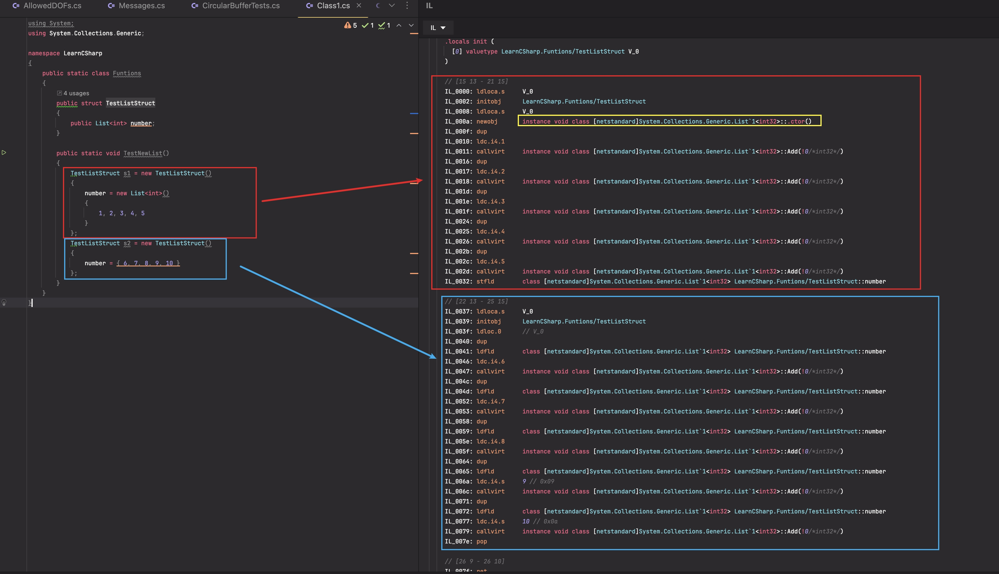

初始化struct/class里的List时，第二种写法会报nullref

```csharp
public struct MyStruct
{
    public List<int> MyList1;
    public MyStruct()
    {
    }
}


static void Main(string[] args)
{
    // 第一种写法，正常
    MyStruct s1 = new MyStruct()
    {
        MyList1 = new List<int> { 1, 2, 3 }
    }
    
    // 第二种写法，报错
    MyStruct s2 = new MyStruct()
    {
        MyList1 = { 1, 2, 3 }
    }
}
```

观察编译后的IL代码，第一种写法会调用List的构造函数，而第二种写法则是直接对MyList1进行赋值。
在C#中，结构体（struct）和类（class）在初始化时有一些细微的差别。特别是在处理引用类型字段时，这种差异可能会导致一些意想不到的错误。


