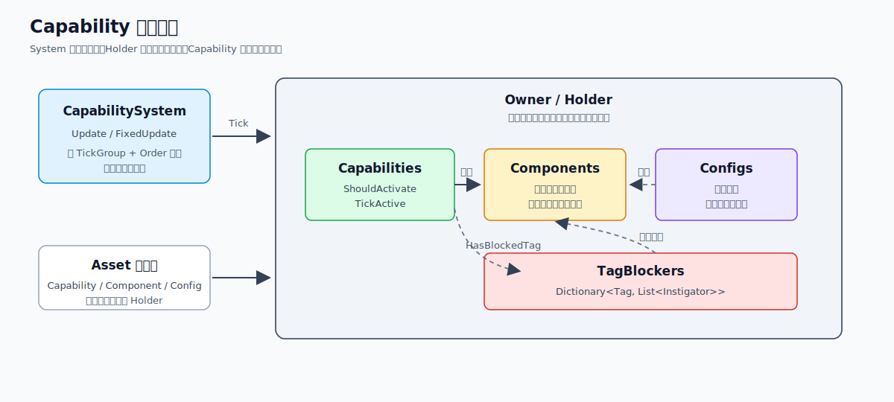
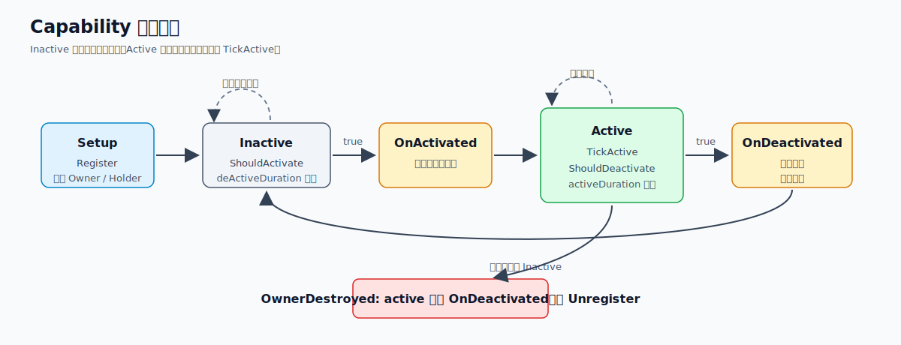
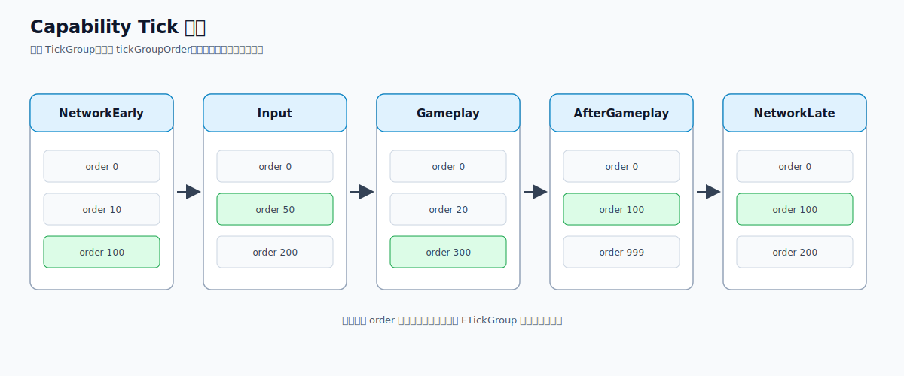
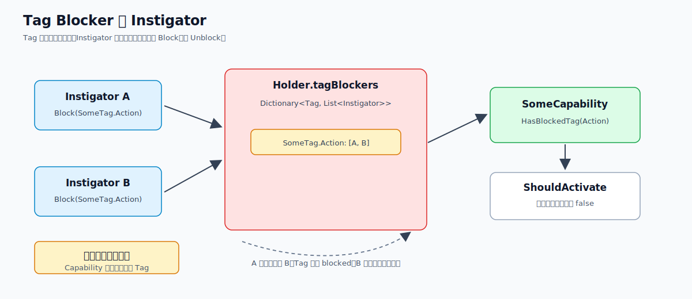
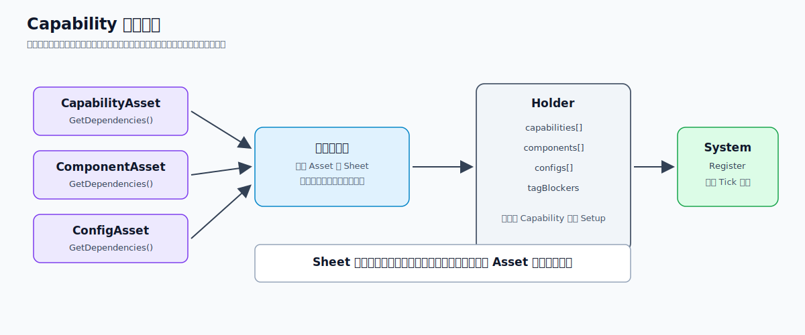

# Capability 系统架构实践

`Capability` 是挂在对象上的细粒度行为。它自己判断什么时候激活、退出，激活期间每帧做什么。

这套实现参考了 GDC 2025《双影奇境》的 Capabilities。个人感觉它有点像挂在对象上的小型 ECS System：

```text
GameObject / Owner
  -> Holder
      -> Capabilities  行为
      -> Components    状态
      -> Configs       参数
      -> TagBlockers   阻塞来源

CapabilitySystem
  -> 按 TickGroup 和 Order 推进所有 Capability
```



## 为什么需要 Capability

`GameObject + Component` 写久了以后，状态和决策很容易散在各个组件里。Capability 把行为拿出来，Component 只保留共享状态和工具函数。

一个 Capability 只处理自己的几个问题：

- 我现在能不能激活。
- 我激活时要做什么。
- 我激活期间每帧要做什么。
- 我什么时候退出。
- 我退出时要清理什么。

## 它不是状态机

状态机通常是一个主状态退出、另一个主状态进入。多个 Capability 可以同时激活，也没有显式的状态连线，只根据 Component、Config 和 Tag 判断自己的生命周期。

## 和 ECS 的关系

ECS System 面向一批 Entity，Capability 只描述 Holder 上某个对象的一个行为：

```text
ECS:
  System -> 扫一批 Entity + Component

Capability:
  Owner -> Holder -> 一组小型 System
```

## 和 GAS 的区别

GAS 更偏外部事件尝试激活 Ability，这里的 Capability 每帧自己执行 `ShouldActivate` / `ShouldDeactivate`。没激活时直接查判断条件比较方便，代价是每帧轮询。

## 框架结构

框架核心代码在：

```text
Assets/Framework/UnityToolkit/Capabilities
```

主要类型：

| 类型 | 作用 |
| --- | --- |
| `CapabilitySystem` | 管理所有能力，按 TickGroup 和 Order 更新 |
| `CapabilityBase<TTag, TOwner>` | 能力基类，封装注册、Owner、Holder、生命周期 |
| `ICapability` | 能力运行时接口 |
| `ICapabilityHolder<TTag, TOwner>` | 能力拥有者接口 |
| `CapabilityHolderBase<TTag, TOwner>` | 非 Unity 场景下的通用 Holder |
| `MonoBehaviorCapabilityHolder<TTag>` | Unity `GameObject` 侧 Holder |
| `IComponent` | 运行时状态接口 |
| `IConfig` | 配置接口 |
| `Instigator` | 阻塞来源 |
| `ETickGroup` | Tick 分组 |

```text
CapabilitySystem
  Register(ICapability)
  Unregister(ICapability)
  Update(deltaTime)
  FixedUpdate(fixedDeltaTime)

CapabilityBase
  Setup(holder, system)
  ShouldActivate()
  OnActivated()
  TickActive(deltaTime)
  ShouldDeactivate()
  OnDeactivated()
  OnOwnerDestroyed(system)

Holder
  GetOwner()
  TryGetComp<T>()
  TryGetConfig<T>()
  BlockCapabilities(tag, instigator)
  UnblockCapabilities(tag, instigator)
  HasBlockedTag(tag)
```

## 生命周期

一个能力的生命周期基本是：

```text
Setup
  -> 每帧检查 ShouldActivate
  -> OnActivated
  -> 每帧 TickActive
  -> 每帧检查 ShouldDeactivate
  -> OnDeactivated
```

框架里的 `CapabilitySystem.Update` 大概是这个逻辑：

```text
foreach tickGroup:
  foreach capability:
    currentActive = capability.active

    if currentActive && ShouldDeactivate:
      active = false
      OnDeactivated

    if !currentActive && ShouldActivate:
      active = true
      OnActivated

    if active:
      activeDuration += deltaTime
      deActiveDuration = 0
      TickActive(deltaTime)
    else:
      activeDuration = 0
      deActiveDuration += deltaTime
```

`currentActive` 是本轮开始时的状态。能力这一帧退出后不会马上重新激活；这一帧刚激活则会立刻执行 `TickActive`。



## Setup

```csharp
system.Register(this);
Owner = holder.GetOwner();
capabilityComp = holder;
```

组件和配置也在 `Setup` 中从 Holder 取：

```csharp
capabilityComp.TryGetComp(out SomeComponent component);
capabilityComp.TryGetConfig(out SomeConfig config);
```

`tickGroup` 必须在构造或初始化阶段确定，Setup 后 setter 会抛异常。

## TickGroup 和 Order

更新顺序有两层：

- `ETickGroup`
- `tickGroupOrder`

当前 `ETickGroup` 有：

```text
NetworkEarly
Input
Gameplay
AfterGameplay
NetworkLate
```

`Register` 把能力放进对应组，再按 `tickGroupOrder` 排序：

```csharp
list.Sort((a, b) => a.tickGroupOrder.CompareTo(b.tickGroupOrder));
```

使用时可以约定：

- 输入读取放在 `Input`。
- 常规逻辑放在 `Gameplay`。
- 依赖前面结果的收口逻辑放在 `AfterGameplay`。
- 网络同步前后分别放在 `NetworkEarly` 和 `NetworkLate`。



## FixedUpdate

`FixedUpdate` 只处理 active 并实现了 `IPhysicsTick` 的能力：

```text
if capability.active && capability is IPhysicsTick:
  PhysicsTickActive(fixedDeltaTime)
```

## Holder

`Holder` 连接能力和 Owner，持有：

```text
capabilities
components
configs
tagBlockers
```

依赖统一从 Holder 取：

```csharp
TryGetComp<T>()
TryGetConfig<T>()
TryGetCapability<T>()
```

`TryGetCapability<T>()` 虽然存在，但能力之间最好通过 Component 通信：

```text
Capability A -> 写 Component 状态
Capability B -> 读 Component 状态
```

## Component 和 Config

`IComponent` 和 `IConfig` 都是空接口，只区分用途：

- `Component`：运行时状态，会被能力读写。
- `Config`：配置参数，运行时一般只读。

Component 可以有工具函数，但不要决定是否进入某个行为。

## Tag Blocker

一个能力临时禁止另一类能力时：

```csharp
capabilityComp.BlockCapabilities(SomeTag.Action, new Instigator(this));
```

结束时再解除：

```csharp
capabilityComp.UnblockCapabilities(SomeTag.Action, new Instigator(this));
```

Holder 内部保存：

```text
Dictionary<TTag, List<Instigator>>
```

同一个 Tag 可以被多个来源阻塞，全部解除后才恢复。框架不会自动判断 Tag，能力需要在 `ShouldActivate` 或 `ShouldDeactivate` 中检查：

```csharp
if (capabilityComp.HasBlockedTag(SomeTag.Action))
{
    return false;
}
```



## Instigator

`Instigator` 用来记录阻塞来源：

```csharp
public struct Instigator : IEquatable<Instigator>
{
    public object reference;
}
```

相等比较使用 `reference`。Block 和 Unblock 必须传同一个能力实例或系统对象，否则解除不掉。

## ScriptableObject 资产层

Unity 侧有三个资产基类：

```text
CapabilityAsset
ComponentAsset
ConfigAsset
```

用来声明依赖：

```csharp
public abstract ICapability[] GetDependencies();
public abstract IEnumerable<IComponent> GetDependencies();
public abstract IConfig[] GetDependencies();
```

这层只负责装配。更大的组合可以再做 Sheet，保存一组 Capability、Component 和 Config Asset。



## MonoBehaviour Holder

`MonoBehaviorCapabilityHolder<TTag>` 继承 `MonoBehaviour` 并实现：

```csharp
ICapabilityHolder<TTag, GameObject>
```

Owner 是：

```csharp
gameObject
```

它内部同样维护：

```text
capabilityAssets
componentAssets
configAssets
tagBlockers
capabilities
components
configs
```

具体什么时候展开 Asset、调用 Setup 仍由上层初始化流程决定。

## 销毁流程

`CapabilityBase.OnOwnerDestroyed`：

```csharp
if (active) OnDeactivated();
system.Unregister(this);
```

active 能力会先走 `OnDeactivated` 清理状态和 Tag，再从 `CapabilitySystem` 反注册。

## 一个最小能力

伪代码大概这样：

```csharp
public class SomeCapability : CapabilityBase<SomeTag, GameObject>
{
    SomeComponent component;
    SomeConfig config;

    public override void Setup(ICapabilityHolder<SomeTag, GameObject> holder, ICapabilitySystem system)
    {
        base.Setup(holder, system);
        capabilityComp.TryGetComp(out component);
        capabilityComp.TryGetConfig(out config);
    }

    public override bool ShouldActivate()
    {
        if (capabilityComp.HasBlockedTag(SomeTag.SomeAction)) return false;
        return component.requested;
    }

    public override void OnActivated()
    {
        component.running = true;
    }

    public override void TickActive(in float deltaTime)
    {
        component.elapsed += deltaTime;
    }

    public override bool ShouldDeactivate()
    {
        return component.elapsed >= config.duration;
    }

    public override void OnDeactivated()
    {
        component.running = false;
        component.elapsed = 0;
    }
}
```

能力自己判断激活和退出，运行时状态放 Component，参数放 Config，外部打断走 Tag。

## 使用时注意

Capability 适合输入驱动、持续一段时间、可以被打断并且需要排序的行为。纯工具函数、配置、全局服务和一次性计算直接用原来的写法即可。

- `ShouldActivate` 和 `ShouldDeactivate` 只判断，不产生副作用
- `OnActivated` 和 `OnDeactivated` 处理进入、退出和清理
- `TickActive` 只处理激活期间的逻辑
- Component 保存共享状态，Config 保存只读参数
- 判断函数每帧都会执行，不要在里面做复杂查询
- TickGroup 和 Order 不对时会读到旧数据
- Block / Unblock 必须成对，Instigator 来源要稳定
- Tag 太粗会误伤，太细又失去统一阻塞的意义

能力多以后需要一个运行时面板，至少能看到 active 状态、`activeDuration`、被 Block 的 Tag 和 Instigator。否则全靠断点会比较痛苦。

两个能力长得像也不一定要抽父类。抽完到处都是参数和分支，还不如先保持独立。

## 新增能力的流程

1. 确定它确实是一个有生命周期的行为。
2. 定义需要的 Tag、Component 和 Config。
3. 继承 `CapabilityBase<TTag, TOwner>`。
4. 初始化 `tickGroup` 和 `tickGroupOrder`。
5. 在 `Setup` 中从 Holder 取依赖。
6. 实现激活、Tick 和退出。
7. 在退出逻辑里清理状态并解除阻塞。
8. 通过 Holder 或 Asset 装配到对象。

`CapabilitySystem` 只负责调度，不会替业务处理 Tag。

## 参考

- [Capability 系统实践](https://zhuanlan.zhihu.com/p/1927489591159521310)
- `Assets/Framework/UnityToolkit/Capabilities/CapabilitySystem.cs`
- `Assets/Framework/UnityToolkit/Capabilities/CapabilityBase.cs`
- `Assets/Framework/UnityToolkit/Capabilities/CapabilityHolderBase.cs`
- `Assets/Framework/UnityToolkit/Capabilities/interface.cs`
- `Assets/Framework/UnityToolkit/Capabilities/Instigator.cs`
- `Assets/Framework/UnityToolkit/Capabilities/ETickGroup.cs`
- `Assets/Framework/UnityToolkit/Capabilities/Runtime/MonoBehaviorCapabilityHolder.cs`
- `Assets/Framework/UnityToolkit/Capabilities/Runtime/CapabilityAsset.cs`
- `Assets/Framework/UnityToolkit/Capabilities/Runtime/ComponentAsset.cs`
- `Assets/Framework/UnityToolkit/Capabilities/Runtime/ConfigAsset.cs`
