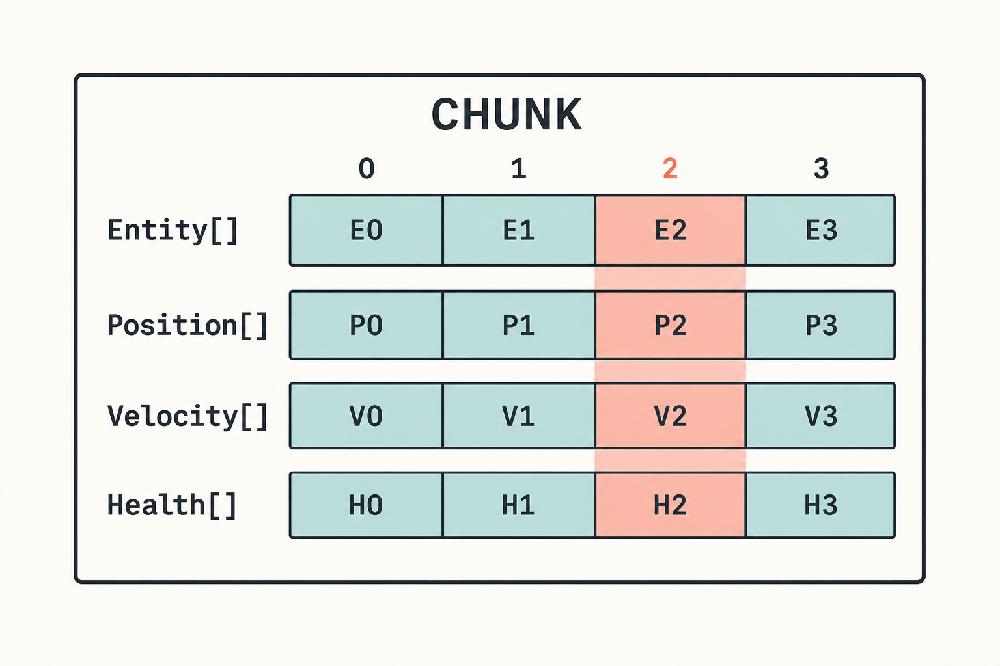
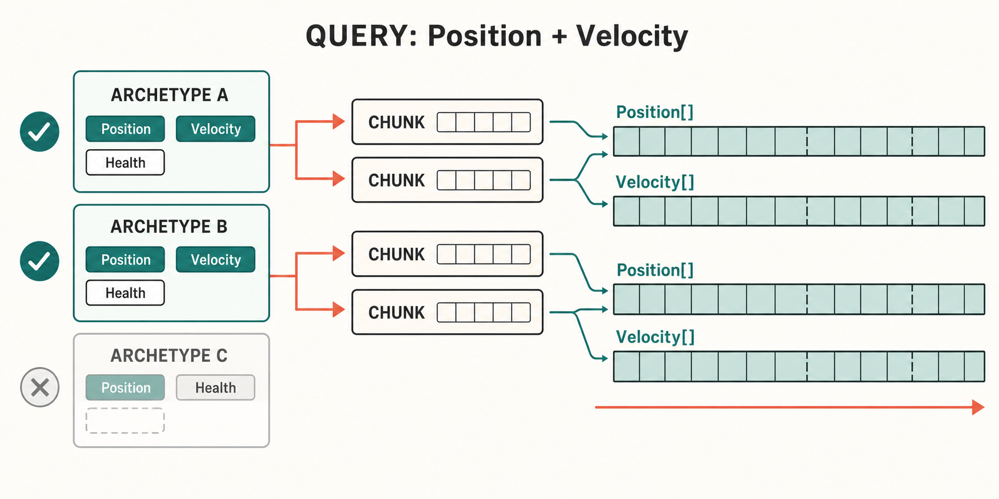
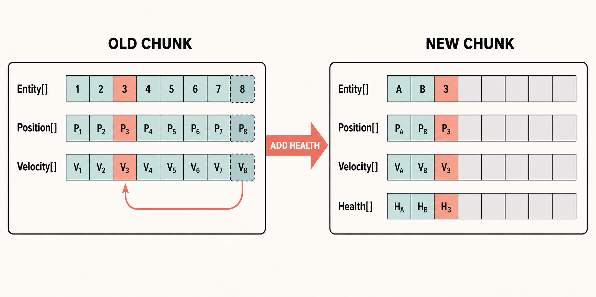

# Entities中的数据存储和遍历

这是在Unity Entities中遍历的一个经典例子

现在来分析这段代码究竟做了什么，是如何到Position和Velocity的

```csharp
foreach (var (position, velocity) in
         SystemAPI.Query<RefRW<Position>, RefRO<Velocity>>())
{
    position.ValueRW.Value += velocity.ValueRO.Value * deltaTime;
}
```


## Entity

Entity本身只有两个int，可以简单理解成

```csharp
public struct Entity
{
    public int Index;
    public int Version;
}
```

Index是Entity的编号，Version用来判断这个Entity是否已经失效。

Entity销毁以后Index可以复用，例如原来的Entity是`(100, 1)`，后来新建的Entity又拿到了Index 100，Version会变成2。之前保存的`(100, 1)`就不能访问这个新Entity。

World内部会记录Entity现在存在哪里

```text
Entity(Index, Version)
    -> Chunk
    -> IndexInChunk
```

所以Entity不是组件的指针，只是一个句柄。

Entity从一个Chunk搬到另一个Chunk，Entity本身可以不变，只需要更新这份映射。

两个World中的Entity即使Index和Version都一样，也不是同一个Entity。

## Archetype

Archetype表示一组组件类型的组合。

```text
Entity A: Position + Velocity
Entity B: Position + Velocity
Entity C: Position + Velocity + Health
Entity D: Position + Health
```

这里有三个Archetype

```text
Archetype 1 = { Position, Velocity }          -> A、B
Archetype 2 = { Position, Velocity, Health }  -> C
Archetype 3 = { Position, Health }            -> D
```

组件的值不影响Archetype。A和B的位置、速度完全不同，仍然属于同一个Archetype。

Query查询`Position + Velocity`时，会先匹配Archetype 1和Archetype 2，然后遍历它们下面的Chunk。并不会把World里所有Entity拿出来检查一次。

Tag Component虽然不占逐Entity的数据空间，但Tag也属于组件类型，当然会影响Archetype。

如果有10个可以独立添加删除的Tag，最多能组合出`2^10 = 1024`种Archetype。实际项目不一定真的全排列，但是拿Tag表示一堆频繁切换的状态，Archetype数量会很多

## Chunk

同一个Archetype的Entity会放进一个或多个Chunk。

标准Chunk是一块16 KiB的内存，里面按组件类型分成多段数组

```text
Entity[]   = [E0, E1, E2, E3, ...]
Position[] = [P0, P1, P2, P3, ...]
Velocity[] = [V0, V1, V2, V3, ...]
Health[]   = [H0, H1, H2, H3, ...]
```



相同下标属于同一个Entity。E2的组件就是P2、V2和H2。

这就是SoA（Structure of Arrays），不过范围只在一个Chunk内，不是整个World共用一个Position数组。

面向对象的写法通常是这样

```csharp
class Unit
{
    public float3 Position;
    public float3 Velocity;
    public float Health;
    public string Name;
    public GameObject View;
}
```

移动系统只用Position和Velocity，但是每个Unit中还夹着Health、Name和View，对象本身也可能散落在托管堆里。

Chunk中的Position和Velocity是连续数组。移动系统的循环其实更像

```text
P0 += V0 * dt
P1 += V1 * dt
P2 += V2 * dt
...
```

CPU缓存和硬件预取喜欢这种内存，Burst也更容易向量化。

这就是ECS快的核心，充分利用了CPU缓存和SIMD指令。

### Chunk Capacity

一个Chunk能装多少Entity，取决于这个Archetype中每个Entity占多少空间。

除了普通组件，还要算Entity数组、内存对齐、Dynamic Buffer内部容量和Chunk自己的元数据，不能直接用16 KiB除以组件大小。

组件越大，Chunk Capacity越低。

如果一个每帧运行的系统只读取Position，却把名字、角色描述、低频统计也塞在同一个组件中，一次Chunk能处理的Entity会变少。这些冷数据还会跟着Position一起进入缓存，很亏。

### Chunk中的顺序

Chunk中间不能留洞。

删除B时，通常会把最后一个Entity搬过来，这是一个常见数组的O(1)删除算法

当然因此Query返回的顺序不稳定，不能拿它当业务顺序。
如果确实需要顺序，保存一个排序字段，然后自己排序。

Entity发生结构变化以后也可能被搬走，之前拿到的组件引用、指针、`DynamicBuffer`都不能长期保存。

```text
删除前：[A, B, C, D]
删除后：[A, D, C]
```


## Query是怎么遍历的

回到开头的移动代码

```csharp
[BurstCompile]
public partial struct MoveSystem : ISystem
{
    [BurstCompile]
    public void OnUpdate(ref SystemState state)
    {
        float deltaTime = SystemAPI.Time.DeltaTime;

        foreach (var (position, velocity) in
                 SystemAPI.Query<RefRW<Position>, RefRO<Velocity>>())
        {
            position.ValueRW.Value += velocity.ValueRO.Value * deltaTime;
        }
    }
}
```

SystemAPI.Query会通过Source Generator生成代码并缓存EntityQuery。

大概的执行过程

```text
找到包含Position和Velocity的Archetype
    -> 遍历Archetype下的Chunk
    -> 从Chunk获取Position[]和Velocity[]
    -> 使用相同的IndexInChunk读写两个数组
```



不是这样

```text
遍历所有Entity
    -> HasComponent<Position>()
    -> HasComponent<Velocity>()
    -> 分别获取两个Component
```

`RefRW<Position>`表示要写Position，`RefRO<Velocity>`表示只读Velocity。这个声明会参与Job依赖分析，不只是API写法不同。


### Query的过滤

普通的组件查询在Archetype层就能完成。

Shared Component Filter和Change Filter是Chunk级别的过滤。一个Chunk通过以后，通常会处理整个Chunk。

Enableable Component不同，它有每个Entity自己的启用位。同一个Chunk中可能只有一部分Entity启用了某个组件，所以遍历时还要看Enabled Mask。

这也是`IJobChunk.Execute`中为什么会出现`useEnabledMask`和`chunkEnabledMask`。

## IJobEntity

IJobEntity按Entity写Execute

```csharp
[BurstCompile]
public partial struct MoveJob : IJobEntity
{
    public float DeltaTime;

    private void Execute(ref Position position, in Velocity velocity)
    {
        position.Value += velocity.Value * DeltaTime;
    }
}
```

`ref Position`是写入，`in Velocity`是只读。Source Generator可以直接从Execute参数生成Query。

调度代码

```csharp
state.Dependency = new MoveJob
{
    DeltaTime = SystemAPI.Time.DeltaTime
}.ScheduleParallel(state.Dependency);
```

这里不是给每个Entity创建一个Job。

IJobEntity最终还是转换成Chunk遍历，再把不同Chunk分给工作线程。一个Entity一个Job的话，调度成本早就爆炸了。

多数逐Entity计算用IJobEntity就可以，代码比较少，读写权限和Enabled Mask也会自动处理。

## IJobChunk

需要直接访问Chunk时可以用IJobChunk，例如每个Chunk只计算一次、处理Chunk Component，或者自己控制遍历过程。

```csharp
[BurstCompile]
public struct MoveChunkJob : IJobChunk
{
    public ComponentTypeHandle<Position> PositionType;

    [ReadOnly]
    public ComponentTypeHandle<Velocity> VelocityType;

    public float DeltaTime;

    public void Execute(
        in ArchetypeChunk chunk,
        int unfilteredChunkIndex,
        bool useEnabledMask,
        in v128 chunkEnabledMask)
    {
        NativeArray<Position> positions =
            chunk.GetNativeArray(ref PositionType);
        NativeArray<Velocity> velocities =
            chunk.GetNativeArray(ref VelocityType);

        var enumerator = new ChunkEntityEnumerator(
            useEnabledMask,
            chunkEnabledMask,
            chunk.Count);

        while (enumerator.NextEntityIndex(out int i))
        {
            Position position = positions[i];
            position.Value += velocities[i].Value * DeltaTime;
            positions[i] = position;
        }
    }
}
```

到这里就能直接看到Chunk里的组件数组了。

如果Query不涉及Enableable Component，循环基本就是一个普通for。通用写法不能直接忽略Enabled Mask，不然禁用组件的Entity也会被处理。

IJobChunk没有什么神奇的，只是Source Generator原本帮忙处理的东西，现在需要自己写了。

## 结构变化

修改组件的值不会改变Entity的存储结构

```csharp
position.Value += velocity.Value * deltaTime;
```

添加、删除组件则会改变Archetype。

```text
{ Position, Velocity }
    -> AddComponent<Health>
{ Position, Velocity, Health }
```

Entity要从旧Chunk搬到新Archetype的Chunk中

```text
找到目标Archetype
    -> 在目标Chunk分配位置
    -> 复制Position和Velocity
    -> 初始化Health
    -> 从旧Chunk删除数据
    -> 更新Entity的存储位置
```



旧Chunk删掉Entity以后，还要拿末尾Entity填空。

Entity句柄没有变，但是组件数据的地址和IndexInChunk都可能变了。

创建、销毁Entity，添加、删除组件，修改Shared Component，都属于结构变化。除了搬数据，还可能需要先完成正在访问相关组件的Job，于是主线程出现同步点。

EntityCommandBuffer可以在Job中先记录操作，等到固定的位置统一Playback。这样不会在帧内到处产生同步点，也方便批量处理。

但是ECB只是晚点搬，不是不搬。Playback时结构变化的成本依然存在。

创建大量同类Entity时，最好直接使用最终Archetype批量创建。先创建空Entity，再一个个Add Component，会在几个中间Archetype之间反复横跳。

### Enableable Component

如果一个状态需要频繁开关，可以使用Enableable Component

```csharp
public struct Sleeping : IComponentData, IEnableableComponent
{
}
```

禁用时组件数据没有删除，Entity也不用换Archetype，只修改Chunk中的Enabled Mask。

代价是Query遍历时需要根据Mask跳过一部分Entity。

它就是用稍微复杂一点的遍历，换掉频繁搬Entity的成本。很久才改变一次的状态没必要全部改成Enableable Component。

## 几种特殊组件的存储

### Dynamic Buffer

Dynamic Buffer可以在Chunk中预留一部分空间

```csharp
[InternalBufferCapacity(8)]
public struct PathNode : IBufferElementData
{
    public float3 Position;
}
```

不超过8个元素时，数据留在Chunk中。超过以后转移到外部内存。

Internal Buffer Capacity不是越大越好。每个Entity预留32个元素，实际大部分Entity只用2个，剩下30个的位置会一直占着Chunk。

设得太小又会让大量Buffer溢出，产生外部分配和一次间接访问。

还是要看项目里Buffer长度的实际分布，没有一个通用数字。

### Shared Component

Shared Component用于按值给Chunk分组。一个Chunk中的Entity必须使用相同的Shared Component值。

例如按渲染批次或者阵营分组，值的数量很少，这样是合适的。

如果1000个Entity有1000个Shared Component值，可能会拆出大量只装了一个Entity的Chunk。这个Shared就没Shared起来，只剩碎片了。

Shared Component不适合保存唯一ID，也不适合保存每帧变化的数据。

### Managed Component

Managed Component的对象在托管内存中，Chunk中保存它的关联。

这意味着GC、间接访问和Burst限制。

### Tag Component和Chunk Component

Tag Component没有逐Entity数据，只参与Archetype和Query匹配。

Chunk Component是每个Chunk保存一份，适合Chunk级别的LOD、边界和统计数据。

## Query和随机访问

Query适合批量遍历，但不是所有逻辑都能写成Query。

例如一个Entity保存了攻击目标

```csharp
public struct AttackTarget : IComponentData
{
    public Entity Value;
}
```

已经知道目标Entity，需要读取它的Position，可以使用ComponentLookup

```csharp
ComponentLookup<Position> positions =
    SystemAPI.GetComponentLookup<Position>(true);

if (positions.HasComponent(target))
{
    Position position = positions[target];
}
```

Lookup需要通过Entity定位Chunk和IndexInChunk，目标Entity之间也不一定连续。

父子关系、Owner、攻击目标这种跨Entity读取适合Lookup。批量更新自身组件还是应该用Query。


## 参考

- [Unity Entities：Archetype concepts](https://docs.unity.cn/Packages/com.unity.entities@1.0/manual/concepts-archetypes.html)
- [Unity Entities：Component concepts](https://docs.unity.cn/Packages/com.unity.entities@1.0/manual/concepts-components.html)
- [Unity Entities：SystemAPI.Query](https://docs.unity.cn/Packages/com.unity.entities@1.0/manual/systems-systemapi-query.html)
- [Unity Entities：IJobEntity](https://docs.unity.cn/Packages/com.unity.entities@1.0/manual/iterating-data-ijobentity.html)
- [Unity Entities：IJobChunk](https://docs.unity.cn/Packages/com.unity.entities@1.0/manual/iterating-data-ijobchunk.html)
- [Unity Entities：Enableable components](https://docs.unity.cn/Packages/com.unity.entities@1.3/manual/components-enableable.html)
- [Unity Entities：Entity command buffer](https://docs.unity.cn/Packages/com.unity.entities@1.0/manual/systems-entity-command-buffers.html)
