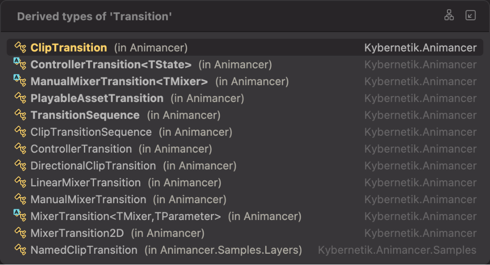
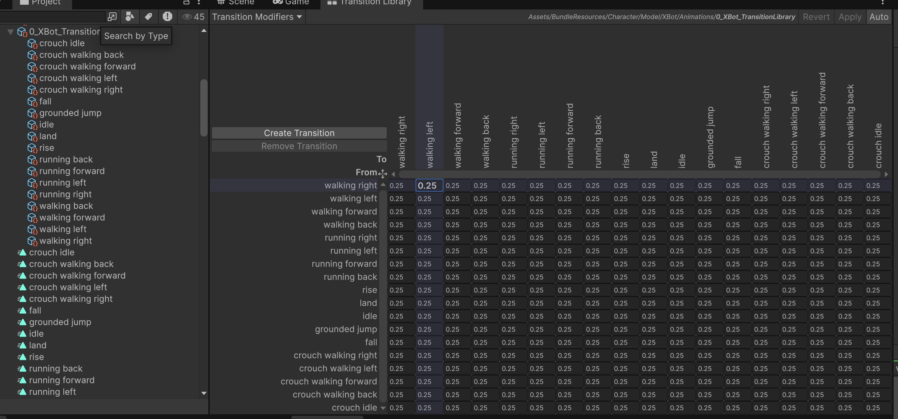

```text
本文记录了在使用Animancer时开发动画网络同步的一些经验和解决方案。
```

# Animancer简介

https://kybernetik.com.au/animancer/

Animancer是Unity中的一个强大的动画管理插件，提供了比传统Animator更灵活和高效的动画控制方式。它允许开发者通过代码直接控制动画状态机，简化了动画的管理和切换。

## 了解Transition和AnimancerState

### Transition

Animacner中，动画不是按照AnimationClip为资源单位播放，而是按照Transition为资源单位播放的

Transition有很多类型，比如ClipTransition，LinearMixTransition，PlayableTransition等等。

- ClipTransition: 最简单的Transition，直接封装了一个AnimationClip，可以设置淡入淡出时间，速度等参数
- LinearMixTransition: 用于混合多个AnimationClip，适合需要平滑过渡的动画场景
- PlayableTransition: 更高级的Transition，可以自定义PlayableGraph，实现复杂的动画逻辑
- ....



## AnimancerState

AnimancerState是Animancer中表示动画播放状态的类。每个Transition在播放时都会生成一个对应的AnimancerState。不同类型的Transition会生成不同类型的AnimancerState，比如ClipTransition会生成ClipState，


## AnimancerLayer

AnimancerLayer是Animancer中用于管理动画层的类。

类似于Unity Animator中的Layer概念

每个AnimancerLayer可以包含多个AnimancerState，允许在同一层上播放多个动画，并通过权重进行混合。

# Animancer网络同步

首先明确三个问题

1. 我们需要序列化什么
2. 如何序列化
3. 如何反序列化

## 需要序列化什么？

### AnimancerLayer

- Layer的索引 （用于反序列化时定位Layer）
- 包括Layer的权重 （用于反序列化时还原Layer的权重）
- 当前播放的所有AnimancerState的信息

### AnimancerState

- Transition的信息 （用于反序列化时还原AnimancerState）
- 当前播放时间 （用于反序列化时还原播放进度）
- 权重 （用于反序列化时还原权重）
- 播放速度 （用于反序列化时还原播放速度）
- 过渡信息 （用于反序列化时还原过渡状态）

## 如何序列化？

一个完整的Animacner网络同步数据结构应该包含多个AnimancerLayer，每个Layer包含多个AnimancerState。

### 序列化AnimancerState

已知，不同的Transition会生成不同类型的AnimancerState，因此在序列化时需要区分不同类型的State。

- 首先定义一个枚举类型StateType，用于区分不同类型的AnimancerState

```csharp
        public enum StateType
        {
            Clip,
            DirectionalMixer,
            CartesianMixer,
            LinearMixer
        }
```

- 上面定义了最常用四种类型
    - Clip表示普通的ClipState
    - DirectionalMixer表示方向混合状态
    - CartesianMixer表示笛卡尔混合状态
    - LinearMixer表示线性混合状态


- 使用一个ArraySegment<byte>来存储额外的payload数据，用于存储不同类型State特有的数据


- 定义NetworkAnimationStateData结构体来表示序列化后的AnimancerState数据

```csharp
    [MemoryPackable]
    public partial struct NetworkAnimationStateData
    {
        public StateType stateType;
        public int stateHash;
        public int transitionIndex;
        public float speed;
        public float time;
        public float weight;
        public float remainimgFadeDuration;
        public ArraySegment<byte> payload;
    }
```

- 结构体字段说明：
    - stateType: 状态类型
    - stateHash: 状态的哈希值，用于唯一标识状态
    - transitionIndex : Transition的索引，用于反序列化时还原Transition (仅对ClipState有效)
    - speed: 播放速度
    - time: 当前播放时间
    - weight: 权重
    - remainimgFadeDuration: 剩余淡出时间
    - payload: 额外的payload数据

#### 准备Transition索引映射

需要有一个地方存储Transition到索引的映射关系

这里之所以可以使用AnimationClip和ClipTransition作为索引单元，是因为我们提前将所有的AnimationClip都生成了ClipTransition，并且存放到了Animacner的TransitionLibrary中。



```csharp
private readonly Dictionary<AnimationClip, ClipTransition> _clip2TransitionsDict = new ();
private readonly Dictionary<ClipTransition, int> _transition2IndexDict = new ();
```

```csharp
for (var i = 0; i < animancer.Transitions.Definition.Transitions.Length; i++)
{
    var assetBase = animancer.Transitions.Definition.Transitions[i];
    if (assetBase is TransitionAsset { Transition: ClipTransition clipTransition })
    {
        _clip2TransitionsDict[clipTransition.Clip] = clipTransition;
        _transition2IndexDict[clipTransition] = animancer.Transitions.Library.IndexOf(clipTransition);
    }
}
```

#### ClipState

对于ClipState，payload可以为空，因为ClipState不需要额外的数据。

对应的序列化代码如下：

```csharp
AnimancerState state = layer.ActiveStates[i];
var stateData = new NetworkAnimationStateData
{
    stateType = NetworkAnimationStateData.StateType.Clip,
    stateHash = state.Index,
    time = state.Time,
    weight = state.Weight,
    speed = state.Speed
};

if (state.FadeGroup != null && Mathf.Approximately(state.TargetWeight, 1))
{
    stateData.remainimgFadeDuration = state.FadeGroup.RemainingFadeDuration;
}
```

其中寻找Transition索引的代码如下：

```csharp
 stateData.transitionIndex = _transition2IndexDict[_clip2TransitionsDict[state.Clip]];
```

为了方便，如果存在正在过渡的状态，我们直接将过渡的目标状态放到Layer的State列表中的第一个

```csharp
if(thisStateIsInFade)
{ 
    (networkAnimationDatas[0], networkAnimationDatas[i]) =  (networkAnimationDatas[i], networkAnimationDatas[0]);
}
```

#### DirectionalMixerState

对于DirectionalMixerState，需要序列化当前方向参数，所有的子状态的Transition索引，以及每个子状态对应的阈值。

对应的额外payload数据结构如下：

```csharp
    [MemoryPackable]
    public partial struct DirectionalMixerStateData
    {
        public Vector2 parameter;
        public int[] transitionIndices;
        public Vector2[] thresholds;
    }
```

对应的序列化代码如下：

```csharp
stateData.stateType = NetworkAnimationStateData.StateType.DirectionalMixer;
var payload = new DirectionalMixerStateData();
payload.parameter = directionalMixerState.Parameter;
payload.transitionIndices = new int[directionalMixerState.ChildCount];
payload.thresholds = new Vector2[directionalMixerState.ChildCount];

for (int index = 0; index < directionalMixerState.ChildCount; index++)
{
    var child = directionalMixerState.GetChild(index);
    var transitionIndex = _transition2IndexDict[_clip2TransitionsDict[child.Clip]];
    payload.transitionIndices[index] = transitionIndex;
    payload.thresholds[index] = directionalMixerState.GetThreshold(index);
}
stateData.payload = MemoryPackSerializer.Serialize(payload);
```

#### CartesianMixerState

CartesianMixerState的序列化方式和DirectionalMixerState类似，并没有什么不同

```csharp
    [MemoryPackable]
    public partial struct CartesianMixerStateData
    {
        public Vector2 parameter;
        public int[] transitionIndices;
        public Vector2[] thresholds;
    }
```

```csharp
stateData.stateType = NetworkAnimationStateData.StateType.DirectionalMixer;
var payload = new DirectionalMixerStateData();
payload.parameter = directionalMixerState.Parameter;
payload.transitionIndices = new int[directionalMixerState.ChildCount];
payload.thresholds = new Vector2[directionalMixerState.ChildCount];

for (int index = 0; index < directionalMixerState.ChildCount; index++)
{
    var child = directionalMixerState.GetChild(index); 
    var transitionIndex = _transition2IndexDict[_clip2TransitionsDict[child.Clip]];
    payload.transitionIndices[index] = transitionIndex;
    payload.thresholds[index] = directionalMixerState.GetThreshold(index);
}

stateData.payload = MemoryPackSerializer.Serialize(payload);
```

#### LinearMixerState

Linear和Directional/Cartesian的区别在于，LinearMixerState参数和阈值是float类型

```csharp
    [MemoryPackable]
    public partial struct LinearMixerStateData
    {
        public float parameter;
        public int[] transitionIndices;
        public float[] thresholds;
    }
```

```csharp
stateData.stateType = NetworkAnimationStateData.StateType.LinearMixer;
var payload = new LinearMixerStateData();
payload.parameter = linearMixerState.Parameter;
payload.transitionIndices = new int[linearMixerState.ChildCount];
payload.thresholds = new float[linearMixerState.ChildCount]; 
for (int index = 0; index < linearMixerState.ChildCount; index++)
{
    var child = linearMixerState.GetChild(index); 
    var transitionIndex = _transition2IndexDict[_clip2TransitionsDict[child.Clip]]; 
    payload.transitionIndices[index] = transitionIndex;
    payload.thresholds[index] = linearMixerState.GetThreshold(index);
}

stateData.payload = MemoryPackSerializer.Serialize(payload);
```

### 序列化AnimancerLayer

定义NetworkAnimationLayerData结构体来表示序列化后的AnimancerLayer数据

```csharp
    [MemoryPackable]
    public partial struct NetworkAnimationLayerData
    {
        public int layerIndex;
        public float layerWeight;
        public ArraySegment<NetworkAnimationStateData> states;
    }
```

Layer的序列化相对简单，只需要记录Layer的索引，权重，以及包含的所有AnimancerState的序列化数据即可。

```csharp
var layer = animancer.Layers[layerIndex];
var layerData = new NetworkAnimationLayerData
{
    layerIndex = layerIndex,
    layerWeight = layer.Weight 
};
var networkAnimationDatas = new NetworkAnimationStateData[layer.ActiveStates.Count];
for (var i = 0; i < layer.ActiveStates.Count; i++)
{
    var state = layer.ActiveStates[i];
    // 序列化state的代码，参考上面的内容
}
```

## 如何反序列化？

反序列化要做的事情主要有两件，创建AnimancerState，以及还原AnimancerState的播放状态。

在初始化的时候，就已经创建好了所有的Layer，所以不需要同步的创建Layer

### 反序列化AnimancerLayer

```csharp
var layerData = dataList[layerIndex];
var layer = animancer.Layers[layerData.layerIndex];
layer.Stop();
if (layerData.layerWeight == 0) continue;
if (layerData.states.Count == 0) continue;
layer.Weight = layerData.layerWeight;

AnimancerState first;

// 反序列化每个AnimancerState
for (int i = 0; i < layerData.states.Count; i++)
{
    // 反序列化state的代码，参考下面的内容
}

layer.Play(firstState, layerData.states[0].remainimgFadeDuration);
```

### 反序列化AnimancerState

首先需要一个Dict记录所有已经创建的AnimancerState，避免重复创建

```csharp
private Dictionary<int, AnimancerState> id2State = new Dictionary<int, AnimancerState>();
```

同样的，需要对不同的AnimancerState类型进行区分处理

#### ClipState

```csharp
var stateData = layerData.states[i];
AnimancerState state = null;
if (stateData.stateType == NetworkAnimationStateData.StateType.Clip)
{
    if (!id2State.TryGetValue(stateData.stateHash, out state))
    {
        if (!animancer.Graph.Transitions.TryGetTransition(stateData.transitionIndex,
            out var transitionModifierGroup))
        {
            Debug.LogError(
                $"Transition index {stateData.transitionIndex} not found in Animancer Graph.");
            continue;
        }
        state = layer.GetOrCreateState(transitionModifierGroup.Transition);
        id2State[stateData.stateHash] = state;
    }
}

state.Speed = stateData.speed;
state.Time = stateData.time;
state.Weight = stateData.weight;
```

#### CartesianMixer

主要是创建的时候需要反序列化payload数据，然后根据payload数据创建CartesianMixerState

```csharp
DirectionalMixerState mixerState;
var parmData = MemoryPackSerializer.Deserialize<DirectionalMixerStateData>(stateData.payload);
if (!id2State.TryGetValue(stateData.stateHash, out state))
{
    mixerState = new DirectionalMixerState();
    state = mixerState;

    for (int index = 0; index < parmData.transitionIndices.Length; index++)
    {
        if (!animancer.Graph.Transitions.TryGetTransition(parmData.transitionIndices[index],
            out var transitionModifierGroup))
        {
            Debug.LogError(
                $"Transition index {parmData.transitionIndices[index]} not found in Animancer Graph.");
            continue;
        }

        mixerState.Add(
            transitionModifierGroup.Transition,
            parmData.thresholds[index]);
    }

    id2State[stateData.stateHash] = state;
}

mixerState = state as DirectionalMixerState;
if (mixerState == null)
{
    Debug.LogError($"State hash {stateData.stateHash} is not DirectionalMixerState.");
    continue;
}

mixerState.Parameter = parmData.parameter;
```


#### DirectionalMixer 

..... 内容和CartesianMixer类似，不再赘述


#### LinearMixer

..... 内容和CartesianMixer类似，不再赘述