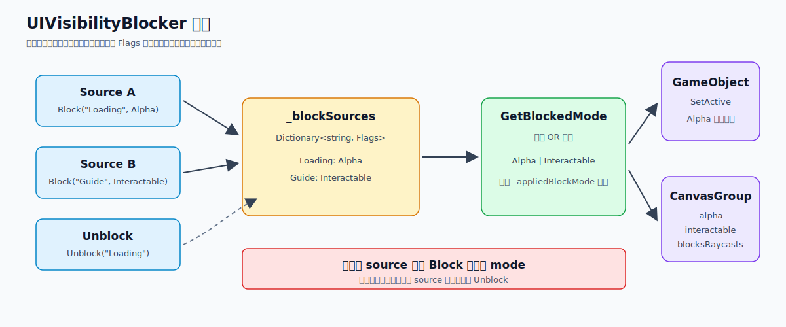

# UIVisibilityBlocker 可见性阻塞器

这里记录一下 `UIVisibilityBlocker`。

源码位置：

```text
UnityToolkit/UnityToolkit/Runtime/UIFramework/UIVisibilityBlocker.cs
```

先说结论：它解决的是“多个来源都可能要求一个 UI 隐藏”的问题。

正常写法里，经常会出现这种情况：

- 新手引导想隐藏某个按钮。
- Loading 流程想隐藏某个按钮。
- 战斗状态想禁用某个按钮。
- 弹窗打开时想挡住某块 UI 的点击。

如果每个地方都直接 `SetActive(false)`，最后就很容易乱。

比如 A 隐藏了 UI，B 也隐藏了 UI。然后 A 恢复显示时直接 `SetActive(true)`，就会把 B 仍然想隐藏的 UI 提前放出来。

`UIVisibilityBlocker` 的做法是记录每个隐藏来源。

只有所有来源都解除后，UI 才真正恢复。



## 核心结构

它主要有两个枚举。

第一个是整体控制模式：

```csharp
public enum VisibilityMode
{
    GameObject,
    CanvasGroup,
}
```

`GameObject` 模式通过 `GameObject.SetActive` 控制显示隐藏。

`CanvasGroup` 模式通过 `CanvasGroup` 控制透明度、交互和射线遮挡。

第二个是具体阻塞内容：

```csharp
[Flags]
public enum VisibilityModeEnum
{
    Alpha = 1 << 0,
    Interactable = 1 << 1,
    BlockRaycasts = 1 << 2,

    All = Alpha | Interactable | BlockRaycasts
}
```

这个枚举是 `Flags`。

所以一次隐藏请求不一定要控制全部内容。

比如：

- 只隐藏显示：`Alpha`
- 只禁用点击：`Interactable | BlockRaycasts`
- 全部隐藏并禁用：`All`

## 多来源阻塞

核心数据结构是：

```csharp
private readonly Dictionary<string, VisibilityModeEnum> _blockSources;
```

key 是来源字符串。

value 是这个来源想阻塞的内容。

调用 `Block` 时：

```csharp
public void Block(string source, VisibilityModeEnum mode = VisibilityModeEnum.All)
{
    _blockSources[source] = mode;
    UpdateVisibility();
    UpdateDebugInfo();
}
```

注意这里是赋值：

```csharp
_blockSources[source] = mode;
```

所以同一个 `source` 重复调用 `Block`，会覆盖之前的 mode。

调用 `Unblock` 时：

```csharp
public void Unblock(string source)
{
    _blockSources.Remove(source);
    UpdateVisibility();
    UpdateDebugInfo();
}
```

所以一定要用同一个 source 字符串解除。

比较推荐写成常量：

```csharp
const string SourceLoading = "Loading";
const string SourceGuide = "Guide";

blocker.Block(SourceLoading);
blocker.Unblock(SourceLoading);
```

不要随手拼一个临时字符串。

尤其不要把时间戳、随机数、对象 hash 拼进去，否则后面基本解不掉。

## 合并规则

当前真正要应用的阻塞状态由 `GetBlockedMode` 计算。

```csharp
private VisibilityModeEnum GetBlockedMode()
{
    var mode = 0;
    foreach (var blockSource in _blockSources)
    {
        mode |= (int)blockSource.Value;
    }

    return (VisibilityModeEnum)mode;
}
```

也就是说，它会把所有来源的 `VisibilityModeEnum` 做一次按位 OR。

例如：

```text
Loading -> Alpha
Guide   -> Interactable

blockedMode = Alpha | Interactable
```

只要还有任意来源阻塞 `Alpha`，UI 就继续隐藏。

只要还有任意来源阻塞 `Interactable`，UI 就继续不可交互。

这个逻辑和引用计数类似，但比简单计数更好排查，因为能看到每个来源。

## GameObject 模式

`GameObject` 模式下，`Alpha` 会映射为 `SetActive`。

代码是：

```csharp
private void ApplyGameObjectMode(VisibilityModeEnum blockedMode)
{
    if (ShouldApplyMode(blockedMode, VisibilityModeEnum.Alpha))
        Target.SetActive(!blockedMode.HasFlag(VisibilityModeEnum.Alpha));

    var cg = CachedCanvasGroup;
    if (cg == null)
        return;

    if (ShouldApplyMode(blockedMode, VisibilityModeEnum.Interactable))
        cg.interactable = !blockedMode.HasFlag(VisibilityModeEnum.Interactable);

    if (ShouldApplyMode(blockedMode, VisibilityModeEnum.BlockRaycasts))
        cg.blocksRaycasts = !blockedMode.HasFlag(VisibilityModeEnum.BlockRaycasts);
}
```

这里有一个细节。

即使是 `GameObject` 模式，如果对象上有 `CanvasGroup`，也会顺手控制：

- `interactable`
- `blocksRaycasts`

但 `Alpha` 控制的是 `Target.SetActive`，不是 `CanvasGroup.alpha`。

所以 `GameObject` 模式适合真正想关掉整个节点的情况。

比如这个 UI 被隐藏后，不希望继续参与布局、Update、子对象逻辑。

## CanvasGroup 模式

`CanvasGroup` 模式不会关闭 GameObject。

它只控制 `CanvasGroup`：

```csharp
private void ApplyCanvasGroupMode(CanvasGroup cg, VisibilityModeEnum blockedMode)
{
    if (ShouldApplyMode(blockedMode, VisibilityModeEnum.Alpha))
        cg.alpha = blockedMode.HasFlag(VisibilityModeEnum.Alpha) ? 0f : 1f;

    if (ShouldApplyMode(blockedMode, VisibilityModeEnum.Interactable))
        cg.interactable = !blockedMode.HasFlag(VisibilityModeEnum.Interactable);

    if (ShouldApplyMode(blockedMode, VisibilityModeEnum.BlockRaycasts))
        cg.blocksRaycasts = !blockedMode.HasFlag(VisibilityModeEnum.BlockRaycasts);
}
```

这种方式适合 UI 还要保持激活，但暂时不可见或不可交互。

比如：

- 想保留布局。
- 想保留脚本生命周期。
- 想做淡入淡出前后的状态切换。
- 只想禁用交互，不想隐藏显示。

如果设置为 `CanvasGroup` 模式，但找不到 `CanvasGroup`，代码会打 Warning，然后回退到 `GameObject` 模式。

## ShouldApplyMode 的作用

这里有一个比较容易忽略的函数：

```csharp
private bool ShouldApplyMode(VisibilityModeEnum currentMode, VisibilityModeEnum mode)
{
    return currentMode.HasFlag(mode) || _appliedBlockMode.HasFlag(mode);
}
```

它不是单纯判断当前 mode 有没有这个 flag。

它还会看上一次已经应用过的 `_appliedBlockMode`。

原因是需要恢复状态。

比如第一帧：

```text
blockedMode = Alpha
```

代码把 UI 隐藏。

下一帧这个来源解除：

```text
blockedMode = 0
```

如果只看当前 mode，`Alpha` 已经不存在，就不会再设置 alpha 或 active。

这样 UI 就永远恢复不了了。

所以需要 `_appliedBlockMode` 记录上一次应用过什么。

当前没有阻塞，但上一次阻塞过，也要再执行一次，把状态恢复回来。

这就是 `ShouldApplyMode` 的意义。

## 调试信息

组件里有两个调试字段：

```csharp
[SerializeField]
private bool showDebugInfo;

[SerializeField]
private List<string> debugBlockSources;
```

`UpdateDebugInfo` 只在 `UNITY_EDITOR` 下生效：

```csharp
[System.Diagnostics.Conditional("UNITY_EDITOR")]
private void UpdateDebugInfo()
```

如果 `showDebugInfo` 打开，Inspector 里会看到当前有哪些来源正在阻塞。

显示格式大概是：

```text
Loading: All
Guide: Interactable, BlockRaycasts
```

这个对排查 UI 不显示很有用。

因为问题通常不是“这个 UI 为什么隐藏了”，而是“是谁还没有 Unblock”。

## 使用方式

最简单的用法：

```csharp
var blocker = GetComponent<UIVisibilityBlocker>();

blocker.Block("Loading");
blocker.Unblock("Loading");
```

只禁用点击，不隐藏：

```csharp
blocker.Block("Guide", VisibilityModeEnum.Interactable | VisibilityModeEnum.BlockRaycasts);
```

只隐藏显示，但保留点击状态的控制权：

```csharp
blocker.Block("FadeOut", VisibilityModeEnum.Alpha);
```

清空所有来源：

```csharp
blocker.ClearAll();
```

`ClearAll` 适合 UI 重置、面板关闭、状态机切换这类场景。

但不要把它当成普通恢复手段乱用。

因为它会清掉所有来源，不管这些来源是不是当前调用者加的。

## 注意点

第一，`source` 不能为空。

代码里会检查空字符串和 null：

```csharp
if (string.IsNullOrEmpty(source))
{
    Debug.LogWarning(...);
    return;
}
```

第二，同一个 source 重复 Block 会覆盖 mode。

这通常是合理的。

比如同一个系统先只禁用点击，后面改成完全隐藏，就直接覆盖即可。

第三，`Unblock` 不会检查 source 是否存在。

不存在就什么都不做。

这让调用方可以在清理时直接 Unblock，不用先查一次。

第四，`OnDestroy` 只清理内部字典。

```csharp
private void OnDestroy()
{
    _blockSources.Clear();
    debugBlockSources.Clear();
    _appliedBlockMode = 0;
}
```

它没有再调用 `UpdateVisibility` 恢复目标状态。

一般组件和 UI 一起销毁时没问题。

但如果目标对象和 blocker 生命周期不一致，就要注意销毁前的显示状态。

第五，`GameObject` 模式会影响激活状态。

如果其他逻辑依赖这个对象一直 active，那就不要用 `GameObject` 模式。

改用 `CanvasGroup` 模式更稳。

第六，`CanvasGroup` 模式要求对象上有 `CanvasGroup`。

没有的话会回退到 `GameObject` 模式。

## 适合什么场景

适合这些情况：

- 多个系统都可能控制同一个 UI 是否显示。
- UI 显示和交互状态需要拆开控制。
- 想知道当前是谁还在隐藏这个 UI。
- 想避免 `SetActive(true/false)` 被不同逻辑互相覆盖。

不太适合这些情况：

- 只有一个地方控制 UI 显隐。
- UI 只是一次性打开关闭。
- 需要复杂动画状态机。
- 需要记录隐藏前的原始 alpha、interactable、blocksRaycasts。

最后一点要注意。

当前实现恢复时会把 alpha 恢复成 `1f`，把 interactable 和 blocksRaycasts 恢复成 `true`。

它不是“保存旧值再恢复旧值”的系统。

如果某个 UI 原本 alpha 就不是 1，或者原本就不可交互，需要额外处理。

## 总结

`UIVisibilityBlocker` 本质上是一个 UI 显隐的多来源阻塞器。

它不复杂，但能解决一个很常见的问题：多个系统同时控制同一个 UI 时，谁也不应该随便把 UI 恢复出来。

核心就是三点：

- 用 `source` 记录来源。
- 用 `VisibilityModeEnum` 区分阻塞内容。
- 用 `_appliedBlockMode` 保证解除后能恢复之前应用过的状态。

如果项目里经常出现 UI 被不同流程反复隐藏、恢复，这种写法比到处 `SetActive` 要清楚很多。

## 参考

- `UnityToolkit/UnityToolkit/Runtime/UIFramework/UIVisibilityBlocker.cs`
