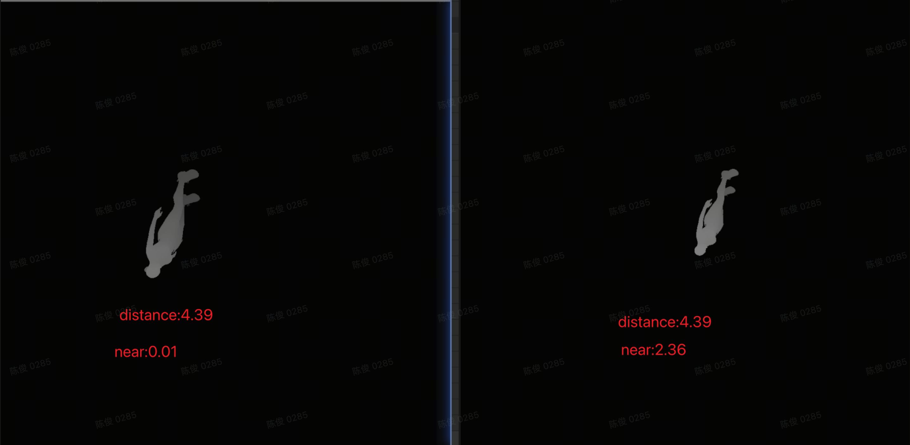

## ShadowMap精度

先说结论: Unity中的阴影距离实际上是 near plane + shadow distance

观察下面两种ShadowMap
- 左边: neap plane = 0.01 , shadow distance = 4.39
- 右边: neap plane = 2.36 , shadow distance = 4.39

可以明显看出左边的人物阴影区域更大， 说明距离的更近了

