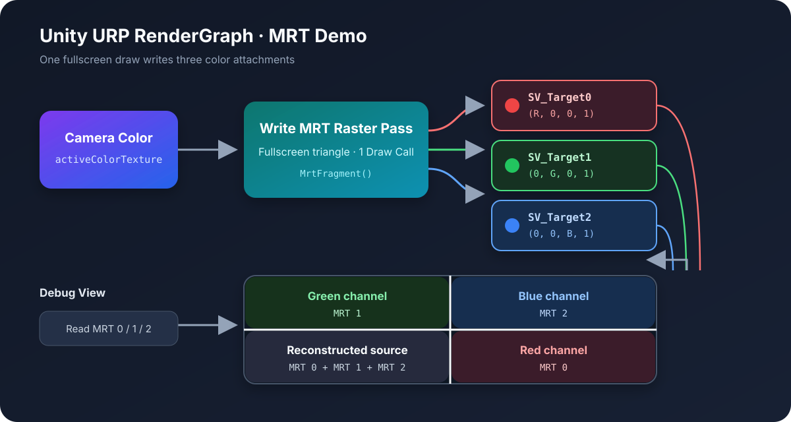
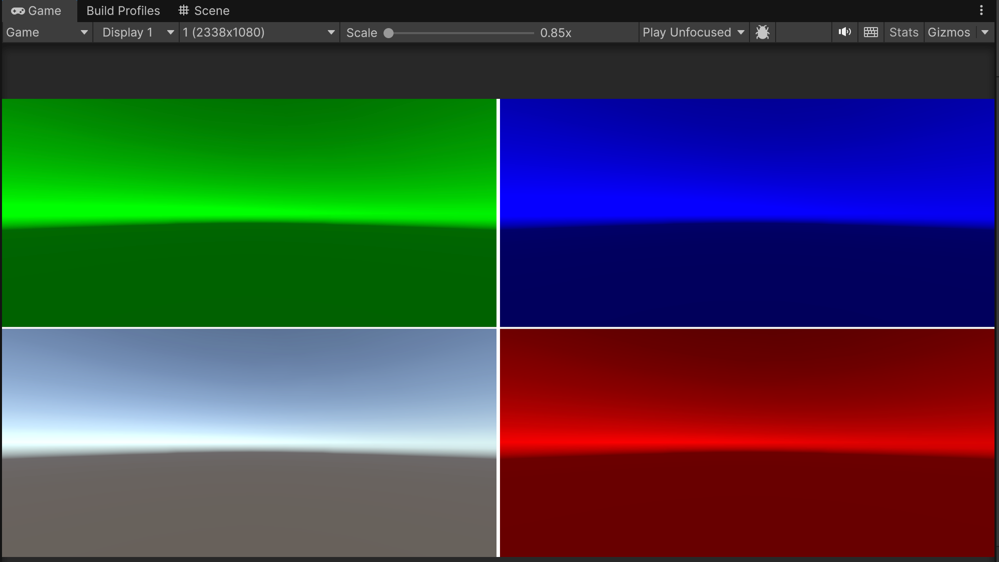

本文在 Unity 6000.3.9f1 和 URP 17.3.0 中实现一个最小的 MRT（Multiple Render Targets）Demo：

- 从当前相机颜色纹理取样
- 用一次全屏 Draw Call 同时写入 3 张 Render Target
- 3 张纹理分别保存原图的 R、G、B 通道
- 再通过一个调试 Pass 将结果显示成四宫格



# MRT是什么

普通片元着色器通常只向 `SV_Target` 输出一个颜色值。MRT 允许同一个片元着色器通过 `SV_Target0`、`SV_Target1`、`SV_Target2` 等语义，同时向多个颜色附件写入数据。

```hlsl
struct MrtOutput
{
    half4 target0 : SV_Target0;
    half4 target1 : SV_Target1;
    half4 target2 : SV_Target2;
};
```

它常用于：

- Deferred Rendering 的 GBuffer
- 同时输出颜色、法线、材质参数或 Mask
- 一次绘制生成多张后处理数据纹理

MRT 可以减少重复的几何处理和 Draw Call，但每多写一张 Render Target 都会增加显存占用和带宽开销，所以并不是输出数量越多越好。

# Demo效果

调试 Pass 会把屏幕分成四块：

- 左下：将 3 张 MRT 纹理相加，重建原始画面的 RGB
- 右下：`SV_Target0`，只保留红色通道
- 左上：`SV_Target1`，只保留绿色通道
- 右上：`SV_Target2`，只保留蓝色通道



# Shader同时写入3张纹理

下面展示的是 Shader 中与 MRT 直接相关的部分。完整 Shader 还需要 URP 的基础 Include、全屏渲染状态和两个 Pass：

```shaderlab
Shader "Hidden/TechExp/MRT Sample"
{
    SubShader
    {
        Tags { "RenderPipeline" = "UniversalPipeline" }
        Cull Off
        ZWrite Off
        ZTest Always

        HLSLINCLUDE
        #pragma target 3.5
        #include "Packages/com.unity.render-pipelines.universal/ShaderLibrary/Core.hlsl"
        #include "Packages/com.unity.render-pipelines.core/ShaderLibrary/GlobalSamplers.hlsl"

        // Attributes、Varyings 和 FullscreenVert 放在这里
        ENDHLSL

        Pass
        {
            Name "Write MRT"
            HLSLPROGRAM
            #pragma vertex FullscreenVert
            #pragma fragment MrtFragment
            // MrtFragment 放在这里
            ENDHLSL
        }

        Pass
        {
            Name "Debug View"
            HLSLPROGRAM
            #pragma vertex FullscreenVert
            #pragma fragment DebugFragment
            // DebugFragment 放在这里
            ENDHLSL
        }
    }

    Fallback Off
}
```

首先使用 `SV_VertexID` 生成一个全屏三角形，不需要额外创建 Mesh。

```hlsl
struct Attributes
{
    uint vertexID : SV_VertexID;
    UNITY_VERTEX_INPUT_INSTANCE_ID
};

struct Varyings
{
    float4 positionCS : SV_POSITION;
    float2 uv : TEXCOORD0;
    UNITY_VERTEX_OUTPUT_STEREO
};

Varyings FullscreenVert(Attributes input)
{
    Varyings output;
    UNITY_SETUP_INSTANCE_ID(input);
    UNITY_INITIALIZE_VERTEX_OUTPUT_STEREO(output);
    output.positionCS = GetFullScreenTriangleVertexPosition(input.vertexID);
    output.uv = GetFullScreenTriangleTexCoord(input.vertexID);
    return output;
}
```

片元着色器读取相机颜色，然后将 R、G、B 分别写入 3 个输出：

```hlsl
TEXTURE2D_X(_MrtSourceTexture);

struct MrtOutput
{
    half4 target0 : SV_Target0;
    half4 target1 : SV_Target1;
    half4 target2 : SV_Target2;
};

MrtOutput MrtFragment(Varyings input)
{
    UNITY_SETUP_STEREO_EYE_INDEX_POST_VERTEX(input);

    half4 source = SAMPLE_TEXTURE2D_X(
        _MrtSourceTexture,
        sampler_LinearClamp,
        input.uv);

    MrtOutput output;
    output.target0 = half4(source.r, 0.0h, 0.0h, 1.0h);
    output.target1 = half4(0.0h, source.g, 0.0h, 1.0h);
    output.target2 = half4(0.0h, 0.0h, source.b, 1.0h);
    return output;
}
```

Shader 里的 `SV_TargetN` 与 RenderGraph 中颜色附件的索引是一一对应的：

| Shader输出 | RenderGraph颜色附件 |
| --- | --- |
| `SV_Target0` | `SetRenderAttachment(mrt0, 0)` |
| `SV_Target1` | `SetRenderAttachment(mrt1, 1)` |
| `SV_Target2` | `SetRenderAttachment(mrt2, 2)` |

# 在RenderGraph中创建MRT

自定义 `ScriptableRenderPass` 通过 `RecordRenderGraph` 录制渲染命令。

首先取得当前相机颜色纹理，并复制它的描述信息来创建 3 张临时纹理：

```csharp
UniversalResourceData resourceData =
    frameData.Get<UniversalResourceData>();

if (resourceData.isActiveTargetBackBuffer)
{
    Debug.LogWarning(
        "MRT Sample: the active color target is the back buffer and cannot be sampled.");
    return;
}

TextureHandle source = resourceData.activeColorTexture;
TextureDesc targetDesc = renderGraph.GetTextureDesc(source);

targetDesc.clearBuffer = true;
targetDesc.clearColor = Color.clear;
targetDesc.bindTextureMS = false;
targetDesc.msaaSamples = MSAASamples.None;
targetDesc.filterMode = FilterMode.Bilinear;
targetDesc.wrapMode = TextureWrapMode.Clamp;

targetDesc.name = "_MrtSample0";
TextureHandle mrt0 = renderGraph.CreateTexture(targetDesc);

targetDesc.name = "_MrtSample1";
TextureHandle mrt1 = renderGraph.CreateTexture(targetDesc);

targetDesc.name = "_MrtSample2";
TextureHandle mrt2 = renderGraph.CreateTexture(targetDesc);
```

这里直接复制相机颜色纹理的 `TextureDesc`，可以保证 3 个附件的尺寸、格式和纹理维度一致。这个 Demo 是全屏后处理，不需要 MSAA，因此将输出纹理的 MSAA 关闭。

先在 `MrtRenderPass` 中缓存 Shader 属性 ID：

```csharp
private static readonly int SourceTextureId =
    Shader.PropertyToID("_MrtSourceTexture");
private static readonly int Mrt0Id =
    Shader.PropertyToID("_MrtSample0");
private static readonly int Mrt1Id =
    Shader.PropertyToID("_MrtSample1");
private static readonly int Mrt2Id =
    Shader.PropertyToID("_MrtSample2");
```

然后在同一个 Raster Pass 中绑定 3 个颜色附件：

```csharp
using (IRasterRenderGraphBuilder builder =
       renderGraph.AddRasterRenderPass<MrtPassData>(
           "MRT Sample: Write 3 Targets",
           out MrtPassData passData))
{
    passData.source = source;
    passData.material = m_Material;
    passData.properties = m_MrtProperties;

    builder.UseTexture(source, AccessFlags.Read);
    builder.SetRenderAttachment(mrt0, 0, AccessFlags.Write);
    builder.SetRenderAttachment(mrt1, 1, AccessFlags.Write);
    builder.SetRenderAttachment(mrt2, 2, AccessFlags.Write);

    builder.SetGlobalTextureAfterPass(
        mrt0, Mrt0Id);
    builder.SetGlobalTextureAfterPass(
        mrt1, Mrt1Id);
    builder.SetGlobalTextureAfterPass(
        mrt2, Mrt2Id);

    builder.SetRenderFunc(static (
        MrtPassData data,
        RasterGraphContext context) =>
    {
        data.properties.Clear();
        data.properties.SetTexture(
            SourceTextureId,
            data.source);

        context.cmd.DrawProcedural(
            Matrix4x4.identity,
            data.material,
            0,
            MeshTopology.Triangles,
            3,
            1,
            data.properties);
    });
}
```

`SetGlobalTextureAfterPass` 会在 Pass 执行后将 3 张纹理设置为全局 Shader 属性，后续 Renderer Feature 可以在同一帧继续读取它们。消费这些全局纹理的 RenderGraph Pass 还必须声明依赖：

```csharp
builder.UseGlobalTexture(Mrt0Id, AccessFlags.Read);
builder.UseGlobalTexture(Mrt1Id, AccessFlags.Read);
builder.UseGlobalTexture(Mrt2Id, AccessFlags.Read);
```

如果后续 Pass 已经持有对应的 `TextureHandle`，也可以像调试 Pass 一样直接使用 `UseTexture`。这里只调用 `SetGlobalTextureAfterPass` 并不会自动建立消费依赖；关闭调试显示且没有任何后续消费者时，MRT Pass 可能会被 RenderGraph 裁剪。

这里创建的是 RenderGraph 临时资源，不能保存 `TextureHandle` 并跨帧使用。

# 调试显示

调试 Pass 读取 3 张输出纹理，将屏幕 UV 映射到四个象限：

```hlsl
TEXTURE2D_X(_MrtSample0);
TEXTURE2D_X(_MrtSample1);
TEXTURE2D_X(_MrtSample2);

half4 DebugFragment(Varyings input) : SV_Target
{
    UNITY_SETUP_STEREO_EYE_INDEX_POST_VERTEX(input);

    float2 quadrantUv = frac(input.uv * 2.0);
    half4 channel0 = SAMPLE_TEXTURE2D_X(
        _MrtSample0, sampler_LinearClamp, quadrantUv);
    half4 channel1 = SAMPLE_TEXTURE2D_X(
        _MrtSample1, sampler_LinearClamp, quadrantUv);
    half4 channel2 = SAMPLE_TEXTURE2D_X(
        _MrtSample2, sampler_LinearClamp, quadrantUv);

    bool right = input.uv.x >= 0.5;
    bool top = input.uv.y >= 0.5;

    if (!right && !top)
        return half4(channel0.rgb + channel1.rgb + channel2.rgb, 1.0h);
    if (right && !top)
        return channel0;
    if (!right && top)
        return channel1;

    return channel2;
}
```

调试 Pass 的 RenderGraph 依赖关系也需要显式声明：

```csharp
builder.UseTexture(mrt0, AccessFlags.Read);
builder.UseTexture(mrt1, AccessFlags.Read);
builder.UseTexture(mrt2, AccessFlags.Read);
builder.SetRenderAttachment(
    resourceData.activeColorTexture,
    0,
    AccessFlags.Write);
```

如果不需要在屏幕上显示四宫格，可以跳过调试 Pass，并让真正的后续消费者声明对 MRT 输出的依赖。

# RendererFeature设置

注入位置由 Renderer Feature 的 Inspector 字段控制，代码默认值是 `AfterRenderingPostProcessing`。它位于主要后处理之后、Final Blit 之前，所以默认读取的是此时的相机颜色：

```csharp
[SerializeField]
private RenderPassEvent m_RenderPassEvent =
    RenderPassEvent.AfterRenderingPostProcessing;

public override void Create()
{
    m_Pass = new MrtRenderPass
    {
        renderPassEvent = m_RenderPassEvent
    };
}

public override void AddRenderPasses(
    ScriptableRenderer renderer,
    ref RenderingData renderingData)
{
    // 省略相机、Material 和硬件能力检查
    m_Pass.renderPassEvent = m_RenderPassEvent;
    m_Pass.Setup(m_Material, m_ShowDebugView);
    renderer.EnqueuePass(m_Pass);
}
```

在 `Setup` 中启用中间颜色纹理，避免相机颜色直接落在无法采样的 Back Buffer 上：

```csharp
internal void Setup(Material material, bool showDebugView)
{
    m_Material = material;
    m_ShowDebugView = showDebugView;
    requiresIntermediateTexture = true;
}
```

中间颜色纹理会带来额外的显存和带宽成本，尤其需要关注 XR 和移动端。即使设置了 `requiresIntermediateTexture`，仍应保留前面的 `isActiveTargetBackBuffer` 检查，不要把需要采样相机颜色的 Pass 放到通常已经进入 Back Buffer 的 `AfterRendering`。

完整配置步骤如下：

1. 创建 `MrtSample.shader` 和对应的 Material。
2. 创建 `MrtRendererFeature.cs`，在 Renderer Data 中添加这个 Renderer Feature。
3. 将 Material 赋值给 Renderer Feature。
4. 将注入位置设为 `After Rendering Post Processing`；如果 Renderer Asset 已经序列化了其他值，以 Inspector 为准。
5. 启用 `Show Debug View` 查看四宫格结果。
6. 在 URP Global Settings 中关闭 Render Graph Compatibility Mode。

这个实现只提供了 `RecordRenderGraph`，没有实现 Compatibility Mode 所需的回退路径，因此开启 Compatibility Mode 后不会执行。

# 平台检查

并不是所有设备都支持同时绑定 3 张颜色纹理。入队前可以通过 `SystemInfo.supportedRenderTargetCount` 检查：

```csharp
const int requiredRenderTargetCount = 3;

if (SystemInfo.supportedRenderTargetCount < requiredRenderTargetCount)
{
    Debug.LogWarning(
        $"MRT requires {requiredRenderTargetCount} render targets, " +
        $"but this device only supports " +
        $"{SystemInfo.supportedRenderTargetCount}.");
    return;
}
```

# 注意事项

- 同一个 Raster Pass 的颜色附件需要保持相同的尺寸和采样数。
- `SetRenderAttachment` 的索引必须与 Shader 中的 `SV_TargetN` 对应。
- 读取当前相机颜色时不能直接采样 Back Buffer，需要让 URP 创建中间颜色纹理。
- RenderGraph 创建的临时纹理只保证在声明的依赖范围内有效，不要跨帧保存 `TextureHandle`。
- 如果需要跨帧保存 MRT 结果，应自行管理 `RenderTexture` 或 `RTHandle`，再通过 `ImportTexture` 导入 RenderGraph。
- `SetGlobalTextureAfterPass` 只负责设置全局属性；消费 Pass 仍要使用 `UseGlobalTexture`、`UseAllGlobalTextures(true)` 或 `UseTexture` 声明读取依赖。
- MRT 减少的是重复绘制，不会减少像素写入量；高分辨率、多附件和高精度格式都会明显增加带宽。
- 如果需要的是后处理前的画面，可以把注入位置改到 `BeforeRenderingPostProcessing`，但要重新确认与其他 Renderer Feature 的执行顺序。
- Camera Stack 中每个 Base 或 Overlay Camera 都可能执行 Renderer Feature 并覆盖相同的全局纹理，需要根据 `cameraData.renderType` 或 `resolveFinalTarget` 过滤目标相机。
- 本例把 3 张输出纹理的 Alpha 都写成了 1，因此四宫格左下只重建 RGB，并不还原原图 Alpha。

MRT 的核心就是两处：Shader 使用多个 `SV_TargetN` 输出，RenderGraph 使用相同索引绑定多个颜色附件。把这两个索引对齐之后，就可以在一次绘制中生成多份屏幕空间数据。
