我把 Mipmap 理解为：**预先算好的平均结果**。

它真正解决的问题是一个屏幕像素其实往往对应了纹理中的一片区域。
如果直接按UV取一个值，可以得到这个点对应的纹理贴图上对应位置是什么颜色；
但渲染需要的是“这片区域整体是什么颜色”。
如果每帧都临时计算区域平均，代价太高，于是把不同尺度的过滤结果提前算好，运行时只选择合适的一层。


# 从一个 UV 到 Pixel Footprint

片元着色器收到的是一个确定的 UV，屏幕像素在纹理空间中覆盖的却是一片区域。

设屏幕坐标到纹理坐标的映射为：

$$T(x,y)=(u(x,y),v(x,y))$$

一个屏幕像素占据的方形区域记作 $P$，映射到纹理空间以后得到：

$$F=T(P)$$

$F$ 就是这个像素在纹理空间中的 **footprint**。像素中心 $(x_c,y_c)$ 经过 $T$ 映射后仍然只是一个 UV 点；像素四个角映射出的四个 UV 围成的区域，才是这个像素需要代表的纹理范围。

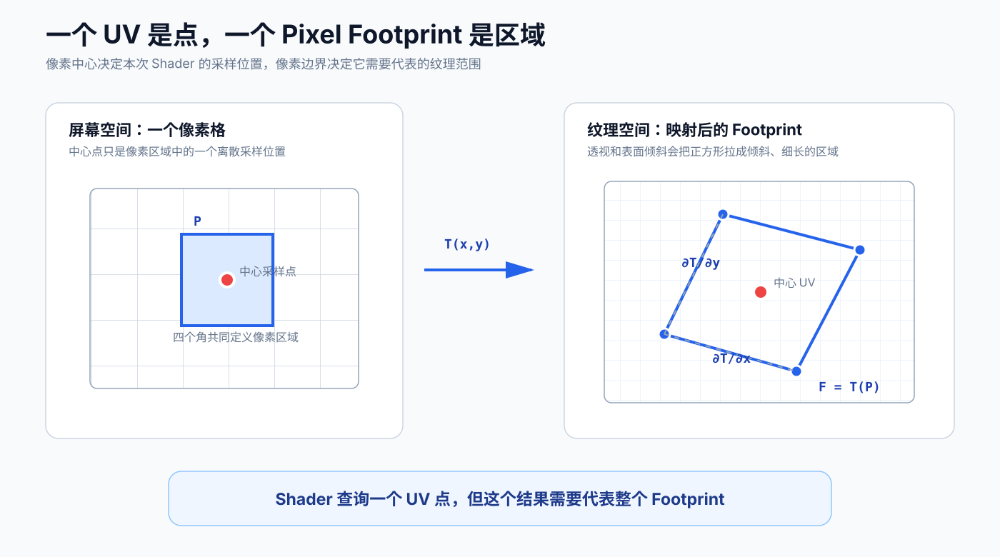

在一个三角形内部，GPU 对顶点 UV 做透视正确插值。映射 $T$ 通常不是全局线性的，但在一个像素附近可以用一阶 Taylor 展开近似：

$$
T(x_c+\Delta x,y_c+\Delta y)
\approx
T(x_c,y_c)+
\frac{\partial T}{\partial x}\Delta x+
\frac{\partial T}{\partial y}\Delta y
$$

把两个偏导写开：

$$
\frac{\partial T}{\partial x}=
\left(\frac{\partial u}{\partial x},\frac{\partial v}{\partial x}\right),
\qquad
\frac{\partial T}{\partial y}=
\left(\frac{\partial u}{\partial y},\frac{\partial v}{\partial y}\right)
$$

它们分别描述屏幕坐标向右、向上移动一个像素时，UV 会移动多少。也就是说，这两个向量已经给出了 footprint 的两条局部边。

## 一个具体的数量级

把一张宽度为 4096 texel 的纹理完整贴到一个只有 8 pixel 宽的平面上。先忽略透视，水平方向的映射可以写成：

$$u(x)=\frac{x}{8}$$

一个像素的宽度是 1，所以它映射到纹理空间后的 UV 宽度为：

$$\Delta u=\frac{1}{8}$$

再乘纹理宽度：

$$4096\times\frac{1}{8}=512$$

片元着色器仍然只得到一个中心 UV，但这个像素在水平方向覆盖了约 512 个 texel。如果纵向也是相同比例，footprint 就会覆盖约 $512\times512$ 个 texel。

这里真正关心的不是物体离相机多远，而是 **UV 在相邻屏幕像素之间变化得有多快**。距离、FOV、分辨率、模型缩放、表面朝向和 UV Tiling 最终都会反映到这个变化率里。

# 双线性插值解决不了区域采样

给定一个 UV，双线性插值会读取附近四个 texel：

$$
C(u,v)=(1-s)(1-t)C_{00}+s(1-t)C_{10}+(1-s)tC_{01}+stC_{11}
$$

它解决的是离散纹理的重建问题：UV 落在 texel 之间时，怎样得到连续变化的颜色。纹理被放大时，这可以消除 Nearest Sampling 带来的方块和跳变。

但纹理缩小时，问题已经变了。假设一个 footprint 覆盖 $512\times512$ 个基础 texel，Level 0 的双线性采样仍然只看中心附近的 $2\times2$ 个 texel。四个局部样本无论怎样插值，都不能代表整片区域。

黑白棋盘格很容易暴露这个问题。一个屏幕像素如果覆盖许多黑格和白格，理想结果应该接近灰色。中心采样却可能落在黑色、白色或两者的边缘。相邻像素的 UV 又会跨过大量 texel，于是原本细密的纹理会被重新拼成宽大的明暗条带，也就是摩尔纹。

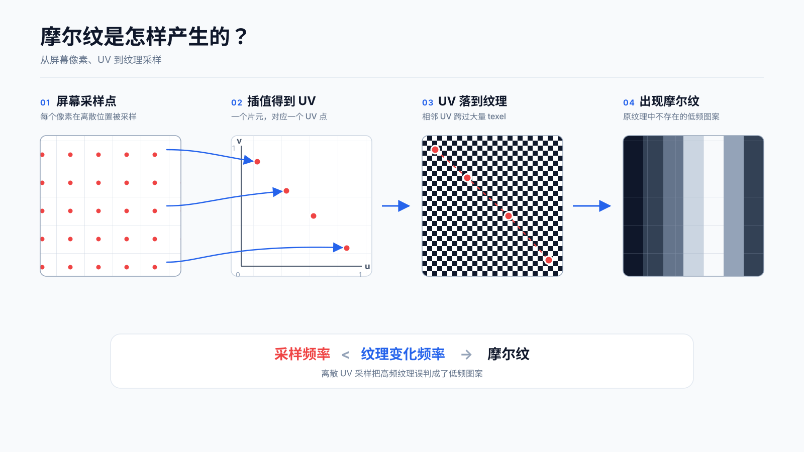

从采样理论看，如果投影到屏幕后的纹理频率超过屏幕采样频率的一半：

$$f_{texture}>\frac{f_{sample}}{2}$$

就超过了 Nyquist 频率。采样后的离散序列无法区分原来的高频信号，高频会折叠成并不存在的低频图案。摩尔纹是其中一种表现；噪点、闪烁和爬动也可能来自同一类欠采样。

# 从点查询改成区域积分

如果暂时不考虑实时开销，一个像素的颜色更接近对整个像素区域积分：

$$
C_{pixel}=\frac{1}{A_P}\int_P C(T(x,y))\mathrm{d}x\mathrm{d}y
$$

当一个像素内部的映射可以看作仿射变换，Jacobian 近似为常量，上式也可以写成对纹理 footprint 的面积平均：

$$
C_{pixel}\approx\frac{1}{A_F}\int_F C(u,v)\mathrm{d}u\mathrm{d}v
$$

这一步把纹理查询从 Point Query 变成了 Area Query。直接实现它，需要找出所有与 footprint 相交的 texel，再按覆盖面积加权。footprint 可能是旋转、倾斜的四边形，也可能跨过 UV 接缝和三角形边界，精确积分并不便宜。

另一条路是在屏幕像素内部做超采样。仍然使用前面的 $4096\rightarrow8$ 例子，如果横纵方向都放置 512 个子采样点，就需要：

$$512^2=262144$$

次纹理查询。如果每次查询还是双线性过滤，理论上的基础 texel tap 数量会达到：

$$512^2\times4=1048576$$

纹理空间遍历和屏幕空间超采样是在两个不同空间里逼近同一个积分。它们能说明正确答案是什么，却不适合常规实时渲染。

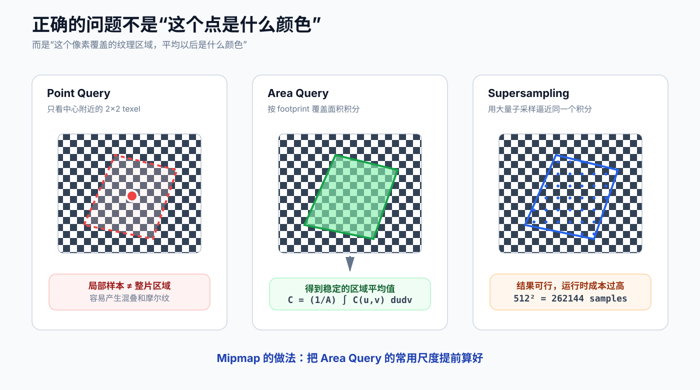

# Mipmap：把平均提前算好

Mipmap 把最昂贵的部分挪到了资源生成阶段。Level 0 保存原图，后面的每一级先做低通滤波，再把宽高各缩小一半。最简单的 Box Filter 写成：

$$
C_{l+1}(x,y)=\frac{1}{4}
\sum_{i=0}^{1}\sum_{j=0}^{1}C_l(2x+i,2y+j)
$$

对于 Box Filter，Level $l$ 中的一个 texel 对应 Level 0 中约 $2^l\times2^l$ 范围的平均结果。实际的离线生成器也可以使用覆盖范围更大、频率响应更好的滤波核，因此更准确的说法是“预先算好的低通结果”；在这篇文章的推导里，仍然把它简称为平均结果。

一张 $4096\times4096$ 纹理的 Mipmap Chain 是这样的：

| Level | 分辨率 | 一个 mip texel 约覆盖的 Level 0 区域 |
| --- | ---: | ---: |
| 0 | $4096\times4096$ | $1\times1$ |
| 1 | $2048\times2048$ | $2\times2$ |
| 2 | $1024\times1024$ | $4\times4$ |
| 3 | $512\times512$ | $8\times8$ |
| ... | ... | ... |
| 9 | $8\times8$ | $512\times512$ |
| 12 | $1\times1$ | 整张纹理 |

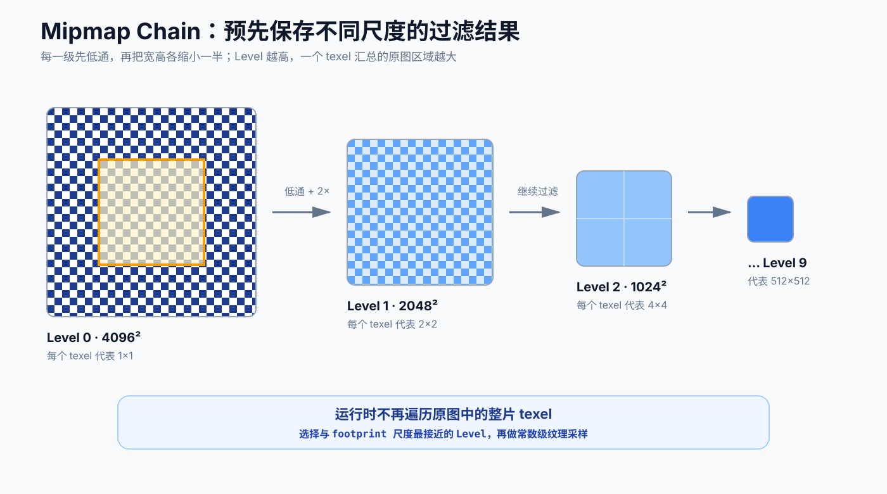

前面的 footprint 恰好是 $512\times512$，而 $2^9=512$。查询 Level 9 时，一个 mip texel 已经汇总了这片 Level 0 区域。运行时不再读取几十万个基础 texel，只要在 Level 9 附近做一次常数级查询。

这仍然是近似。Mipmap 预过滤的是轴对齐的方形区域，不可能用四个值精确重建任意形状的 footprint。它的价值在于，把昂贵的任意面积查询变成了对相近尺度预过滤结果的少量采样。

“MIP”来自拉丁语 *multum in parvo*，大意是“在很小的空间里放入很多东西”。Lance Williams 在 1983 年的论文 *Pyramidal Parametrics* 中系统描述了这套金字塔式纹理过滤方法。这个名字也很贴切：一条纹理链用额外约三分之一的空间，保存了从原始细节到整张纹理平均值的所有常用尺度。

# GPU 如何算出 LOD

纹理链生成以后，运行时还要回答一个问题：当前片元应该读取哪一级？

设纹理尺寸为 $W\times H$。UV 偏导是归一化纹理坐标，需要乘纹理尺寸，才能得到以 texel 为单位的 footprint 边向量：

$$
\mathbf{g}_x=
\left(W\frac{\partial u}{\partial x},
H\frac{\partial v}{\partial x}\right)
$$

$$
\mathbf{g}_y=
\left(W\frac{\partial u}{\partial y},
H\frac{\partial v}{\partial y}\right)
$$

$\mathbf{g}_x$ 表示屏幕向右一个像素会跨过多少 texel，$\mathbf{g}_y$ 表示屏幕向上一个像素会跨过多少 texel。一种常见的各向同性尺度估计是：

$$
\rho_x=\lVert\mathbf{g}_x\rVert,
\qquad
\rho_y=\lVert\mathbf{g}_y\rVert
$$

$$
\rho=\max(\rho_x,\rho_y)
$$

Level 每增加 1，线性尺度扩大 2 倍，所以连续 LOD 为：

$$\lambda=\log_2\rho$$

代入几个值就能看出对数从哪里来：

| $\rho$ | 一个屏幕像素约跨过的 texel | $\lambda$ |
| ---: | ---: | ---: |
| 1 | 1 | 0 |
| 2 | 2 | 1 |
| 4 | 4 | 2 |
| 8 | 8 | 3 |
| 512 | 512 | 9 |

当 $\rho<1$ 时，$\lambda$ 为负，说明当前属于纹理放大；采样器会使用 Level 0 的放大过滤。实际 API 还会叠加 LOD Bias，并把结果裁剪到纹理存在的 Level 范围内。

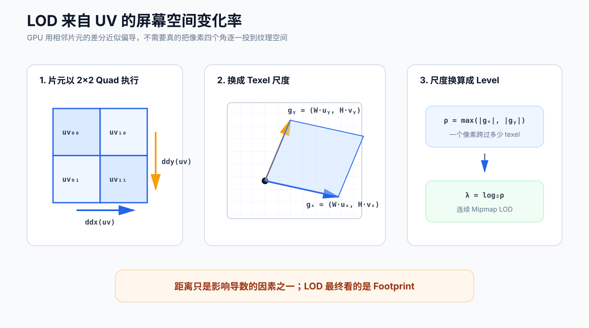

片元着色器通常以 $2\times2$ 的 quad 组织执行，相邻 lane 之间的差分可以近似偏导数。在 Unity URP 的 HLSL 中可以直接写：

```hlsl
float2 uvDx = ddx(uv);
float2 uvDy = ddy(uv);
```

普通采样不需要手动计算这些值：

```hlsl
half4 color = SAMPLE_TEXTURE2D(_BaseMap, sampler_BaseMap, uv);
```

`SAMPLE_TEXTURE2D` 最终使用隐式导数完成 LOD 选择。只有使用显式 LOD、显式梯度，或者处在无法获得隐式导数的 Shader Stage 时，才需要换成对应的采样接口。

用中心 UV 和两个导数，也可以近似还原像素四个角：

$$
uv_{corner}\approx uv_c+
\alpha\frac{\partial uv}{\partial x}+
\beta\frac{\partial uv}{\partial y},
\qquad
\alpha,\beta\in\{-0.5,0.5\}
$$

所以“四个角围出 footprint”和“通过 `ddx`、`ddy` 估计 footprint”并不是两套原理，只是两种描述方式。

# Nearest、Bilinear 和 Trilinear 分别做什么

Mipmap 决定了可用的过滤尺度，Sampler 还要决定怎样读取这些数据。

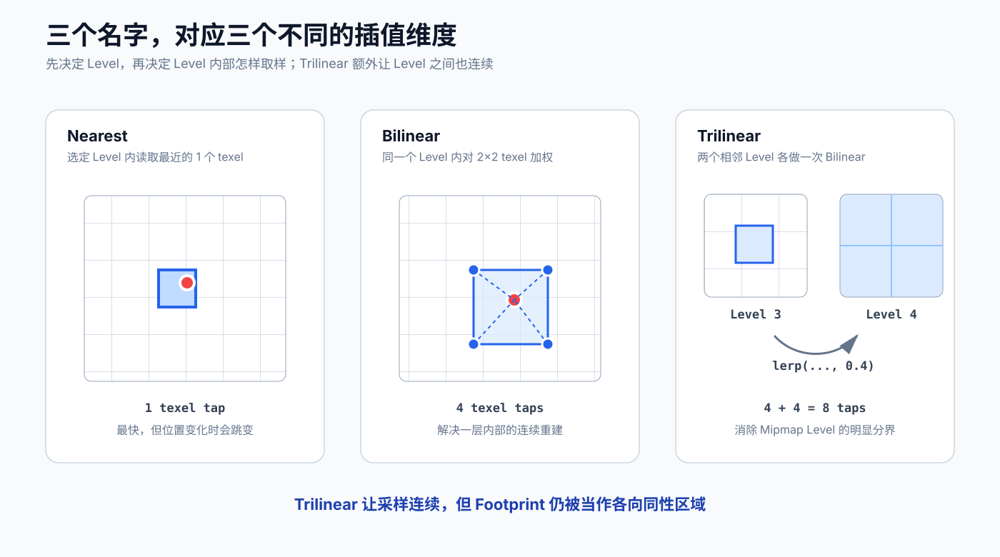

**Nearest** 在选定 Level 中取最近的一个 texel，便宜但不连续。

**Bilinear** 在一个 Level 中读取相邻四个 texel并插值。它处理的是同一层内部的连续性，不能消除 Level 之间的切换。

**Trilinear** 同时在相邻两个 Level 做 Bilinear，再按连续 LOD 的小数部分插值。假设 $\lambda=3.4$：

$$
C=0.6C_3+0.4C_4
$$

其中 $C_3$、$C_4$ 分别是 Level 3 和 Level 4 的双线性结果。从概念上看，它需要 $4+4=8$ 个 texel tap。硬件如何合并请求和利用缓存属于实现细节，但“两个 Level、每层一次双线性”这个理解是成立的。

Trilinear 消除了明显的 mip level 分界，却没有改变各向同性假设：它仍然用一个方形尺度近似 footprint。

# 各向异性过滤：正方形不够用了

斜着看地面时，屏幕上的一个像素映射到纹理空间，往往不是接近正方形，而是一条又长又窄的区域：

如果按长轴选择一个足够低分辨率的 mip level，短轴也会一起被强烈低通，远处地面就会糊成一片；如果按短轴选择较高分辨率，长轴方向又会欠采样，摩尔纹和闪烁会回来。

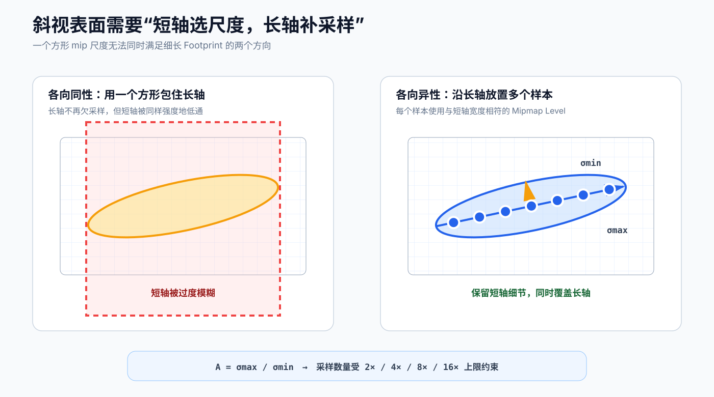

## 从 Jacobian 求长轴和短轴

前面已经得到 $\mathbf{g}_x$ 和 $\mathbf{g}_y$。把它们作为列向量组成局部 Jacobian：

$$
J=
\begin{bmatrix}
W\frac{\partial u}{\partial x} & W\frac{\partial u}{\partial y}\\
H\frac{\partial v}{\partial x} & H\frac{\partial v}{\partial y}
\end{bmatrix}
=
\begin{bmatrix}\mathbf{g}_x & \mathbf{g}_y\end{bmatrix}
$$

它把屏幕空间的单位方形变成纹理空间中的平行四边形。为了得到与坐标轴无关的长短轴，可以把 footprint 近似成椭圆，再计算 $J$ 的两个奇异值。

令：

$$
a=\mathbf{g}_x\cdot\mathbf{g}_x,
\qquad
b=\mathbf{g}_x\cdot\mathbf{g}_y,
\qquad
c=\mathbf{g}_y\cdot\mathbf{g}_y
$$

$J^TJ$ 的两个特征值为：

$$
\mu_{\pm}=\frac{(a+c)\pm\sqrt{(a-c)^2+4b^2}}{2}
$$

对应的奇异值是：

$$
\sigma_{max}=\sqrt{\mu_+},
\qquad
\sigma_{min}=\sqrt{\mu_-}
$$

$\sigma_{max}$ 和 $\sigma_{min}$ 就是局部 footprint 的长轴、短轴尺度，各向异性比可以写成：

$$
A=\frac{\sigma_{max}}{\max(\sigma_{min},\varepsilon)}
$$

前面各向同性 LOD 使用的 $\max(\lVert\mathbf{g}_x\rVert,\lVert\mathbf{g}_y\rVert)$ 是一种常见且便于计算的近似；奇异值分解则把 footprint 的旋转也考虑进来了。实际 GPU 的精确估计和采样模式由硬件实现决定，不一定逐字执行上面的公式，但几何含义相同。

## 普通 Mipmap 加上多次定向采样

各向异性过滤的思路是：根据短轴选择基础 mip 尺度，再沿长轴方向取多次样本并合并。

概念上可以写成：

$$
\lambda_{minor}\approx\log_2\max(\sigma_{min},1)
$$

$$
N\approx\left\lceil
\frac{\sigma_{max}}{\max(\sigma_{min},1)}
\right\rceil
$$

然后把 $N$ 限制在 Sampler 允许的最大各向异性等级内。每个样本负责长轴上的一段，使用与短轴宽度相符的 mip level；合起来以后，长轴得到足够的覆盖，短轴又不会被无谓地模糊。

Unity 纹理设置中的 2x、4x、8x、16x 表示允许的最大各向异性程度，不应该机械理解成永远执行固定次数的纹理查询。真实 tap 数、权重和优化方式由平台与 GPU 决定。

斜向 footprint 也能处理，因为采样方向来自 footprint 的长轴，并不局限于纹理的水平或垂直方向。它仍有上限：当 $A$ 超过最大各向异性等级时，采样器只能扩大短轴方向的过滤范围或者减少长轴覆盖精度，结果会重新变糊或出现残余混叠。

## Ripmap 和各向异性过滤不是一回事

一种很直观的扩展是分别沿 U、V 方向生成不同缩放组合：$1\times2$、$1\times4$、$2\times1$、$4\times1$……这类结构叫 **Ripmap**。它能直接查询轴对齐的矩形平均值，但要保存所有横纵尺度组合，完整存储量趋近 Level 0 的 4 倍：

$$
\left(1+\frac12+\frac14+\cdots\right)^2=4
$$

普通 Mipmap 只有相同横纵尺度的对角线组合，完整存储量则是：

$$
1+\frac14+\frac1{16}+\cdots=\frac43
$$

Ripmap 对旋转后的细长 footprint 仍然不是精确解。现代 GPU 常见的各向异性过滤不要求纹理额外生成一套 Ripmap，而是在普通 Mipmap Chain 上做多次定向采样。把这两个概念分开以后，“各向异性过滤为什么能处理斜着看的地面”就比较容易理解了。

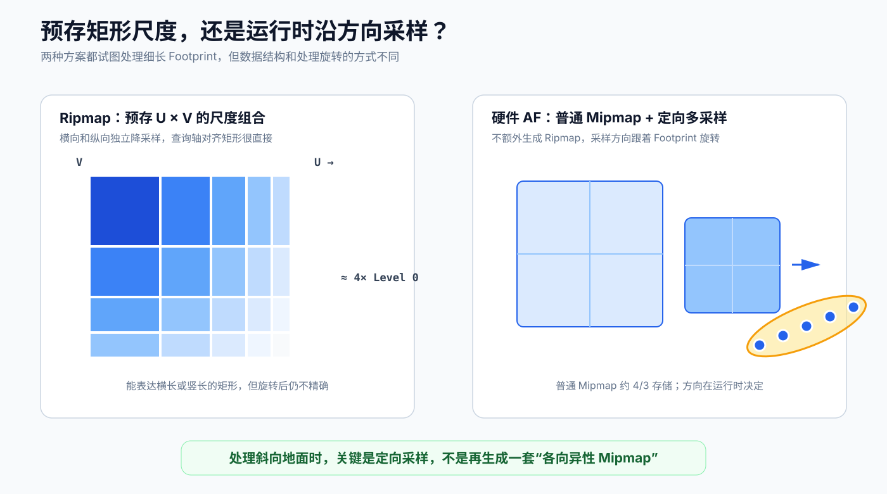

# 在 Unity URP 中把 LOD 显示出来

下面这个 Shader 不会读取 GPU 内部最终选中的私有状态，而是用前面同样的导数公式重建常见的各向同性 LOD 近似，再把 LOD 四舍五入后映射成颜色。这样做的目的，是直接观察模型倾斜、相机距离、纹理尺寸和 Tiling 怎样共同改变 footprint。

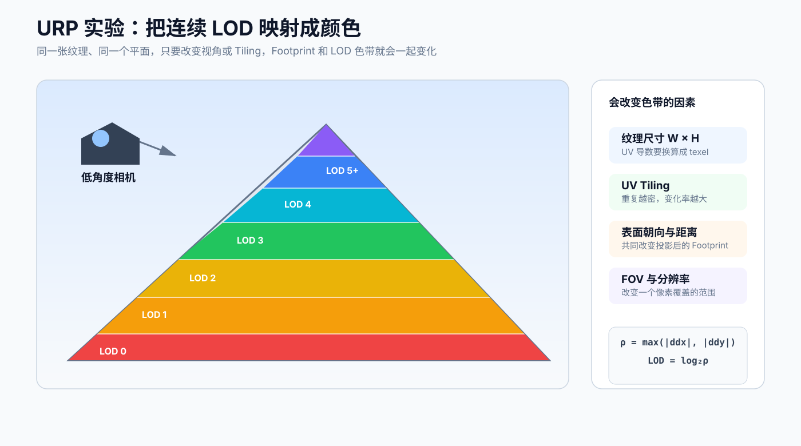

```shaderlab
Shader "Nicoier/MipmapLODVisualizer"
{
    Properties
    {
        _BaseMap("Base Map", 2D) = "white" {}
        _MipColorStrength("Mip Color Strength", Range(0, 1)) = 1
    }

    SubShader
    {
        Tags
        {
            "RenderType" = "Opaque"
            "RenderPipeline" = "UniversalPipeline"
        }

        Pass
        {
            Name "MipLODVisualizer"
            Tags { "LightMode" = "UniversalForward" }

            HLSLPROGRAM
            #pragma target 3.5
            #pragma vertex Vert
            #pragma fragment Frag

            #include "Packages/com.unity.render-pipelines.universal/ShaderLibrary/Core.hlsl"

            struct Attributes
            {
                float4 positionOS : POSITION;
                float2 uv : TEXCOORD0;
            };

            struct Varyings
            {
                float4 positionHCS : SV_POSITION;
                float2 uv : TEXCOORD0;
            };

            TEXTURE2D(_BaseMap);
            SAMPLER(sampler_BaseMap);

            CBUFFER_START(UnityPerMaterial)
                float4 _BaseMap_ST;
                float4 _BaseMap_TexelSize;
                float _MipColorStrength;
            CBUFFER_END

            Varyings Vert(Attributes input)
            {
                Varyings output;
                output.positionHCS = TransformObjectToHClip(input.positionOS.xyz);
                output.uv = input.uv * _BaseMap_ST.xy + _BaseMap_ST.zw;
                return output;
            }

            half4 Frag(Varyings input) : SV_Target
            {
                // _BaseMap_TexelSize.zw 是纹理的宽和高。
                float2 texelCoord = input.uv * _BaseMap_TexelSize.zw;
                float2 gx = ddx(texelCoord);
                float2 gy = ddy(texelCoord);

                float rho = max(length(gx), length(gy));
                float lod = max(0.0, log2(max(rho, 1e-8)));

                // 四舍五入只用于显示清晰的色带；Trilinear 的真实 LOD 是连续值。
                float mipBand = floor(lod + 0.5);
                float3 mipColor = 0.5 + 0.5 * cos(
                    6.2831853 * (mipBand * 0.17 + float3(0.0, 0.33, 0.67)));

                // 普通隐式 LOD 采样，Sampler 会自动使用导数选择 Mipmap。
                half4 baseColor = SAMPLE_TEXTURE2D(
                    _BaseMap,
                    sampler_BaseMap,
                    input.uv);

                half3 color = lerp(
                    baseColor.rgb,
                    (half3)mipColor,
                    _MipColorStrength);
                return half4(color, 1.0);
            }
            ENDHLSL
        }
    }
}
```

- 准备一张高频棋盘格纹理，启用 Generate Mip Maps，先把 Filter Mode 设为 Trilinear。
- 把材质赋给一个拉长的 Plane，将纹理 Tiling 调到 32 或更高。
- 把相机压低，以接近贴地的角度观察 Plane。
- 移动相机、改变分辨率、修改 Tiling 或替换不同尺寸的纹理，色带边界都会变化。

先看棋盘格本身。低角度观察高频纹理时，远处一个屏幕像素会跨过大量 texel；如果预过滤不足，画面就会出现明显的波纹和摩尔纹：

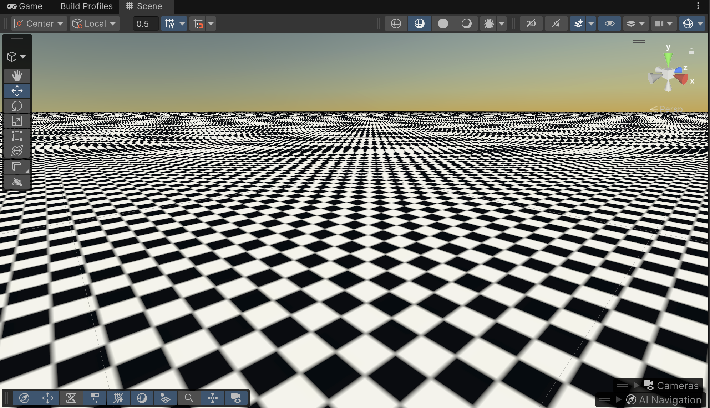

让采样器使用 Mipmap Chain 后，远处会逐步读取更低分辨率的预过滤结果。纹理变得稳定，但斜视时各向同性的方形过滤范围也会让远处细节更早变糊：

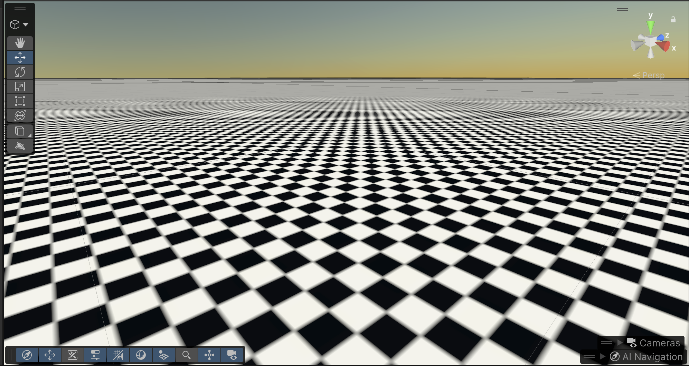

把 `Mip Color Strength` 调到 1，同一个画面就会按照重建出的整数 LOD 显示成色带：

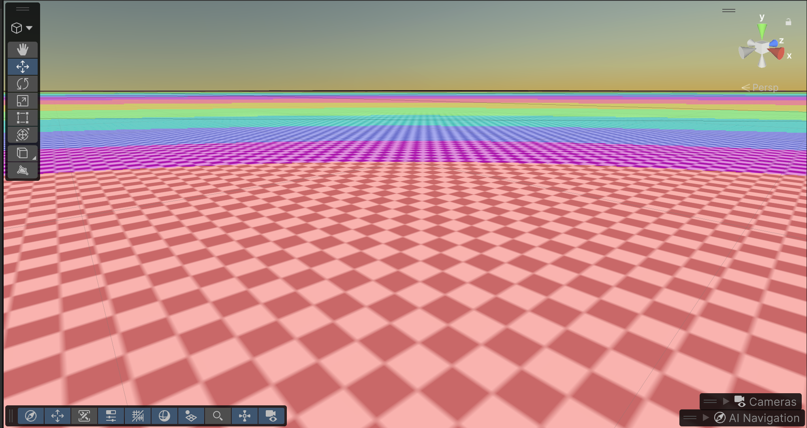

下面的录屏展示了相机逐渐靠近表面时，pixel footprint 变小，LOD 色带边界随之在平面上移动的过程：

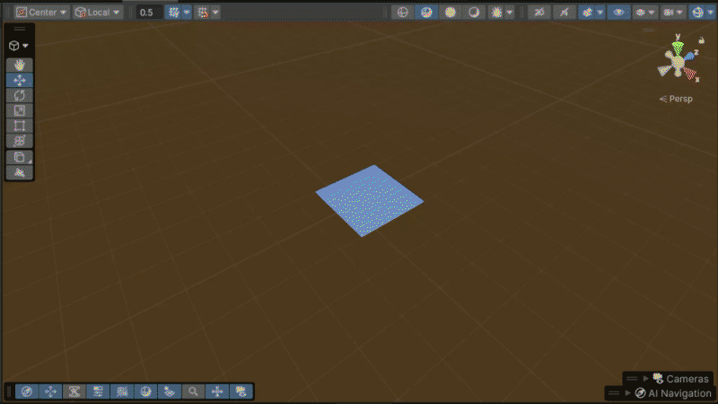

这个实验显示的是各向同性 LOD 估计。打开各向异性过滤以后，硬件会继续使用 footprint 的方向和长宽比执行多次查询，但 Shader 里算出的单个 `lod` 不会把这些额外 tap 展示出来。

# 生成 Mipmap 时，平均什么很重要

Mipmap 不是把所有纹理都当普通 RGB 图片缩小。平均方式必须符合数据的含义。

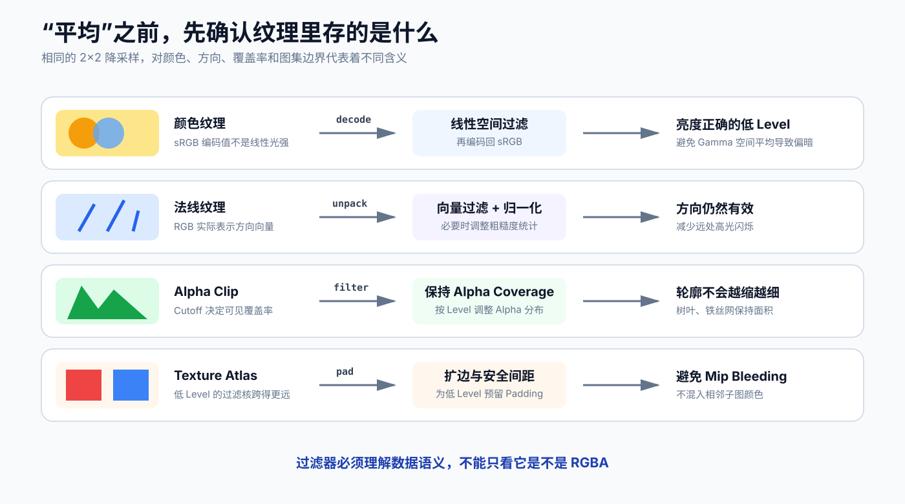

- **颜色纹理**：sRGB 颜色应先解码到线性空间，在线性空间过滤，再编码回 sRGB。直接平均 Gamma 编码值会让低 Level 的亮度不正确。
- **法线纹理**：先把存储值还原为方向，再过滤并重新归一化。远处高光闪烁还与法线分布和粗糙度有关，单纯归一化并不能保留完整的微表面统计。
- **Alpha Clip 纹理**：普通平均会改变 Cutoff 以上的覆盖率，树叶和铁丝网可能随着 mip level 增加而逐渐变细。生成时通常要保持 Alpha Coverage。
- **Mask 和数据纹理**：粗糙度、金属度、AO、高度等通道能否直接平均，取决于这些数值进入后续公式的方式，不能只因为它们被打包在 RGBA 中就统一处理。
- **Texture Atlas**：越低的 Level 过滤范围越大。子图之间没有足够 padding 时，相邻区域会混在一起，形成 mip bleeding。

这也是为什么同样叫“生成 Mipmap”，颜色、法线、植被 Alpha 和数据纹理可能需要不同的导入设置或离线处理。

# 存储和运行时成本

二维纹理每一级的宽高各减半，面积变成上一层的 $\frac14$。完整 Mipmap Chain 相对 Level 0 的总面积为：

$$
1+\frac14+\frac1{16}+\frac1{64}+\cdots=\frac43
$$

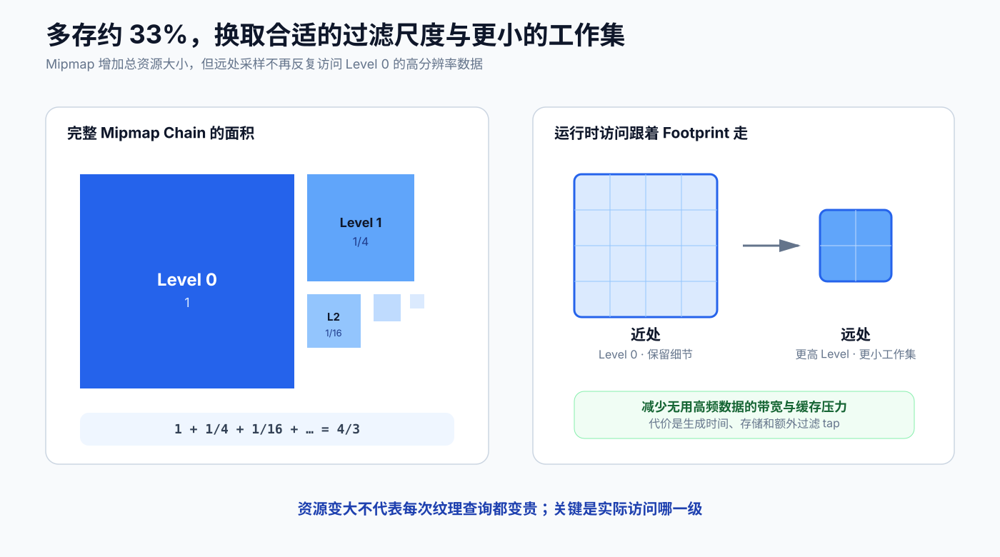

所以它通常增加约 33% 的纹理存储。换来的不只是更少的摩尔纹：远处物体读取较小的 mip level，工作集更小，纹理缓存命中率通常更高，也避免把不会显示出来的高频数据持续搬进缓存。

Trilinear 和各向异性过滤会增加采样工作，但这不等于打开 Mipmap 一定更慢。实际性能取决于纹理带宽、缓存、采样器吞吐和场景中的缩小比例。纹理流送还可以利用这条层级结构，只让当前需要的 Level 驻留在显存中。

# 对 TAA 的延伸思考

写到这里很容易想到另一个问题：既然摩尔纹来自采样不足，而 TAA 会在不同帧改变亚像素采样位置，它能不能缓解纹理摩尔纹？

理论上可以。投影矩阵加入 jitter 后，同一个屏幕像素在不同帧落到略有差异的位置，也会得到不同的 UV。历史累积可以写成：

$$
C_{TAA}=\sum_{k=1}^{N}w_kC(u_k,v_k)
$$

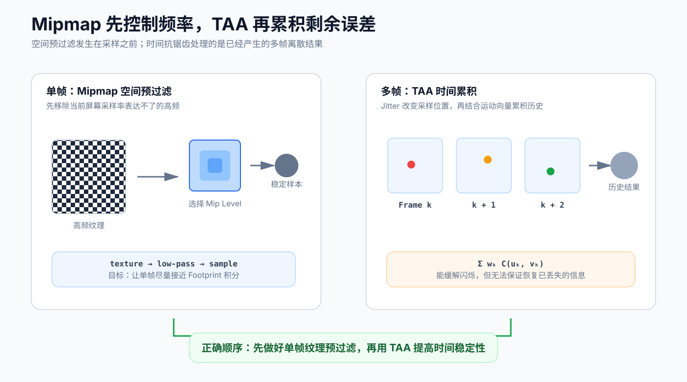

如果不同帧分别采到棋盘格中的黑色和白色，累积结果确实可能趋近灰色。因此 TAA 往往能减轻纹理混叠带来的闪烁、爬动和一部分摩尔纹。

但这里有一个顺序问题：Mipmap 在采样前压低超过 Nyquist 上限的高频，TAA 累积的是采样后已经离散化的结果。少量 jitter 不一定覆盖一个很大的 footprint；稳定的错误低频图案也可能被历史完整保留。镜头运动、遮挡变化、透明物体、UV 动画、历史拒绝和错误运动向量都会进一步破坏积累。

所以我的结论是：**TAA 可以缓解 Mipmap 没有完全处理掉的时间不稳定性，但不能替代纹理预过滤。** 先让单帧采样尽量接近正确的区域积分，再让 TAA 处理剩余误差，这两步并不冲突。

# 现在怎样理解 Mipmap

回到开头那句话，Mipmap 就是预先算好的平均结果。更完整一点说：它是一组预过滤的多分辨率纹理，用来近似屏幕像素在纹理空间中的面积积分。

GPU 通过 UV 的屏幕空间导数估计 footprint，用 $\lambda=\log_2\rho$ 把线性尺度转换为 mip level；Bilinear 处理一层内部的连续采样，Trilinear 处理两层之间的连续过渡；footprint 变得细长时，各向异性过滤再根据长轴方向和长宽比增加采样。


# 参考资料

1. Lance Williams, *Pyramidal Parametrics*: <https://doi.org/10.1145/800059.801126>
2. 计算机图形学七：纹理映射及 Mipmap 技术：<https://zhuanlan.zhihu.com/p/144332091>
3. Unity Manual：Texture Import Settings：<https://docs.unity3d.com/6000.0/Documentation/Manual/texture-type-default.html>
4. Unity Manual：Write an unlit basic shader in URP：<https://docs.unity3d.com/6000.0/Documentation/Manual/urp/writing-shaders-urp-basic-unlit-structure.html>
5. Microsoft Learn：Sample (DirectX HLSL Texture Object)：<https://learn.microsoft.com/en-us/windows/win32/direct3dhlsl/dx-graphics-hlsl-to-sample>
6. Microsoft Learn：ddx (DirectX HLSL)：<https://learn.microsoft.com/en-us/windows/win32/direct3dhlsl/dx-graphics-hlsl-ddx>
7. OpenGL 4.6 Core Specification：<https://registry.khronos.org/OpenGL/specs/gl/glspec46.core.pdf>
