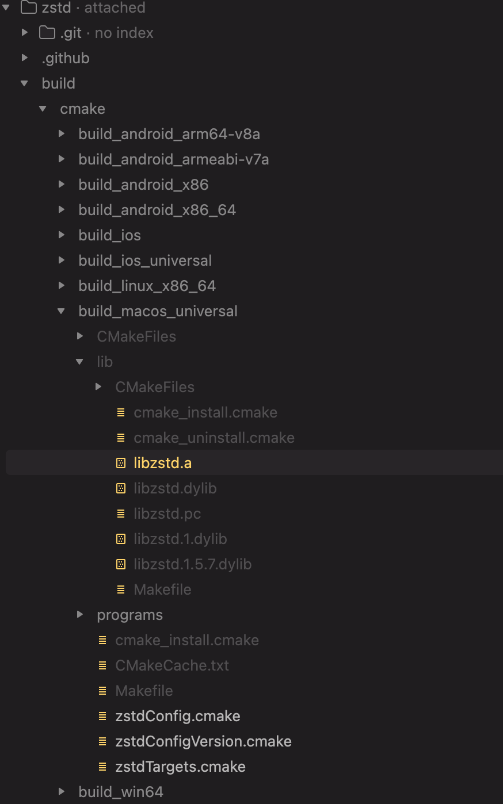

# zstd-for-unity
```text
本文主要记录了在Unity中集成zstd的过程。
```

集成并制作完毕后的结果提供在此 https://github.com/NicoIer/zstd-unity.git


zstd是facebook开源的一款高效压缩算法，具有极高的压缩比和压缩速度，广泛应用于各种场景中。它被集成在linux内核中，并且被许多知名项目采用，比如Docker、Kubernetes等。 其在游戏开发中的应用也比较广泛，像熟知的英雄联盟就使用了它
## 下载&静态编译zstd源码
- https://github.com/facebook/zstd
- ```shell
    git clone https://github.com/facebook/zstd
    ```
- checkout到最新发布版本，目前是v1.5.7
- ```shell
    git checkout v1.5.7
    ```
- 切换到build目录
- ```shell
    cd zstd/build/cmake
    ```
- 为了在常见的游戏平台上编译出静态库，这里需要安装交叉编译工具链(gcc,ndk,xcode,mingw,cmake等)，使用的电脑操作系统最好是MacOS，NDK的话我这里直接用Unity下载好的
  ```shell
    brew install cmake
    brew install mingw-w64
    brew install gcc
    ```
- 然后就是为不同的平台调用cmake进行编译了
- ```shell
    # armeabi-v7a
    export NDK_PATH=/Applications/Unity/Hub/Editor/6000.3.0f1/PlaybackEngines/AndroidPlayer/NDK
  
    cmake -S . -B build_android_armeabi-v7a \
    -DCMAKE_TOOLCHAIN_FILE=$NDK_PATH/build/cmake/android.toolchain.cmake \
    -DANDROID_ABI=armeabi-v7a \
    -DANDROID_PLATFORM=android-21 \
    -DBUILD_SHARED_LIBS=ON
  
    cmake --build build_android_armeabi-v7a --config Release
    ```
  
    ```shell
    # arm64-v8a
    export NDK_PATH=/Applications/Unity/Hub/Editor/6000.3.0f1/PlaybackEngines/AndroidPlayer/NDK

    cmake -S . -B build_android_arm64-v8a \
    -DCMAKE_TOOLCHAIN_FILE=$NDK_PATH/build/cmake/android.toolchain.cmake \
    -DANDROID_ABI=arm64-v8a \
    -DANDROID_PLATFORM=android-21 \
    -DBUILD_SHARED_LIBS=ON
  
    cmake --build build_android_arm64-v8a --config Release
    ``` 

    ```shell
    export NDK_PATH=/Applications/Unity/Hub/Editor/6000.3.0f1/PlaybackEngines/AndroidPlayer/NDK
    cmake -S . -B build_android_x86 \
  
    -DCMAKE_TOOLCHAIN_FILE=$NDK_PATH/build/cmake/android.toolchain.cmake \
    -DANDROID_ABI=x86 \
    -DANDROID_PLATFORM=android-21 \
    -DBUILD_SHARED_LIBS=ON
  
    cmake --build build_android_x86 --config Release
    ```

    ```shell
    # x86_64
    export NDK_PATH=/Applications/Unity/Hub/Editor/6000.3.0f1/PlaybackEngines/AndroidPlayer/NDK
  
    cmake -S . -B build_android_x86_64 \
    -DCMAKE_TOOLCHAIN_FILE=$NDK_PATH/build/cmake/android.toolchain.cmake \
    -DANDROID_ABI=x86_64 \
    -DANDROID_PLATFORM=android-21 \
    -DBUILD_SHARED_LIBS=ON
  
    cmake --build build_android_x86_64 --config Release
    ```

    ```shell
    # 配置
    cmake -S . -B build_win64 \
    -DCMAKE_SYSTEM_NAME=Windows \
    -DCMAKE_C_COMPILER=x86_64-w64-mingw32-gcc \
    -DCMAKE_RC_COMPILER=x86_64-w64-mingw32-windres \
    -DBUILD_SHARED_LIBS=ON
    # 编译
    cmake --build build_win64 --config Release
    ```

    ```shell
    cmake -S . -B build_ios \
    -DCMAKE_SYSTEM_NAME=iOS \
    -DCMAKE_OSX_ARCHITECTURES=arm64 \
    -DCMAKE_OSX_DEPLOYMENT_TARGET=11.0 \
    -DBUILD_SHARED_LIBS=ON
    cmake --build build_ios --config Release

    ```
    ```shell
    cmake -S . -B build_ios_universal \
    -DCMAKE_SYSTEM_NAME=iOS \
    -DCMAKE_OSX_ARCHITECTURES="arm64;x86_64" \
    -DCMAKE_OSX_DEPLOYMENT_TARGET=11.0 \
    -DBUILD_SHARED_LIBS=ON
    cmake --build build_ios_universal --config Release
    ```

    ```shell
    cmake -S . -B build_linux_x86_64 \
    -DCMAKE_BUILD_TYPE=Release \
    -DBUILD_SHARED_LIBS=ON
    cmake --build build_linux_x86_64 --config Release
    ```

    ```shell
    cmake -S . -B build_macos_universal \
    -DCMAKE_OSX_ARCHITECTURES="x86_64;arm64" \
    -DCMAKE_OSX_DEPLOYMENT_TARGET=10.13 \
    -DBUILD_SHARED_LIBS=ON
    cmake --build build_macos_universal --config Release
    ```
  
 - 完成上面的步骤之后，就可以在对应的build目录下找到编译好的静态库文件了

## 导出静态库到unity
- 把不同平台编译好的静态库文件放到Unity项目的Plugins目录，按照平台差异创建文件夹，配置导入选项

## 为zstd.h生成C#绑定代码
- zstd.h中定义了zstd提供的所有方法，我们可以直接在C#里面一一声明这些方法，然后通过DllImport调用对应平台的静态库文件中的方法
- 手动编译比较浪费时间，而且容易出错，这里使用ClangSharpPInvokeGenerator工具自动生成绑定代码
- 下载ClangSharp源码
  ```shell
  git clone https://github.com/dotnet/ClangSharp
  ```
- 编译ClangSharpPInvokeGenerator工具
  ```shell
  cd ClangSharpPInvokeGenerator
  dotnet build -c Release
  ```
- 然后就可以得到ClangSharpPInvokeGenerator.dll
- clang是llvm项目下的一个C/C++前端编译器工具，我们需要先安装clang（且版本必须是20，否则会和ClangSharpPInvokeGenerator不兼容）)
  ```shell
  brew install llvm@20
  ```
- 阅读zstd.h，其依赖了zstd_errors.h；stddef.h;limits.h等头文件，我们需要把这些头文件路径都添加到ClangSharpPInvokeGenerator的参数中
- 其次不希望生成的代码能够被直接访问到，所以需要添加访问修饰符参数为internal
- 运行ClangSharpPInvokeGenerator生成绑定代码
  ```shell
  export PATH="/usr/local/opt/llvm@20/bin:$PATH"
  
  ./ClangSharpPInvokeGenerator --file ./zstd.h --namespace zstd --output ./csharp_gen/zstd.cs --include-directory /Library/Developer/CommandLineTools/SDKs/MacOSX.sdk/usr/include --libraryPath libzstd --with-access-specifier '*=Internal'
  
  ./ClangSharpPInvokeGenerator --file ./zstd_errors.h --namespace zstd --output ./csharp_gen/zstd_errors.cs --include-directory /Library/Developer/CommandLineTools/SDKs/MacOSX.sdk/usr/include --libraryPath libzstd --with-access-specifier '*=Internal'
  ```
  
## 编写C#并提供zstdcli工具中的差分功能

zstdcli 是zstd源码中自带的一个命令行工具，提供了压缩、解压、差分等功能，我们可以参考zstdcli.c文件的实现，


### zstdcli差分功能原理解析

首先我们要明确一点：zstdcli的"差分"并不是真正意义上的二进制差分，它和bsdiff、xdelta等差分工具的原理完全不同，
zstdcli的差分是基于压缩算法实现的，它的原理是利用zstd的字典压缩功能，将原始文件作为字典，对修改后的文件进行压缩，从而生成一个差分文件。

现在我们有file_v1.bin和file_v2.bin两个文件
- 生成差分的v1_v2.zst的本质是将file_v1.bin作为字典，对file_v2.bin进行字典压缩，生成的文件就是v1_v2.zst。
- 应用差分的本质是将file_v1.bin作为字典，对v1_v2.zst进行字典解压，生成的文件就是file_v2.bin。
