Zebra YooAsset
- 实现一个新的patch生成工具，使用YooAsset的清单文件
- YooAsset的一些工具类需要修改，以支持多线程
- bundle构建和部署工具需要接入patch文件逻辑
- 实现自己的文件下载逻辑

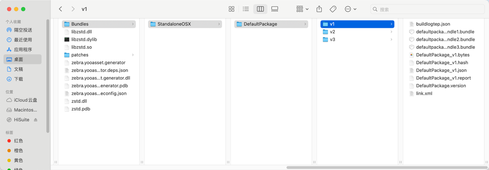

研究探索记录
YooAsset的可读性就是屎，但是应该向它学习，写出可用但是不可改的代码，增加自己的不可替代性
重新写一个文件下载更新系统，但是只处理差量相关bundle

我们就叫他 Zebra 吧，Z来自zstd的Z，灵感来自疯狂动物城
寓意：
- 首字母 Z：直接致敬底层的 Zstd 算法。
- 条纹 (Stripes)：斑马的黑白条纹象征着二进制数据块（Chunks）的对比和差异，非常符合 Diff/Patch 的逻辑。
- 奔跑：斑马是奔跑速度很快的动物，象征更新效率高。

YooAsset负责处理 “删除”，“新增”的bundle

1. 搞清楚YooAsset是如何存储本地文件的，主要是目录，验证等逻辑，这样才能保证覆盖文件的操作是正确的
2. 搞清楚YooAsset是如何比对文件差异的，覆盖之后让YooAsset不要再下载最新文件了
3. 写一个在YooAsset之前工作的文件下载系统，用于下载更新Patch

经过研究，我们要劫持的地方在这里：

DefaultCacheFileSystem 启动一个 SearchCacheFilesOperation，完成后再启动一个VerifyCacheFilesOperation，然后写入_records

Search的目录在这里，意味着我们把文件正确的覆盖到这里面就可以瞒天过海
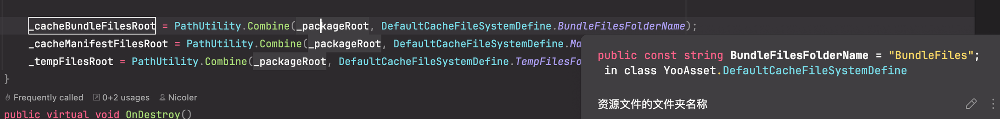
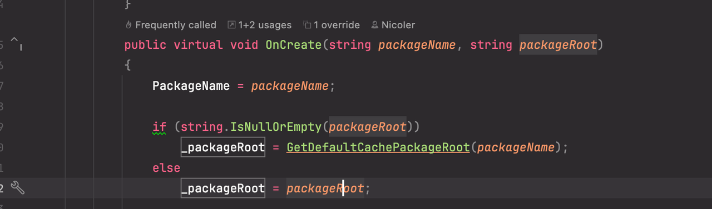
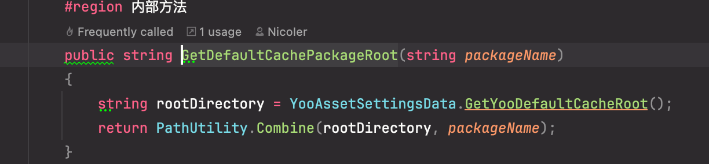
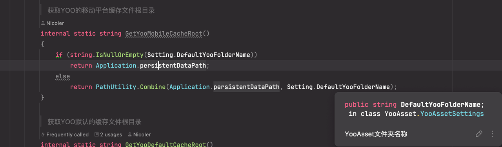
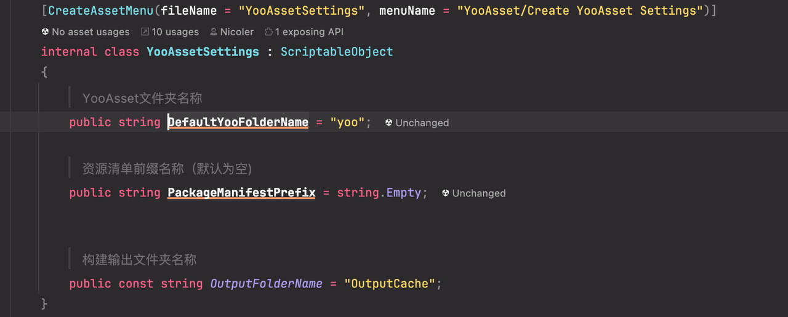

校验的代码如下
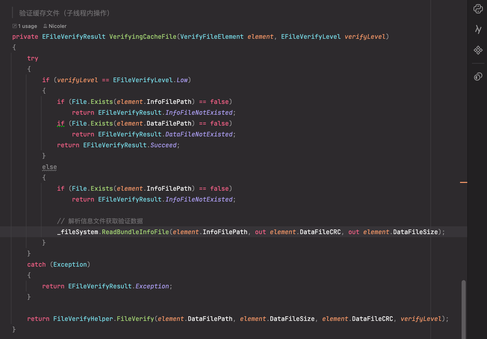

YooAsset下载了一个远程服务器的文件后，是如何写入的呢？

YooAsset用的是GUID当作磁盘中的文件名
所在文件夹的名字：按照FileHash的前两个字符
文件的名字：Bundle的GUID + 后缀
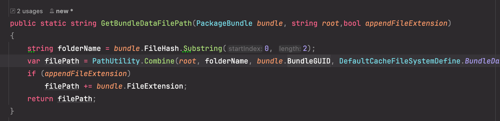

YooAsset如何获取本地的资源版本号？
如果是内置资源，读取指定目录下即可，如果更新过资源呢？
根本就没有本地的一个记录文件
我真服了，是直接根据远程的版本号读的package manifest，没有就下下来
所以我们也应该拿package manifest，然后根据package manifest中记录，来判断文件是否存在，如果存在，是否hash不一致，不一致的时候触发增量更新

但是我怎么根据最新的manifest，找到上一个版本对应的本地文件呢？它用的是FileHash+Bundle GUID来存的文件

现在不知道上一个版本是谁

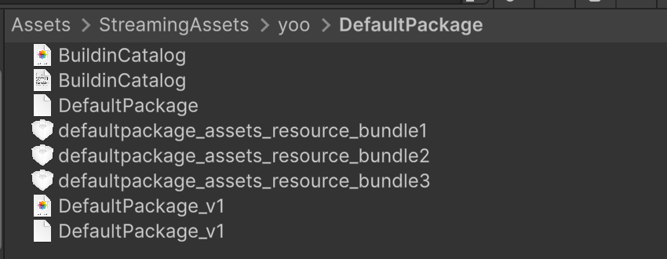

DeserializeManifestOperation用来解析manifest，啊啊啊啊，为什么要自己写Manifest的序列化啊，受不了，纯折磨，用Json会怎么样嘛

和YooAsset结合的版本，直接用YooAsset的Manifest来当记录文件

Patch生成工具的目标应该是这样，在YooAsset构建之后执行
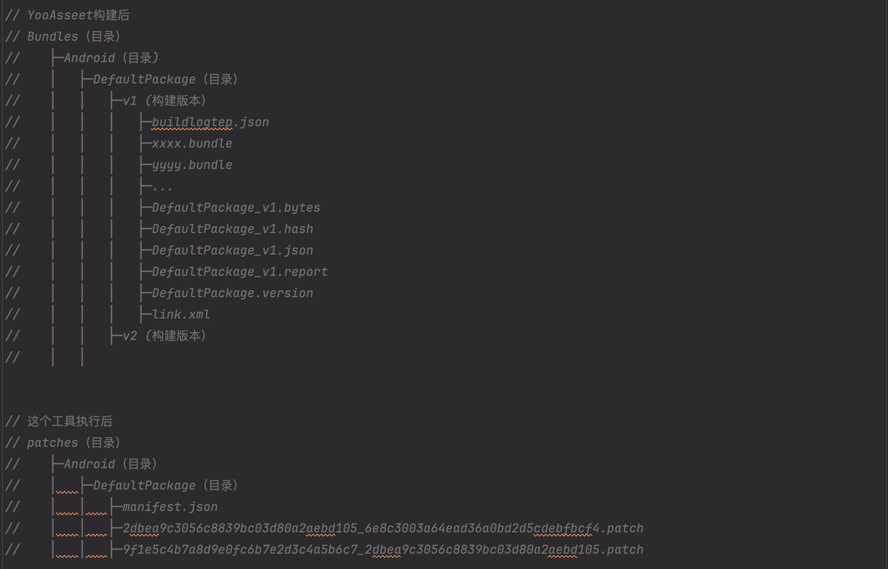

YooAsset就只支持了个多线程下载，但是内部的工具类，拼路径等等，多线程下都有问题

确实成功了
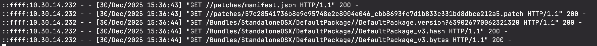
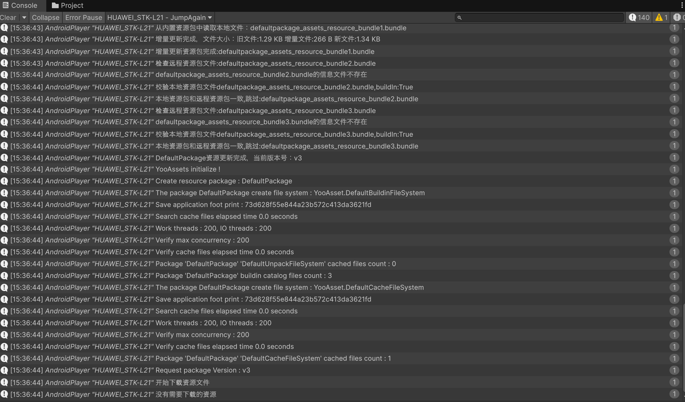

IOS也成功了
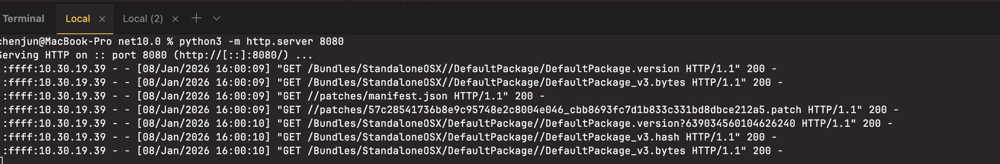

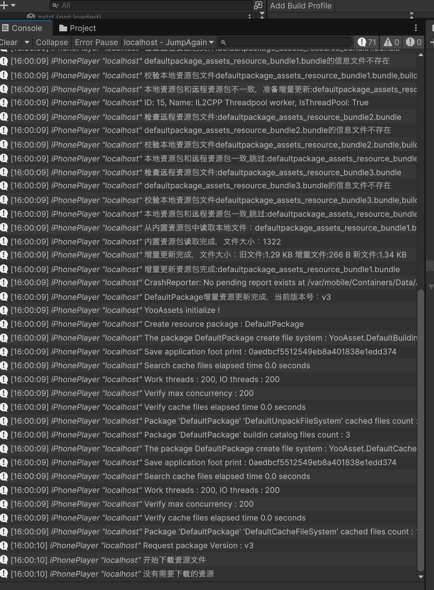
