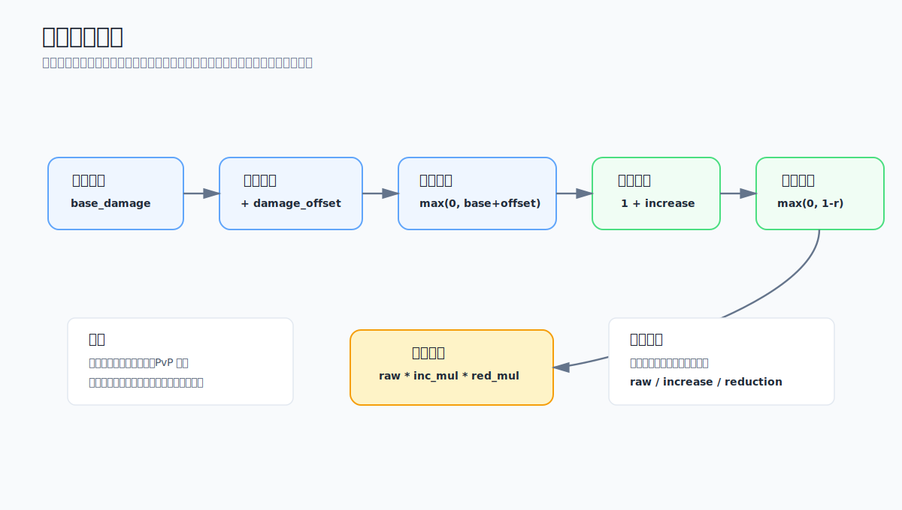

# 伤害计算

先说结论：这版公式适合做一个最小可用的伤害结算模型。

它只处理四件事：

- 基础伤害
- 固定加减伤
- 增伤倍率
- 减伤倍率

如果只是普攻、技能直伤和简单 Buff，这套结构够用。后面要加暴击、护盾、元素抗性、PvP 修正时，建议拆成独立阶段，不要继续把所有东西塞进 `damage_increase` 和 `damage_reduction`。


$$
\begin{aligned}
raw\_damage &= \max(0, base\_damage + damage\_offset) \\
increase\_multiplier &= 1 + damage\_increase \\
reduction\_multiplier &= \max(0, 1 - damage\_reduction) \\
final\_damage &= raw\_damage
  \times increase\_multiplier
  \times reduction\_multiplier
\end{aligned}
$$





## 字段说明

除 `final_damage` 外的属性都是由 `(base_value + offset) * (1 + multiplier)` 计算出的

| 字段 | 说明 | 取值建议 |
| --- | --- | --- |
| `base_damage` | 基础伤害。通常来自技能表、攻击力系数、技能等级或固定基础值。 | 建议不小于 0。 |
| `damage_offset` | 固定伤害修正。适合表达固定加伤、固定减伤、技能额外值、Buff 附加值等。 | 可以为正数或负数；如果可能扣成负数，先用 `raw_damage = max(0, base_damage + damage_offset)` 裁剪。 |
| `damage_increase` | 增伤比例。比如 20% 增伤写成 `0.2`，50% 增伤写成 `0.5`。 | 同一增伤乘区内建议先加总，例如 20% + 30% = `0.5`。 |
| `damage_reduction` | 减伤比例。比如 30% 减伤写成 `0.3`，100% 减伤写成 `1.0`。 | 用 `max(0, 1 - damage_reduction)` 防止超过 100% 减伤后出现负伤害倍率。 |
| `raw_damage` | 裁剪后的原始伤害。用于保证固定减伤不会把伤害变成负数。 | 如果游戏允许负伤害代表治疗，则不要做这一步裁剪。 |
| `increase_multiplier` | 增伤倍率，由 `1 + damage_increase` 得到。 | `damage_increase = 0.2` 时，该倍率为 `1.2`。 |
| `reduction_multiplier` | 减伤倍率，由 `max(0, 1 - damage_reduction)` 得到。 | `damage_reduction = 0.3` 时，该倍率为 `0.7`。 |
| `final_damage` | 最终伤害。通常是战斗结算、飘字和同步给客户端的结果。 | 需要额外明确取整时机，例如向下取整、四舍五入或保留浮点。 |

## 计算顺序

这里建议固定计算顺序，不要让不同技能自己决定。

1. 先算基础伤害和固定修正，得到 `raw_damage`。
2. 再把同一乘区内的增伤加总，得到 `increase_multiplier`。
3. 再把减伤转成 `reduction_multiplier`。
4. 最后得到 `final_damage`。

这样做的好处是调试简单。出现伤害异常时，可以直接看中间字段是哪一步变大或变小。

如果所有技能都把自己的特殊逻辑写进最终公式，后面很难查问题。

## 是否还需要扩展

如果要支持更完整的战斗系统，建议把下面这些规则拆成独立字段或独立阶段：

- 暴击：例如 `critical_multiplier`。
- 护盾、吸收、免疫：通常应该在最终伤害后、扣血前处理。
- 元素、护甲、抗性：建议单独做防御或抗性乘区。
- PvP / PvE 修正：建议独立字段，方便运营调参。
- 多个独立乘区：例如技能增伤、易伤、最终伤害加成，最好明确哪些相加、哪些相乘。
- 最小伤害和伤害上限：例如保底 1 点伤害、Boss 单次受击上限。
- 取整规则：服务端和客户端必须一致，否则容易出现同步误差。

这些东西不是不能加，而是不要一开始就混成一个大公式。

伤害系统最怕的是规则看起来很灵活，但没有明确阶段。到最后每个 Buff 都能改每个字段，调数值和查 bug 都会很痛苦。

## 多行 LaTeX 写法

多行公式可以用 `aligned`。

在当前 Hexo 渲染器下，建议用 `` 包住公式，避免 Markdown 把公式里的换行改成 `<br>`。

```latex

$$
\begin{aligned}
a &= b + c \\
d &= a \times e
\end{aligned}
$$

```

## 注意点

- 服务端和客户端必须使用同一套取整规则。
- 如果伤害结果要同步，最好同步最终值，不要让客户端重复完整计算。
- 如果客户端只做预测，也要能接受服务端最终结果覆盖。
- Buff 修改字段时，最好明确是加到 offset、increase 还是 reduction。
- 不要让显示层直接改伤害字段，飘字只读最终结果。
