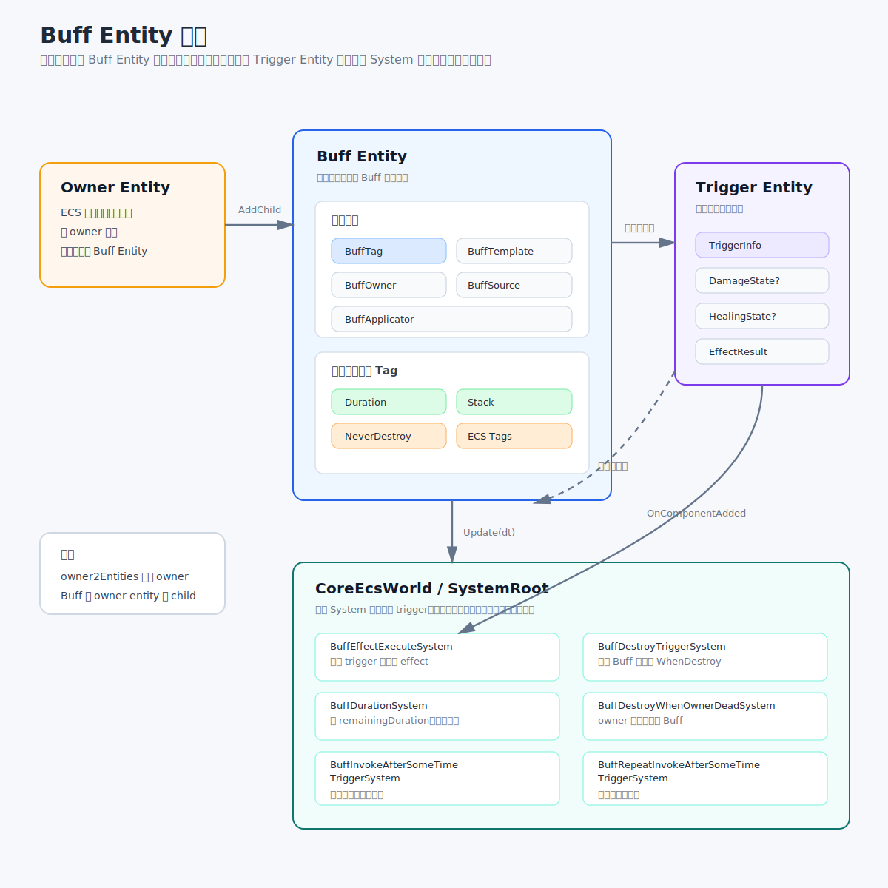
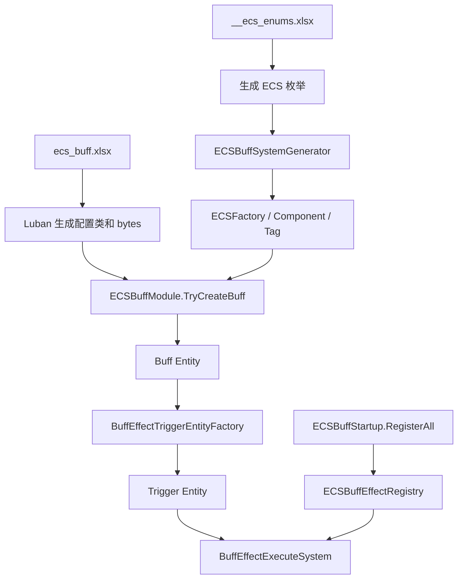

# 基于 ECS 的 Buff 系统

`ECSBuffSystem` 把 Buff 拆成几个可以组合的部分：

- `Buff Template`：定义一个 Buff 模板。
- `Component Template`：定义 Buff 身上的运行时状态。
- `Trigger`：定义什么时候触发效果。
- `Effect`：定义触发后执行什么。
- `Condition`：定义效果执行前的过滤条件。

Buff 本身是一个 `Entity`。生命周期由 ECS System 推进，具体行为由配置表和 Effect Executor 组合。

## 设计思路

Buff 的核心数据被拆成两类 entity：



```text
owner entity
  - buff entity
```

`owner entity` 只是 ECS 世界里用来挂 Buff 的节点。

真正的 Buff 是 `buff entity`，通常会带这些数据：

- `BuffTag`
- `BuffTemplateComponent`
- `BuffOwnerComponent`
- `BuffSourceComponent`
- `BuffApplicatorComponent`
- 表里配置出来的组件
- 表里配置出来的 Tag

执行效果时，不是直接在 Buff 上执行，而是临时创建一个 `trigger entity`：

```text
trigger entity
  - BuffEffectTriggerInfoComponent
  - BuffDamageRuntimeStateComponent，可选
  - BuffHealingRuntimeStateComponent，可选
  - BuffTriggerEffectResultComponent，执行后短暂存在
```

Buff 保存长期状态，`trigger entity` 只保存本次触发的 Buff、trigger 配置以及可选的伤害/治疗上下文。执行完马上删除。

## 配置表

配置入口主要是：

- `design/source/Datas/ecs_buff.xlsx`
- `design/source/Datas/ecs/__ecs_enums.xlsx`
- `design/source/Datas/ecs/__ecs_tables__.xlsx`

`ecs_buff.xlsx` 是业务层配置。

| Sheet | 作用 |
| --- | --- |
| `ecs_buff_entity_template_table` | Buff 主模板 |
| `ecs_component_template_table` | 组件模板 |
| `ecs_buff_trigger_table` | 触发器模板 |
| `ecs_buff_effect_table` | 效果模板 |
| `ecs_buff_effect_condition_table` | 效果条件模板 |

`__ecs_enums.xlsx` 里比较关键的枚举：

- `ECSComponentType`
- `ECSTagEnum`
- `ECSBuffTriggerType`
- `ECSBuffEffectEnum`
- `ECSBuffTagResolveMethod`
- `WhenGotSameBuffStrategyEnum`
- `BuffStackStrategyEnum`

`__ecs_tables__.xlsx` 决定 Luban 要生成哪些配置类和 bytes。

## Buff 主模板

`ecs_buff_entity_template_table` 是入口表。

主要字段：

| 字段 | 说明 |
| --- | --- |
| `id` | Buff 模板 id |
| `name` | 名字 |
| `components` | 这个 Buff 要挂哪些组件模板 |
| `strategy_handle_owner_got_same_id` | 同一个 owner 重复获得同模板 Buff 时怎么处理 |
| `tags` | Buff 自身 Tag |
| `collision_tag` | 会发生冲突的 Tag |
| `tag_collision_resolve_method` | Tag 冲突时的处理方式 |
| `trigger_and_effects` | 触发器到效果数组的映射 |

`trigger_and_effects` 保存 `trigger_id -> effect_id[]`：

```text
trigger_id -> effect_id[]
```

表里的格式类似：

```text
when_attach_to_owner[effect_a,effect_b]
when_destroy[effect_c]
```

添加和销毁时做什么都在这里组装。

## 组件模板

`ecs_component_template_table` 定义 Buff 身上的组件。

当前看到的组件类型包括：

| 组件 | 作用 |
| --- | --- |
| `BuffDurationComponent` | 持续时间，到期后销毁 |
| `BuffNeverDestroyComponent` | 不允许通过统一销毁入口销毁 |
| `BuffDestroyWhenOwnerDeadComponent` | owner 死亡时销毁 |
| `BuffStackComponent` | 层数相关数据 |

`BuffDurationComponent` 会从组件模板的 `parameter_floats[0]` 读取持续时间：

```csharp
duration = config.ParameterFloats[0];
remainingDuration = duration;
```

`BuffStackComponent` 会读取：

```csharp
strategy = (BuffStackStrategyEnum)config.ParameterInt[0];
maxStack = (int)config.ParameterFloats[0];
stackCount = 1;
```

注意：新增 `ECSComponentType` 后，Source Generator 默认只能生成一个空组件。

如果组件需要读取参数，或者需要被某个 System 每帧处理，就还要补对应代码。

## 触发器

`ecs_buff_trigger_table` 定义触发器。

当前支持的触发类型包括：

- `WhenAttachToOwner`
- `WhenExpire`
- `WhenDestroy`
- `WhenStack`
- `BeforeOwnerTakeDamage`
- `AfterOwnerTakeDamage`
- `BeforeOwnerApplyDamage`
- `AfterOwnerApplyDamage`
- `BeforeOwnerApplyHealing`
- `BeforeOwnerTakeHealing`
- `AfterOwnerApplyHealing`
- `AfterOwnerTakeHealing`
- `InvokeAfterSomeTime`
- `RepeatInvokeAfterSomeTime`

同类型 trigger 会先按 `priority` 排序。延迟和周期触发会在创建 Buff 时增加 timer child entity：

- `InvokeAfterSomeTime`
- `RepeatInvokeAfterSomeTime`

由下面两个 System 推进：

- `BuffInvokeAfterSomeTimeTriggerSystem`
- `BuffRepeatInvokeAfterSomeTimeTriggerSystem`

时间到了再创建 trigger entity。

## 效果

`ecs_buff_effect_table` 定义效果。

主要字段：

| 字段 | 说明 |
| --- | --- |
| `id` | effect id |
| `priority` | 效果执行顺序，越小越先执行 |
| `effect_enum` | 对应哪个执行器 |
| `parameter_int` | int 参数 |
| `parameter_floats` | float 参数 |
| `condition` | 执行条件 |

执行器统一实现：

```csharp
public interface IECSBuffEffectExecutor
{
    bool Execute(in ECSBuffEffectContext context);
}
```

`ECSBuffEffectContext` 包含 `triggerEntity`、`config` 和 `ecsWorld`。执行器从 config 读参数，从 trigger entity 读本次上下文。

如果要回到 Buff 本体，需要这样走：

```csharp
Entity buffEntity = ECSBuffEffectUtility.GetBuffEntity(context.triggerEntity);
```

当前比较通用的 effect 包括：

- 修改实体属性百分比。
- 修改实体属性固定值。
- 强制覆盖实体属性。
- 修改伤害运行时状态。
- 根据 Buff 层数修改伤害运行时状态。

伤害类 effect 依赖 trigger entity 上的 `BuffDamageRuntimeStateComponent`。创建 trigger 时没有传伤害上下文，就不能修改伤害数据。

## 条件

`ecs_buff_effect_condition_table` 定义效果条件。

Effect 的 `condition` 字段引用 condition 的 `name_id`：

1. `condition` 为空，直接通过。
2. `condition` 不为空，根据 `name_id` 找到 condition 配置。
3. 根据 condition 的 `id` 找到 checker。
4. checker 返回 true 才执行 effect。

checker 统一实现：

```csharp
public interface IECSBuffEffectConditionChecker
{
    bool IsPassed(in ECSBuffEffectContext context);
}
```

## 代码生成

### Luban 配置生成

Luban 输入：

```text
design/source/Datas/ecs_buff.xlsx
design/source/Datas/ecs/__ecs_enums.xlsx
design/source/Datas/ecs/__ecs_tables__.xlsx
```

输出是：

```text
Server/Model/Generate/Config/GameConfig/ECSBuff*.cs
Server/Model/Generate/Config/GameConfig/ECSComponent*.cs
Server/Model/Generate/Config/GameConfig/ECSTagEnum.cs
Config/Generate/GameData/ecsbuff*.bytes
```

运行时读取：

```csharp
ECSBuffEntityTemplateTable.Instance.Get(templateId)
ECSBuffEffectTable.Instance.Get(effectId)
ECSBuffTriggerTable.Instance.Get(triggerId)
ECSComponentTemplateTable.Instance.Get(componentId)
```

### Source Generator

`ECSBuffSystemGenerator` 是 Roslyn Source Generator，读取编译中的：

```csharp
cfg.ECSComponentType
cfg.ECSTagEnum
```

生成：

- `ECSFactory`
- ECS Tag struct
- ECS Component struct

`ECSFactory` 主要提供：

```csharp
ECSFactory.AddComponent(entity, componentConfig);
ECSFactory.AddTag(entity, tagEnum);
ECSFactory.HasTag(entity, tagEnum);
```

### CodeGenerator

`Server/CodeGenerator` 里和 Buff 相关的是：

```csharp
EcsBuffEffectExecutorCodeGenerator
```

它负责：

- 根据 `ECSBuffEffectEnum` 生成缺失的 effect executor 模板。
- 根据 condition table bytes 生成缺失的 condition checker 模板。
- 重写 `ECSBuffStartup.cs`。

`ECSBuffStartup.RegisterAll()` 会注册所有 executor 和 checker：

```csharp
ECSBuffEffectRegistry.Register(...);
ECSBuffEffectRegistry.RegisterConditionChecker(...);
```

新增 `ECSBuffEffectEnum` 或 condition 后没有跑 `CodeGenerator`，运行时会找不到 executor 或 checker。

## 运行时数据流向



创建 Buff 的入口是：

```csharp
TryCreateBuff(templateId, owner, source, applicator, out Entity buffEntity)
```

内部流程：

1. 读取 Buff 模板配置。
2. 处理同 owner、同 template 的重复获得策略。
3. 处理 Tag 冲突。
4. 创建或复用 owner entity。
5. 创建 buff entity。
6. 添加固定组件，例如 template、owner、source、applicator。
7. 根据表配置添加组件。
8. 根据表配置添加 Tag。
9. 为延迟和周期触发创建 timer child entity。
10. 触发 `WhenAttachToOwner`。

触发效果时：

1. 根据 trigger type 或 trigger id 创建 trigger entity。
2. trigger entity 添加 `BuffEffectTriggerInfoComponent`。
3. `BuffEffectExecuteSystem` 监听到组件添加。
4. 根据 `buffEntityId` 找到 Buff 本体。
5. 根据 `triggerConfigId` 找到 effect id 数组。
6. 读取 effect 配置并排序。
7. 先执行 condition。
8. 再执行 effect executor。
9. 记录执行结果。
10. 抛出事件。
11. 删除 trigger entity。

## 基础 System

`CoreEcsWorld` 初始化时会创建 `EntityStore`、`ECSBuffModule` 和 `SystemRoot`。

基础 System 注册顺序是：

```csharp
_systems.Add(new BuffEffectExecuteSystem(this));
_systems.Add(new BuffDestroyTriggerSystem());
_systems.Add(new BuffDestroyWhenOwnerDeadSystem(this));
_systems.Add(new BuffDurationSystem(this));
_systems.Add(new BuffInvokeAfterSomeTimeTriggerSystem());
_systems.Add(new BuffRepeatInvokeAfterSomeTimeTriggerSystem());
```

| System | 关注的数据 | 作用 |
| --- | --- | --- |
| `BuffEffectExecuteSystem` | `BuffEffectTriggerInfoComponent` | trigger entity 创建后，读取 trigger 配置并执行 effect |
| `BuffDestroyTriggerSystem` | entity delete 事件 | Buff entity 被删除时触发 `WhenDestroy` |
| `BuffDestroyWhenOwnerDeadSystem` | `BuffDestroyWhenOwnerDeadComponent` + `BuffOwnerComponent` | owner 死亡时删除 Buff |
| `BuffDurationSystem` | `BuffDurationComponent`，可选 `BuffStackComponent` | 扣持续时间，到期触发 `WhenExpire` 并销毁 |
| `BuffInvokeAfterSomeTimeTriggerSystem` | `BuffInvokeAfterSomeTimeComponent` | 固定时间后触发一次，然后删除 timer entity |
| `BuffRepeatInvokeAfterSomeTimeTriggerSystem` | `BuffRepeatInvokeAfterSomeTimeComponent` | 每隔固定时间触发一次 |

`BuffEffectExecuteSystem` 和 `BuffDestroyTriggerSystem` 是事件驱动。持续时间、死亡销毁和两个定时触发 System 在 `CoreEcsWorld.Update(dt)` 中推进。

## 生命周期

普通持续时间流程是：

```text
remainingDuration -= dt
remainingDuration <= 0
  -> WhenExpire
  -> DestroyBuffEntity
  -> WhenDestroy
```

如果 Buff 带 `BuffStackComponent`，并且策略是 `Independent`，则每一层有自己的剩余时间。

层数到期时只移除那一层。所有层都到期后，整个 Buff 才过期。

## 重复获得和 Tag 冲突

同一个 owner 重复获得同一个模板时，由 `strategy_handle_owner_got_same_id` 控制。

| 策略 | 行为 |
| --- | --- |
| `IgnoreNew` | 忽略新的 |
| `AddPrevDuration` | 给已有 Buff 增加持续时间 |
| `ReplacePrev` | 先删旧的，再创建新的 |
| `AllowStack` | 不创建新 entity，而是在旧 Buff 上加层 |

Tag 冲突由两个字段控制：

- `collision_tag`
- `tag_collision_resolve_method`

处理方式有：

| 策略 | 行为 |
| --- | --- |
| `None` | 不处理 |
| `Skip` | 已有冲突 Tag 时跳过新 Buff |
| `Destroy` | 销毁已有冲突 Buff，再创建新 Buff |
| `BothDestroy` | 销毁已有冲突 Buff，同时跳过新 Buff |

重复获得和互斥在创建入口统一处理，不需要分散到各个 Buff 类里。

## 和普通 Buff 类的区别

| 对比项 | 传统写法 | ECSBuffSystem |
| --- | --- | --- |
| 行为位置 | Buff 类里 | Trigger + Effect + Executor |
| 生命周期 | Buff 实例自己更新或由 Manager 遍历 | ECS System 统一处理 |
| 参数 | 通常集中在 Buff 配置或构造参数里 | 分散在 component/effect/condition 配置里 |
| 重复获得 | 容易写在各个 Buff 里 | 模板策略统一处理 |
| 互斥 | 容易写成业务判断 | Tag 冲突统一处理 |
| 扩展普通属性 Buff | 往往要新增类或改类 | 多数情况下只配表 |
| 扩展新行为 | 写新 Buff 类 | 写新 executor、checker 或 system |

普通写法比较直观，一个 Buff 的逻辑基本都在一个类里。这里的 trigger、effect 和 condition 可以复用，但是排查链路变成了：

```text
Excel -> Luban -> Config/bytes -> Source Generator -> CodeGenerator -> Registry -> ECS System
```

## 新增 Buff 的流程

如果只是组合已有能力，一般只配表：

1. 在 `ecs_component_template_table` 配组件模板。
2. 在 `ecs_buff_effect_table` 配效果。
3. 在 `ecs_buff_trigger_table` 选择触发器。
4. 在 `ecs_buff_entity_template_table` 组装模板。
5. 跑 Luban，生成配置代码和 bytes。

如果要新增 effect：

1. 在 `__ecs_enums.xlsx` 里加 `ECSBuffEffectEnum`。
2. 跑 Luban。
3. 跑 `Server/CodeGenerator`。
4. 实现生成出来的 executor。
5. 确认 `ECSBuffStartup.RegisterAll()` 注册了它。

如果要新增 condition：

1. 在 `ecs_buff_effect_condition_table` 增加一行。
2. 跑 Luban。
3. 跑 `Server/CodeGenerator`。
4. 实现生成出来的 checker。

如果要新增 component：

1. 在 `__ecs_enums.xlsx` 里加 `ECSComponentType`。
2. 跑 Luban。
3. 确认 Source Generator 生成了组件。
4. 如果组件需要参数，补生成器里的构造逻辑。
5. 如果组件需要运行时行为，补对应 System。

## 注意点

- `trigger entity` 是临时的，执行器不要把长期状态存在 trigger 上。
- 执行器需要 owner/source/template 时，要先通过 trigger 找回 buff entity。
- 临时属性修改通常要配反向效果，比如添加时加，销毁或过期时减。
- `WhenExpire` 和 `WhenDestroy` 是两个不同触发点，超时删除时通常两个都会触发。
- `BuffNeverDestroyComponent` 会阻止统一销毁入口，需要谨慎使用。
- 新增枚举后要确认生成代码和注册代码都更新。
- 表里的 `parameter_int`、`parameter_floats` 没有强类型保护，执行器读取时要和表约定一致。

通用属性修改、持续时间、叠层、互斥和触发条件走配置。特殊业务强行拆成一堆 effect 会很绕，直接扩展 executor、checker 或 System。
