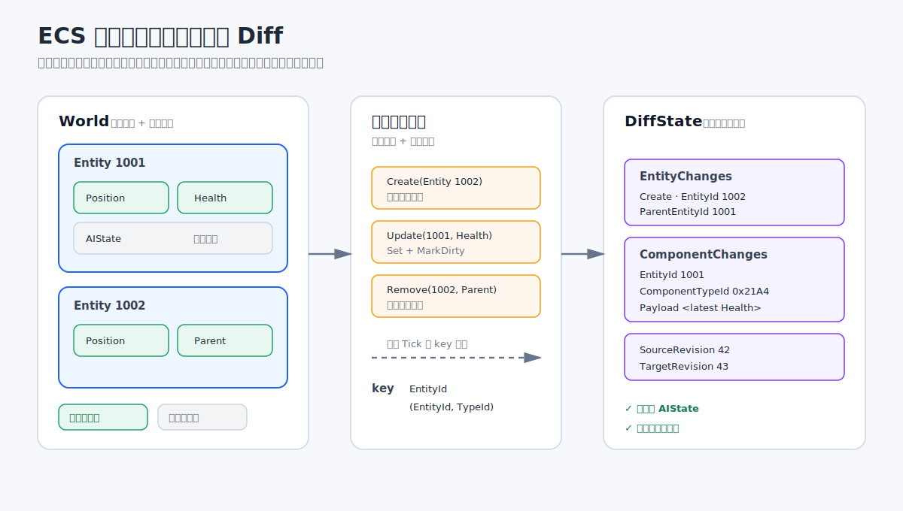
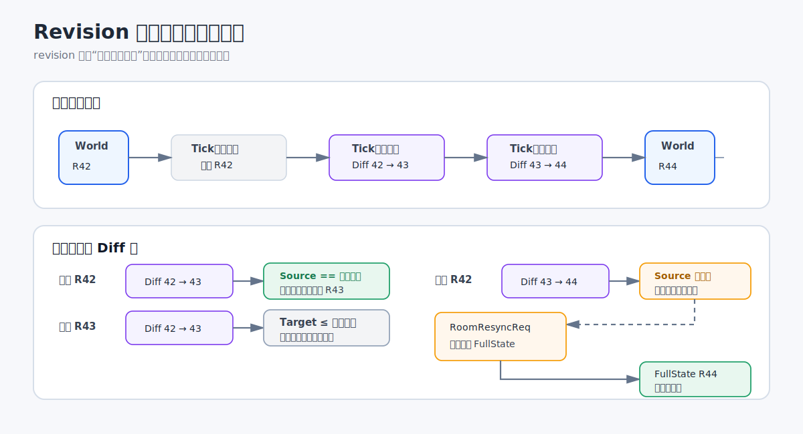
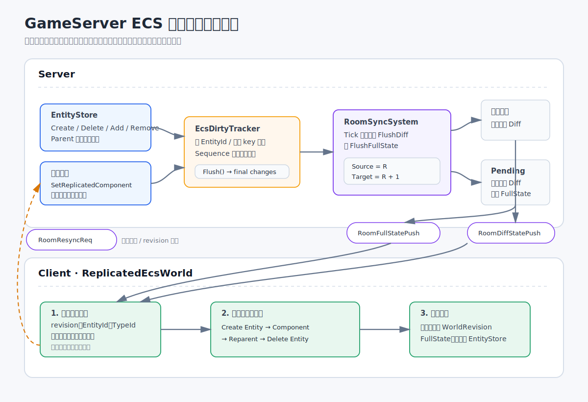

# 基于 ECS 的增量网络同步

先说结论：ECS 生来就适合做网络数据的增量同步。

很多人看 ECS，主要看的是多线程、高性能、内存紧凑和 CPU 缓存命中率。但是对网络同步来说，ECS 还有一个很直接的优点：它已经把世界状态拆成了 `Entity` 和 `Component`。

这里先整理一下基于 ECS 实现增量同步需要什么，然后以 [NicoIer/GameServer](https://github.com/NicoIer/GameServer) 中的实现为例，说明完整的同步流程。

## ECS 为什么适合增量同步

传统对象往往会把状态和行为堆在一起。如果要做增量同步，需要额外判断对象的哪些字段变了，以及这些字段能不能发给客户端。

ECS 已经提前做了一次数据分拆：

```text
World
  -> Entity
       -> Component A
       -> Component B
       -> Component C
```

`Entity` 是实体身份，`Component` 是独立的状态块。一个组件通常只保存一类数据，所以它可以直接成为网络同步的最小单位。

一个 ECS 世界的变化，基本可以归纳成：

- 创建或删除 `Entity`。
- 添加、更新或删除 `Component`。
- 修改 `Entity` 的父子关系。

这些操作本身就是 Diff，不需要在每帧结束后复制一份完整世界，再和上一帧逐字段比较。

另外，大部分 ECS 都有集中的实体和组件操作入口。只要在这些入口记录变化，就可以知道当前 Tick 修改了什么。



## 基于 ECS 的增量同步要怎么做

ECS 只是提供了合适的数据结构。要把它做成可用的网络同步，还需要解决下面几个问题。

### 确定哪些组件需要同步

不是所有组件都应该发给客户端。有些是服务器临时状态，有些可以在客户端自己计算，有些则根本不应该暴露。

所以需要显式标记可同步组件，并且给每种组件分配稳定的类型 id。网络上只发送：

```text
EntityId + ComponentTypeId + Payload
```

客户端根据 `ComponentTypeId` 找到对应类型，再反序列化 `Payload`。

### 收集变化

结构变化通常可以由 ECS 事件捕获：

- `Entity` 创建和删除。
- `Component` 添加和删除。
- 父子关系变化。

已有组件的值变化不一定会产生结构事件。这类更新需要走统一入口，在设置组件的同时显式标记脏数据。

### 合并同一 Tick 内的变化

如果同一个组件在一个 Tick 内被修改了多次，没必要把每个中间状态都发出去。客户端通常只需要 Tick 结束时的最终结果。

常见的合并规则是：

| 同一 Tick 内的操作 | 最终结果 |
| --- | --- |
| 创建实体，然后挂到父实体 | 一条带 `ParentEntityId` 的 `Create` |
| 创建实体，然后又删除 | 互相抵消 |
| 多次更新同一组件 | 只保留最后一份数据 |
| 添加组件，然后更新 | `Add`，使用最新数据 |
| 添加组件，然后删除 | 互相抵消 |
| 删除组件，然后重新添加 | `Update` |
| 删除已存在的实体 | 只保留 `Delete` |

这一步不仅减少消息大小，也可以避免客户端处理已经没有意义的中间状态。

### 同时保留 FullState 和 Diff

纯 Diff 方案没办法处理新连接和状态丢失。完整方案需要两类消息：

```text
FullState
  - WorldRevision
  - Entities[]

DiffState
  - SourceRevision
  - TargetRevision
  - EntityChanges[]
  - ComponentChanges[]
```

`FullState` 提供可信基线，`DiffState` 只描述两个 revision 之间的变化。

### 用 revision 检查状态是否连续

revision 不应该直接使用帧号。没有状态变化时，没有必要推进 revision。

客户端应用 Diff 时只接受：

```text
SourceRevision == 当前 WorldRevision
```

如果 `TargetRevision` 小于或等于当前 revision，说明是重复或过期数据，直接忽略。

如果 `SourceRevision` 对不上，说明中间的 Diff 断了。此时不能继续猜怎么补，直接请求一份新的 `FullState` 即可。



### 客户端先校验，再应用

一份 Diff 可能同时包含实体、组件和父子关系变化。客户端需要先检查整份数据，确认 id、组件类型和引用关系都可用，然后按固定顺序应用：

```text
创建 Entity
  -> 添加、更新、删除 Component
  -> 修改父子关系
  -> 删除 Entity
```

创建放在最前面，是因为新实体可能在同一份 Diff 里带有组件和父子关系。删除放在最后，可以避免后续操作访问到已经不存在的实体。

## GameServer 中的实现

[GameServer](https://github.com/NicoIer/GameServer) 里的具体链路是：

```text
EntityStore 产生变化
  -> EcsDirtyTracker 收集并合并脏数据
  -> RoomSyncSystem 在 Tick 结束时生成 Diff 或 FullState
  -> ReplicatedEcsWorld 校验并应用数据
```



### 同步协议

实体和组件的网络结构放在 `EcsReplicationMessages.cs` 中。

`EcsEntitySnapshot` 和 `EcsComponentSnapshot` 用于全量同步：

```text
EcsEntitySnapshot
  - EntityId
  - ParentEntityId
  - Components[]

EcsComponentSnapshot
  - ComponentTypeId
  - Payload
```

`EcsEntityChange` 和 `EcsComponentChange` 用于增量同步。`EcsChangeKind` 一共有六种：

| 类型 | 作用 |
| --- | --- |
| `Create` | 创建 `Entity` |
| `Delete` | 删除 `Entity` |
| `Add` | 添加 `Component` |
| `Update` | 更新 `Component` |
| `Remove` | 删除 `Component` |
| `Reparent` | 修改或移除父子关系 |

`RoomFullStatePush` 携带当前 `WorldRevision` 和所有实体快照。`RoomDiffStatePush` 携带 `SourceRevision`、`TargetRevision` 和两类变化数组。

### 组件注册和序列化

需要同步的组件会显式标记：

```csharp
[MemoryPackable]
[EcsReplicatedComponent]
public partial struct UserComponent : IComponent
{
    public long Uid;
}
```

`EcsReplicationGenerator` 会扫描这些组件，然后生成：

- 稳定的 `ushort ComponentTypeId`。
- 组件到 MemoryPack 序列化代码的分发。
- 遍历世界并生成全量快照的代码。
- 统一的 `SetReplicatedComponent` 更新入口。

客户端的 `EcsComponentRegistry` 使用同样的 id 注册反序列化、查询、设置和删除函数。

`ComponentTypeId` 由完整类型名生成。修改类名或 namespace 会改变 id，所以类型名实际上也是网络协议的一部分。`EcsComponentRegistry` 在注册时也会检查 id 冲突。

### EcsDirtyTracker

`EcsDirtyTracker` 监听 `EntityStore` 的下面几类事件：

- `OnEntityCreate`
- `OnEntityDelete`
- `OnComponentAdded`
- `OnComponentRemoved`
- `OnChildEntitiesChanged`

实体变化使用 `EntityId` 作为 key，组件变化使用 `(EntityId, ComponentTypeId)` 作为 key。同一个 key 再次变化时，直接覆盖之前的有效结果。

内部还会给每次变化分配一个递增的 `Sequence`。旧的队列项不需要立即删除，`Flush` 时发现 `Sequence` 已经过期就跳过。这样可以保留有效变化的顺序，也不需要在队列中间删数据。

只有能从生成代码中找到 `ComponentTypeId` 的组件才会进入脏数据集合。普通服务器组件会被直接忽略。

### RoomSyncSystem

`RoomSyncSystem` 在每个 Tick 结束时先执行 `FlushDiff`，再执行 `FlushFullState`。

存在脏数据时：

```text
SourceRevision = WorldRevision
TargetRevision = WorldRevision + 1

DirtyTracker.Flush(...)
WorldRevision = TargetRevision
```

没有变化就不发消息，`WorldRevision` 也不会增加。

新加入或者正在等待重同步的连接会放在 `PendingFullStateConnections` 中。这些连接不接收当前 Diff。系统会先把脏数据并入世界 revision，然后给它们发送最新的全量状态。

这样新客户端不会先收到一份没有基线的 Diff，FullState 携带的 revision 也不会落后于服务器。

### ReplicatedEcsWorld

客户端使用 `ReplicatedEcsWorld` 保存复制出来的 ECS 世界。

应用 FullState 时，它会先创建一个新的 `EntityStore`，再依次恢复实体、组件和父子关系。只有整份数据都成功后才替换旧世界。

应用 Diff 前，它会检查：

- 是否已经有 FullState 基线。
- `SourceRevision` 是否等于当前 `WorldRevision`。
- `EntityId` 和 `ComponentTypeId` 是否合法。
- `Add`、`Update`、`Remove` 是否符合当前组件状态。
- 父子关系是否引用了不存在的实体，或者产生循环。

如果 revision 断档、Payload 损坏或者 Diff 校验失败，`ReplicatedEcsWorld` 会进入重同步状态。客户端发送 `RoomResyncReq`，服务器再把该连接加回 `PendingFullStateConnections`。

### 组件更新需要显式标脏

最容易漏的是已有组件的值更新。直接修改字段不一定会触发 `EntityStore` 的结构变化事件。

`GameServer` 中统一使用生成的更新入口：

```csharp
EcsReplicationSerializer.SetReplicatedComponent(
    entity,
    component,
    dirtyTracker);
```

它会更新 ECS 里的组件，同时调用 `MarkComponentUpdated` 记录脏数据。如果业务代码绕过这个入口直接改值，服务器上的数据是对的，但客户端可能永远收不到这次变化。

## 总结

ECS 适合增量同步，本质上是因为它已经把世界拆成了颗粒度合适的状态块，并且大部分结构变化都有统一入口。

但是真正可用的同步方案，不能只有脏数据记录。还需要：

- 同一 Tick 内的变化合并。
- 新连接使用的 FullState。
- 能检查断档的 revision。
- 客户端应用前的数据校验。
- 校验失败后的重同步流程。

简而言之：Diff 负责省流量，FullState 负责把错误状态拉回来。

## 参考

- [NicoIer/GameServer](https://github.com/NicoIer/GameServer)
