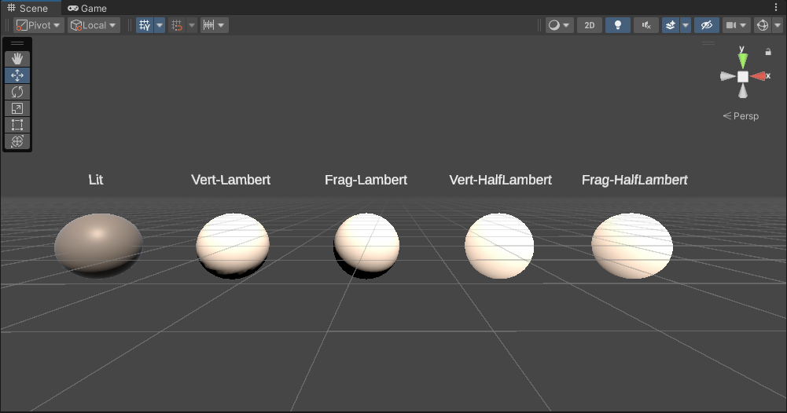

## 光照

### 散射


### 吸收


### 着色


## 标准光照模型

- 环境光

- 自发光

- 高光反射（镜面反射）

- 漫反射

- 菲涅尔效应

## HLSL


| 基本数据类型 | 描述       | 用途                     |
| ------------ | ---------- | ------------------------ |
| float        | 一般是32位 | 顶点，纹理坐标           |
| half         | 一般是16位 | 矢量，方向，位置，颜色等 |


## 线性代数

- 计算向量间的夹角

$$
AB=dot(A, B) = |A||B|cos\theta
$$

$$
cos\theta = \frac{AB}{|A||B|}
$$


## 逐顶点和逐像素

像素是根据顶点插值而来的


## Lambert

是光的漫反射经验模型

**认为某点的漫反射强度和入射光线与其法线方向夹角成正比**

假设所有的向量都是标准化向量的情况下计算出对应点的漫反射强度为
$$
diffuse = clamp01(dot(lightDir,normal))
$$

```c
// 兰伯特漫反射光照模型
half LambertDiffuse(float3 normal, float3 lightDir)
{
    return saturate(dot(normal, lightDir));
}
```


## Half Lambert

当cos值为负数时，会全黑，因此有**Half Lambert**


$$
diffuse = dot(lightDir,normal)*0.5+0.5
$$

```C
half HalfLambdaDiffuse(float3 normal, float3 lightDir)
{
    return saturate(dot(normal, lightDir) * 0.5 + 0.5);
}
```


