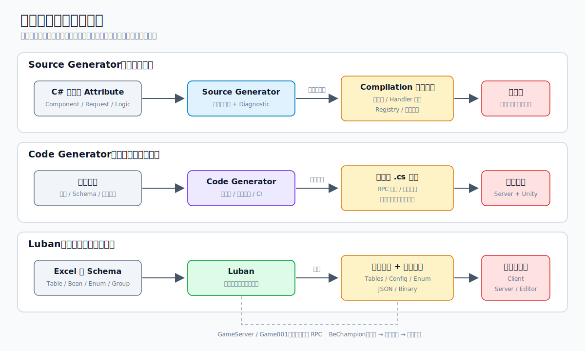

# 游戏开发中的代码生成：Source Generator、Code Generator 与 Luban

`Source Generator`、`Code Generator` 和 `Luban` 都能生成代码，但它们解决的问题并不相同。

- `Source Generator` 适合根据当前 C# 工程中的类型和标记，在编译期间生成重复代码并执行编译期检查。
- `Code Generator` 适合通过显式调用将代码写入工程目录，尤其适用于跨工程生成和创建需要继续编辑的业务骨架。
- `Luban` 适合将 Excel 等策划数据转换为强类型代码和运行时数据，保持客户端、服务器与策划配置的一致性。

这三种方案并不冲突。实际项目中通常由 Luban 定义数据，Code Generator 根据数据创建业务入口，Source Generator 负责检查注册关系并生成编译期代码。



## 为什么要生成代码

游戏项目中存在大量逻辑并不复杂、但必须保持一致的代码。例如：

- 新增一个网络消息后，需要在发送端、接收端和注册中心分别补代码。
- 新增一个 ECS Component 后，需要补类型 id、序列化、反序列化和注册逻辑。
- 新增一种配置后，客户端和服务器都需要相同的数据结构和读取方式。
- 新增一个怪物或角色后，需要创建对应的逻辑类，并把它注册到工厂。

这些工作可以手动完成，但容易出现遗漏。代码生成的价值不仅在于减少重复代码，更在于将“多个位置必须同时修改”转化为“只修改一个可信来源”。

```text
一个可信来源
  -> 自动生成重复部分
  -> 编译或生成阶段检查错误
  -> 客户端、服务器和工具使用同一套定义
```

## 三种方案的区别

| 方案 | 触发时机 | 主要输入 | 输出位置 | 适合人工修改 | 跨工程生成 | 主要用途 |
| --- | --- | --- | --- | --- | --- | --- |
| `Source Generator` | C# 编译期间 | Syntax、类型、Attribute | 当前 Compilation | 不适合 | 不擅长 | 注册、序列化、样板代码、编译检查 |
| `Code Generator` | 手动脚本、构建脚本或 CI | 源码、Schema、程序集、配置 | 普通工程文件 | 可以按规则保留 | 适合 | RPC、跨端代码、业务骨架、批量文件 |
| `Luban` | 执行导表脚本 | Excel、Schema、分组规则 | 类型代码和数据文件 | 生成物不应手改 | 适合客户端和服务器 | 游戏配置生产与校验 |

方案选择主要取决于三项因素：数据源、生成时机以及生成结果是否需要继续编辑。

## Source Generator

`Source Generator` 是 Roslyn 编译流程的一部分。它可以读取当前工程中的语法和类型信息，并将新的 C# 源文件加入同一次编译。

它适用于以下场景：

- 生成结果完全可以从现有类型推导出来。
- 每次编译都应自动保持最新，无需开发者额外执行命令。
- 希望配置错误直接变成编译错误。
- 希望避免在运行时使用反射扫描和动态注册。

例如，为某个 ECS Component 添加“需要同步”的标记后，生成器可以自动生成 Component 类型 id、序列化入口和应用逻辑。开发者只需维护 Component 本身，无需另行维护容易过期的注册表。

它的优势是反馈及时。类型不符合要求、标记重复或缺少实现时，IDE 和编译器可以直接报告错误。生成的代码与普通代码一同参与编译，无需在运行时扫描程序集。

其限制在于，生成结果通常不会作为普通源文件存放于工程目录。排查问题时需要查看 IDE 提供的 Generated Files；同时，生成器必须遵守编译器的执行模型，不适合作为自由读写项目文件的脚本。

## Code Generator

本文中的 `Code Generator` 指独立的命令行程序或编辑器工具。它可以读取源码、程序集或配置，然后将 `.cs` 文件写到指定目录。

它和 Source Generator 最大的区别是：生成结果是普通文件。

因此，它适用于跨项目生成。例如，同一份 RPC 定义可以同时生成：

- 服务器侧消息和注册代码。
- Unity 客户端调用封装。
- 客户端与服务器各自的 Handler 接口。
- 只创建一次、之后交给开发者继续填写的 Handler 骨架。

普通文件可以进入 Git，可以 Code Review，也可以被 Unity 当作常规 Asset 导入。对于需要在生成结果上继续写业务逻辑的场景，工具可以采用“文件不存在才创建”的规则，避免下一次生成覆盖手写内容。

其限制在于需要显式执行。定义修改后若未重新生成，仓库中可能保留过期文件。因此，项目通常需要提供统一脚本，并在构建或 CI 中检查生成结果是否最新。

## Luban

`Luban` 用于构建游戏配置生产流程。输入通常是 Excel 中的表、Bean、Enum 和分组定义，输出是程序使用的强类型代码，以及 JSON、二进制等运行时数据。

它解决的是策划数据到程序数据的转换问题：

```text
Excel / Schema
  -> 数据类型与合法性检查
  -> C# Tables、Bean、Enum
  -> 客户端数据 / 服务器数据
```

配置数据无需再以字符串形式分散解析。程序可以通过生成的类型访问物品、角色、配方等数据，字段改名或类型变化也能更早被发现。

Luban 还可以按 `client`、`server`、`editor` 等分组输出。对于同一份原始表格，可以仅向客户端输出其所需字段，并将服务器专用字段保留在服务器端。这种方式既能减少重复维护，也能避免将非必要数据打包至客户端。

不过，Luban 解决的是数据定义和数据导出问题，不负责生成所有业务行为。在配置表中新增角色后，其决策、移动和战斗逻辑仍需要通过业务代码实现。因此，Luban 需要与 Code Generator 和 Source Generator 配合使用。

## GameServer 和 Game001 中的应用

[GameServer](https://github.com/NicoIer/GameServer) 是 .NET 服务器工程，[Game001](https://github.com/NicoIer/Game001) 是对应的 Unity 客户端。两边共享网络、ECS 和配置定义，但运行环境和代码入口不同。

### ECS 网络同步

GameServer 中的 ECS 增量同步需要知道哪些 Component 可以发给客户端，还要完成类型识别、序列化、全量快照和 Diff 应用。

此处使用 Source Generator 扫描带有同步标记的 Component，并生成统一的同步入口。它同时检查：

- 类型是否为合法的 ECS Component。
- 类型是否满足生成和序列化要求。
- 同步类型能否获得稳定的类型标识。

业务侧新增同步 Component 时，仅需声明数据和同步意图。类型映射、序列化分发和注册逻辑由编译器生成，从而避免服务器新增组件后客户端注册表未同步更新的问题。

这一类代码完全由现有类型决定，也无需人工编辑，因此适合由 Source Generator 生成。

### 网络请求注册

网络请求也有类似问题。每一组 Request 和 Response 都需要注册到请求中心，并连接到正确的 Handler。

GameServer 根据请求上的标记，在编译期生成 Handler 接口和集中注册代码。请求没有实现规定接口、Response 类型不合法或者映射重复时，直接产生编译错误。

它的优势不仅是减少注册代码，更重要的是将网络协议约束转化为编译约束。新增请求后，如果 Handler 没有完整实现，工程将无法通过编译，从而避免在注册缺失的情况下继续运行。

### RPC 与跨工程代码

Game001 的房间 RPC 涉及多个 C# 工程。消息类型需要纳入共享运行时代码，服务器需要接收和发送封装，Unity 客户端也需要对应入口。

此场景更适合使用独立 Code Generator。工具读取公共定义后，一次生成：

- ECS Component 注册代码。
- RPC 消息类型。
- 服务器和客户端的 RPC 调用封装。
- 两端的消息注册代码。
- 尚不存在的 Handler 骨架。

前几类文件可以重复生成并更新，Handler 骨架则只生成一次。后续业务逻辑写在骨架文件中，再次执行工具也不会覆盖。

Source Generator 难以将文件写入其他 Unity 项目，而独立工具可以明确指定多个输出目录。这体现了 Code Generator 在跨工程场景中的优势。

### 客户端和服务器配置

Game001 的配置通过 Luban 从 Excel 生成。导表脚本会生成共享的 C# 配置类型，同时分别输出服务器使用的 JSON 和 Unity 工程使用的 JSON。

服务器从生成目录加载数据，Unity 客户端从资源目录加载数据。两端共用同一份表格定义，无需分别维护 DTO 和解析逻辑。

该链路的职责划分如下：

```text
Luban             负责配置类型和配置数据
Code Generator    负责跨服务器与 Unity 的 RPC、注册和骨架
Source Generator  负责随编译变化的注册、序列化和约束检查
```

## BeChampion 中的组合应用

[BeChampion](https://github.com/NicoIer/BeChampion) 中三种生成方式连接得更直接。

### Luban 作为数据源

项目用 Luban 管理宝可梦、物品、设施和配方。Excel 是原始数据源，导表后生成：

- `PokemonEnum`、`ItemEnum` 等枚举。
- 对应的 Config 和 ConfigTable 类型。
- Unity 运行时通过 Addressables 加载的 JSON。

配置 id、字段类型和表间引用因此集中在同一套定义中。程序无需通过字符串判断某个宝可梦或物品，也无需手写每张表的读取类。

### Code Generator 创建业务骨架

在配置中新增宝可梦后，项目还需要对应的 AI 逻辑类。该类最终会包含手写行为，不能在每次导表时整体覆盖。

BeChampion 的 Code Generator 读取 Luban 生成的 `PokemonEnum`，为缺少实现的枚举项创建逻辑类骨架；如果文件已经存在，则跳过生成。

因此，它仅负责规则化部分：统一类名、Attribute 和基类。开发者只需在新文件中组装该物种的 Evaluator、Goal 和 Action。

如果使用 Source Generator，开发者难以在生成的类中继续编写业务逻辑；如果完全手写，则可能遗漏新配置所需的类。因此，一次性骨架适合由独立 Code Generator 生成。

### Source Generator 检查并注册

逻辑类写完后，Source Generator 会在 Unity 编译时检查每个 `PokemonEnum`：

- 是否有且只有一个对应的逻辑类。
- 逻辑类是否继承正确的基类。
- 类型和构造方式是否满足工厂创建要求。
- 是否存在重复、遗漏或未知 id。

检查通过后，再生成从 `PokemonEnum` 创建具体逻辑对象的 Registry。运行时工厂直接使用这个 Registry，不需要反射遍历所有逻辑类。

完整流程是：

```text
在 Excel 新增宝可梦
  -> Luban 生成 PokemonEnum 和配置数据
  -> Code Generator 创建缺少的逻辑类骨架
  -> 开发者填写 AI 行为
  -> Source Generator 检查映射并生成 Registry
  -> 运行时工厂创建对应逻辑
```

在该链路中，每个工具承担与自身特性匹配的职责。Luban 不处理 AI 行为，Code Generator 不反复覆盖业务代码，Source Generator 不负责在工程中创建可编辑文件。

## 优势

将生成工具按职责拆分后，主要可以获得以下收益。

### 减少重复维护

类型、注册表、序列化和配置数据都从一个来源派生。新增内容时不需要记住所有关联文件。

### 更早发现错误

Luban 在导表时检查数据，Code Generator 在生成时检查输入，Source Generator 在编译时检查类型关系。许多问题可以在游戏运行前被发现。

### 避免运行时反射

注册表和分发代码可以提前生成。运行时直接调用明确的类型和分支，对 Unity、AOT 和服务器环境都更可控。

### 客户端和服务器保持一致

Luban 和独立 Code Generator 都可以向多个工程输出。客户端与服务器无需分别维护同一份配置和协议定义。

### 生成代码可以被审查

需要落盘的生成物可以进入 Git，通过 diff 检查协议或配置结构发生了什么变化。一次性业务骨架也能自然进入日常开发流程。

## 方案选择

可以根据以下规则选择：

- 结果完全由当前 C# 类型决定，并且每次编译都应自动更新：使用 `Source Generator`。
- 需要写入多个工程、生成普通文件，或者生成后还要继续手写：使用独立 `Code Generator`。
- 输入主要来自策划表格，需要生成强类型结构和多端数据：使用 `Luban`。
- 一个功能同时涉及配置、业务骨架和注册关系：可将三者组成流水线，不宜由单一工具承担全部职责。

此外，还需明确生成物的所有权：哪些文件可以在每次生成时覆盖，哪些文件仅创建一次，哪些文件禁止手动修改。该规则的重要性高于生成器本身；如果所有权不明确，自动化工具可能引入新的维护问题。

## 参考

- [The .NET Compiler Platform SDK](https://learn.microsoft.com/en-us/dotnet/csharp/roslyn-sdk/)
- [IIncrementalGenerator](https://learn.microsoft.com/en-us/dotnet/api/microsoft.codeanalysis.iincrementalgenerator)
- [Luban](https://github.com/focus-creative-games/luban)
- [Luban 官方文档](https://www.datable.cn/)
- [NicoIer/GameServer](https://github.com/NicoIer/GameServer)
- [NicoIer/Game001](https://github.com/NicoIer/Game001)
- [NicoIer/BeChampion](https://github.com/NicoIer/BeChampion)
