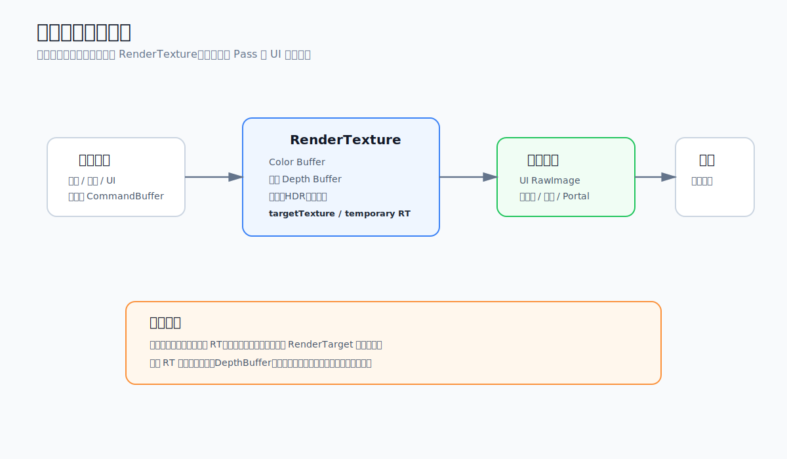

# 离屏渲染

Offscreen Rendering（离屏渲染）是一种在不直接显示到屏幕上的缓冲区中进行图形渲染的技术。

说白了就是RenderTarget不是屏幕，而是一个纹理或者一个缓冲区。

# 常见用途

离屏渲染在游戏里非常常见，比如：

- 小地图
- 角色头像
- 后处理
- UI 中显示 3D 模型
- 阴影贴图
- 反射贴图
- Portal 或监控屏效果
- 需要多次混合的复杂 UI

本质上就是先把某个结果画到一张纹理里，然后再把这张纹理当成普通贴图使用。

# 基本流程

通常流程是这样：

- 创建一张 `RenderTexture`
- 让相机或者 `CommandBuffer` 把内容绘制到这张纹理
- 在后续 Pass 或 UI 中采样这张纹理
- 使用完后释放临时资源

Unity 里最直接的方式是给 Camera 设置 `targetTexture`。

如果只是插入某个渲染步骤，或者不想额外走完整 Camera 流程，也可以使用 `CommandBuffer` 或 URP 的自定义 Pass。

# 代价

离屏渲染不是免费的。

主要开销有：

- 多一次渲染流程
- 多一张 RT，占用显存
- 读写 RT 会增加带宽压力
- 移动端切换 RenderTarget 可能会破坏 Tile-Based GPU 的优化
- 分辨率越高，开销越明显

所以不要看到需要一张图就直接开一张全分辨率 RT。

能降分辨率就降分辨率，能复用临时 RT 就复用，能合并 Pass 就合并。

# 注意点

- 如果只是做 UI 装饰，RT 分辨率通常不需要和屏幕一样大
- 如果结果会被放大，需要注意锯齿和采样方式
- 如果涉及深度，需要明确是否创建 DepthBuffer
- 如果涉及 HDR，需要注意 RT 格式和颜色空间
- 如果是移动端，尽量减少频繁切换 RenderTarget

离屏渲染很好用，但很容易在不知不觉中把带宽吃掉。
