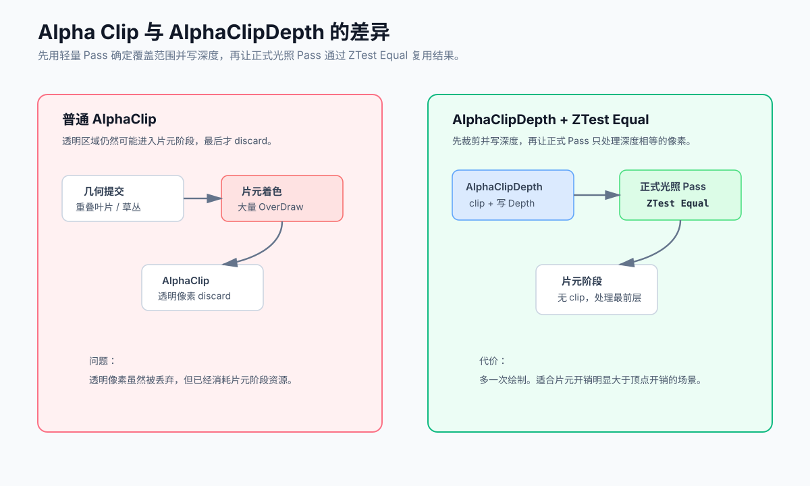

Alpha Clip 常用于植被、头发卡片、铁丝网等镂空材质。它的优点是能够写入深度、参与阴影，并且不需要像透明物体一样排序；缺点是重叠层数较多时，片元阶段的开销可能很高。

一种针对 Forward 渲染的优化方法是把“决定像素是否存在”和“计算最终颜色”拆成两个 Pass：

1. `AlphaClipDepth` Pass 只采样 Alpha、执行 `clip()` 并写入深度。
2. 正式光照 Pass 不再执行 `clip()`，改为 `ZTest Equal`、`ZWrite Off`。

这样，镂空区域和预写集合中被更近表面遮挡的层可以在正式光照 Pass 的深度测试阶段被拒绝，昂贵的光照、阴影、法线和 PBR 计算只需要处理预写后留下的最前层像素。



# 为什么普通 Alpha Clip 仍然可能很贵

Alpha Clip 通常在片元着色器中采样一张 Alpha 纹理，然后调用 `clip()`：

```hlsl
half alpha = SAMPLE_TEXTURE2D(
    _BaseMap,
    sampler_BaseMap,
    input.uv).a * _BaseColor.a;

clip(alpha - _Cutoff);
```

把 `clip()` 放在复杂光照之前，可以避免镂空区域继续执行后续计算，但它仍然有几个问题：

- Alpha 采样和 `clip()` 本身仍然发生在片元阶段。
- `clip/discard` 可能限制部分 GPU 的 Early-Z 优化。
- 多层 Cutout 表面重叠时，通过 Alpha Clip 的每一层仍可能执行完整的主光照。

因此，这个方案的重点并不是消除 Alpha Clip，而是把它集中到一个尽可能便宜的深度 Pass 中，让正式光照 Pass 不再包含 `discard`，从而有机会恢复更有效的 Early-Z。

# 渲染流程

为了估算收益，可以把同一个像素上的工作拆开：

- `M`：被光栅化的 Cutout 重叠层数。
- `N`：普通路径中通过 Alpha，并实际进入完整主着色的层数，`N <= M`。
- `C_clip`：Alpha 采样和裁剪成本。
- `C_main`：裁剪之后的复杂主光照成本。
- `C_depth`：AlphaClipDepth 的成本，通常接近 `C_clip`。

普通方案可以近似看成：

```text
M × C_clip + N × C_main
```

在预写集合中只有一个最前层通过主 Pass 的理想情况下，增加 AlphaClipDepth 后可以近似看成：

```text
M × C_depth + 1 × C_main + 额外的 Draw Call 与顶点开销
```

这只是帮助判断方向的简化模型。实际的 Early-Z 行为、绘制顺序和硬件架构都会改变结果。只有当被省掉的重复主光照成本，大于新增的深度 Pass、顶点处理和提交成本时，这个方案才会获得收益。

完整顺序如下：

| 阶段 | 深度状态 | 片元工作 |
| --- | --- | --- |
| `AlphaClipDepth` | `ZTest LEqual`、`ZWrite On` | Alpha 采样与 `clip()` |
| 正式光照 Pass | `ZTest Equal`、`ZWrite Off` | 只计算最终颜色，不再 `clip()` |

# 实现 AlphaClipDepth Pass

深度 Pass 的关键状态是：

```shaderlab
ZTest LEqual
ZWrite On
ColorMask 0
```

`ColorMask 0` 只是不写颜色，它并不会跳过片元着色器。因为还需要采样 Alpha 并执行 `clip()`，所以这个 Pass 仍然需要一个片元函数，只是要让它尽可能简单。

下面是一个最小结构：

```shaderlab
Pass
{
    Name "AlphaClipDepth"
    Tags { "LightMode" = "AlphaClipDepth" }

    ZTest LEqual
    ZWrite On
    ColorMask 0
    Cull [_Cull]

    HLSLPROGRAM
    #pragma vertex AlphaClipDepthVertex
    #pragma fragment AlphaClipDepthFragment
    #pragma multi_compile_instancing

    #include "Packages/com.unity.render-pipelines.universal/ShaderLibrary/Core.hlsl"

    TEXTURE2D(_BaseMap);
    SAMPLER(sampler_BaseMap);

    CBUFFER_START(UnityPerMaterial)
        float4 _BaseMap_ST;
        half4 _BaseColor;
        half _Cutoff;
    CBUFFER_END

    struct Attributes
    {
        float3 positionOS : POSITION;
        float2 uv         : TEXCOORD0;
        UNITY_VERTEX_INPUT_INSTANCE_ID
    };

    struct Varyings
    {
        float4 positionCS : SV_POSITION;
        float2 uv         : TEXCOORD0;
        UNITY_VERTEX_INPUT_INSTANCE_ID
        UNITY_VERTEX_OUTPUT_STEREO
    };

    Varyings AlphaClipDepthVertex(Attributes input)
    {
        Varyings output = (Varyings)0;

        UNITY_SETUP_INSTANCE_ID(input);
        UNITY_TRANSFER_INSTANCE_ID(input, output);
        UNITY_INITIALIZE_VERTEX_OUTPUT_STEREO(output);

        output.positionCS = TransformObjectToHClip(input.positionOS);
        output.uv = TRANSFORM_TEX(input.uv, _BaseMap);
        return output;
    }

    half4 AlphaClipDepthFragment(Varyings input) : SV_Target
    {
        UNITY_SETUP_INSTANCE_ID(input);
        UNITY_SETUP_STEREO_EYE_INDEX_POST_VERTEX(input);

        half alpha = SAMPLE_TEXTURE2D(
            _BaseMap,
            sampler_BaseMap,
            input.uv).a * _BaseColor.a;

        clip(alpha - _Cutoff);
        return 0;
    }
    ENDHLSL
}
```

实际 Shader 如果包含蒙皮、风动、Billboard、顶点动画、GPU Instancing 或 LOD Dither，不能直接照搬这个最小顶点函数。深度 Pass 必须复用主 Pass 的顶点变形路径。

示例为了便于阅读直接声明了精简版 `UnityPerMaterial`。生产 Shader 应复用已有的材质输入 include，并保证所有 Pass 中 `UnityPerMaterial` 的字段与顺序完全一致，否则会破坏 SRP Batcher 兼容性。

# 修改正式光照 Pass

正式光照 Pass 只允许绘制与深度缓冲完全相等的片元：

```shaderlab
Pass
{
    Name "ForwardLit"
    Tags { "LightMode" = "UniversalForward" }

    ZTest Equal
    ZWrite Off
    Cull [_Cull]

    // 正常的顶点与片元着色代码
    // Fragment 中不再调用 clip() 或 discard
}
```

这里有三个状态需要成套使用：

- `ZTest Equal`：只绘制 AlphaClipDepth 已经写入的表面。
- `ZWrite Off`：主 Pass 不再重复修改深度。
- 移除主 Pass 中的 `clip/discard`：避免它继续影响 Early-Z，并省掉重复的 Alpha Clip。

不能只把主 Pass 改成 `ZTest Equal`。如果深度预写没有执行，深度缓冲中就没有相等的值，整个物体会直接消失。

如果同一个 Shader 同时支持 Opaque、Alpha Clip 和 Transparent，可以把深度状态做成材质属性：

```shaderlab
[HideInInspector] _ZTest("ZTest", Float) = 4
[HideInInspector] _ZWrite("ZWrite", Float) = 1

// 正式 Pass
ZTest [_ZTest]
ZWrite [_ZWrite]
```

下面只列出这项预写优化新增的状态。切换到 Alpha Clip 模式时，同时更新 Pass 和深度状态：

```csharp
using UnityEngine.Rendering;

material.SetShaderPassEnabled("AlphaClipDepth", true);
material.SetFloat("_ZTest", (int)CompareFunction.Equal);
material.SetFloat("_ZWrite", 0);
```

切回普通 Opaque 模式时则恢复：

```csharp
material.SetShaderPassEnabled("AlphaClipDepth", false);
material.SetFloat("_ZTest", (int)CompareFunction.LessEqual);
material.SetFloat("_ZWrite", 1);
```

完整的 Surface Mode 切换还要同步 Alpha 关键字、`RenderType`、Render Queue，以及 `ShadowCaster`、`DepthOnly` 等 Pass 的裁剪状态。

Transparent 模式不适用这套 Cutout 优化，应继续使用自己的混合、排序和深度状态。

# 在 URP 中提前绘制

最简单的调度方式是在 Universal Renderer Data 中添加一个 **Render Objects** Renderer Feature：

| 配置 | 值 |
| --- | --- |
| Event | `BeforeRenderingOpaques` |
| Queue | `Opaque` |
| Layer Mask | 只包含需要优化的 Alpha Clip 对象 |
| Pass Names | `AlphaClipDepth` |
| Override Material / Shader | 关闭 |

AlphaTest 队列仍属于 Opaque 的筛选范围。不要使用统一的 Override Material，因为不同材质通常有各自的 Alpha 纹理、UV、颜色和 Cutoff。

深度状态可以直接由 Shader Pass 控制；如果在 Renderer Feature 中覆盖深度状态，也必须保持 `LEqual + Write Depth`。Feature 必须加入所有实际使用的 Renderer Data，否则某些质量档或相机在缺少预写时会让 `ZTest Equal` 的物体消失。

如果 Renderer Feature 只筛选 Alpha Clip 对象，它解决的是这些对象彼此之间的重叠。此时尚未写入深度的普通 Opaque 物体不能提前剔除 Alpha Clip 主 Pass；若需要这部分遮挡收益，必须复用已有的完整深度预写，或让相关遮挡物也先写入同一深度附件。

以上注入点适用于 Forward 路径。Deferred 路径需要在 GBuffer 之前完成预写，并让 GBuffer Pass 使用 `ZTest Equal`，不能直接套用同一个执行时机。

# 两个 Pass 必须完全一致

`ZTest Equal` 是严格比较。AlphaClipDepth 与正式 Pass 产生的深度只要有差异，就可能出现缺面、闪烁或边缘破损。

必须保持一致的内容包括：

- 顶点位置计算和浮点精度
- 蒙皮、风动、Billboard 与顶点动画
- GPU Instancing 和每实例数据
- Cull 模式与 Depth Offset
- LOD Cross Fade、Dither Fade
- 相机投影、抖动、XR 与动态分辨率路径

最稳妥的做法是让两个 Pass 复用同一个顶点变形函数或 HLSL include。

Alpha 纹理、UV、颜色 Alpha 和 Cutoff 决定预写的覆盖范围。主 Pass 虽然不再裁剪，但 `ShadowCaster`、`DepthOnly`、`DepthNormals`、`MotionVectors` 等独立 Pass 仍要保留与画面一致的 Alpha Clip；相机深度预写不能替代这些用途。

本文示例面向二值硬裁剪。如果材质依赖 MSAA 下的 `AlphaToMask` 或 AlphaToCoverage，深度 Pass 必须复现相同的逐样本覆盖；做不到时不要直接改成这套流程，否则边缘质量和深度覆盖会不一致。

# 与 URP Depth Priming 的关系

这套方案可以理解为“只对选定的 Alpha Clip 对象做深度预写”。URP 自带的 Depth Priming 也会先生成深度，再减少被遮挡像素的主着色。

如果已经启用了 Depth Priming，并且现有 `DepthOnly` Pass 能正确处理 Alpha Clip，应先用 Frame Debugger 检查已有的深度预写和主绘制状态。不要无条件再增加一遍 `AlphaClipDepth`，否则可能只是重复绘制。

需要注意，已有深度预写不一定等价于本文的完整方案：主 Pass 仍可能保留 Alpha 采样和 `clip/discard`。是否已经获得相同收益，还要检查主 Shader 变体并以 GPU 数据为准。

定向的 AlphaClipDepth 适合只想处理高 OverDraw Cutout 物体，而不希望为所有 Opaque 物体增加深度预写的情况。

# 适用场景与代价

比较容易获得收益的场景：

- 植被、头发卡片、栅栏等重叠层数较高的 Cutout
- 物体屏幕覆盖率较大
- 主 Shader 包含多光源、阴影、法线或复杂 PBR
- 性能瓶颈明确在 Fragment 或 Fill Rate

可能没有收益，甚至更慢的场景：

- Alpha Clip 物体很少、很小或几乎没有重叠
- 主 Shader 很简单
- 场景受 CPU、Draw Call 或顶点处理限制
- Alpha 大部分为空，并且原 Shader 已经在片元开头快速裁剪
- Tile-Based GPU 因额外 Pass 产生了更高的 Tile Store/Load 成本

额外成本包括：

- 每个对象多一次 Draw Call
- 顶点处理和三角形装配多一次
- Alpha 纹理多采样一次
- 额外的渲染状态切换与深度带宽

因此不要把它当成所有 Alpha Clip 材质的默认配置。更合理的做法是使用 Layer Mask 或单独的材质开关，只覆盖已经确认存在高 OverDraw 的对象。

# 验证方法

先用 Frame Debugger 或 RenderDoc 检查正确性：

1. `AlphaClipDepth` 确实在正式 Opaque 绘制之前执行。
2. 深度 Pass 使用 `LEqual + ZWrite On + ColorMask 0`。
3. 正式 Pass 使用 `Equal + ZWrite Off`。
4. 正式片元着色器已经没有 `clip/discard`。
5. Alpha 边缘、风动、蒙皮、LOD、阴影、SSAO、TAA、MSAA 与相机堆叠没有视觉回归。

然后在目标设备上做 A/B 测试，重点比较：

- GPU Frame Time
- 两个 Pass 各自的 GPU 耗时
- Fragment Shader Invocations
- Early-Z Rejected / Depth Test Passed
- Draw Calls、Vertex Invocations
- Tile Load/Store 与显存带宽
- CPU Render Thread 时间

移动端尤其需要真机测量。Tile-Based GPU 既可能受益于减少主片元着色，也可能因为新增 Pass 和带宽而付出更高代价，不能只根据编辑器中的 FPS 下结论。

# 常见问题

## 物体完全消失

主 Pass 已经是 `ZTest Equal`，但 `AlphaClipDepth` 没有执行。检查 Renderer Feature、Layer Mask、Render Queue、Pass Names、材质 Pass 开关以及当前相机使用的 Renderer。

## 边缘闪烁或局部缺面

两个 Pass 的顶点位置、Cull、Depth Offset 或动画路径不一致。优先让它们复用同一套顶点代码。

## 材质预览或离屏相机不显示

某些预览、反射或离屏相机可能不会执行自定义 Renderer Feature。所有负责正式颜色绘制的相机都必须先完成深度预写，否则需要提供使用 `LEqual` 和原始 Alpha Clip 的回退路径。

## 开启后反而变慢

说明省掉的主片元成本不足以覆盖第二次绘制。缩小 Layer Mask 的范围，只保留高 OverDraw、重片元的材质，或者直接关闭这项优化。

# 总结

这套方案的本质是：

```text
廉价 AlphaClipDepth：决定覆盖范围并写深度
                    ↓
昂贵主光照 Pass：ZTest Equal，只着色预写集合中的最前层
```

它最适合高 OverDraw、重片元的二值 Cutout 材质。实现时最重要的不是单独设置 `ZTest Equal`，而是保证预写一定先执行、主 Pass 不再 `discard`，并让两个 Pass 生成完全一致的深度。最后仍然要以目标设备上的 GPU 数据决定是否启用。

# 参考资料

- [Unity：在 URP Shader 中编写 Depth-only Pass](https://docs.unity3d.com/cn/current/Manual/urp/writing-shaders-urp-depth-only.html)
- [Unity：Render Objects Renderer Feature](https://docs.unity3d.com/Packages/com.unity.render-pipelines.universal@15.0/manual/renderer-features/renderer-feature-render-objects.html)
- [Unity：ShaderLab ZTest 命令](https://docs.unity3d.com/cn/current/Manual/SL-ZTest.html)
