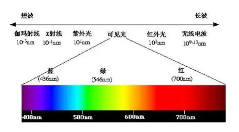
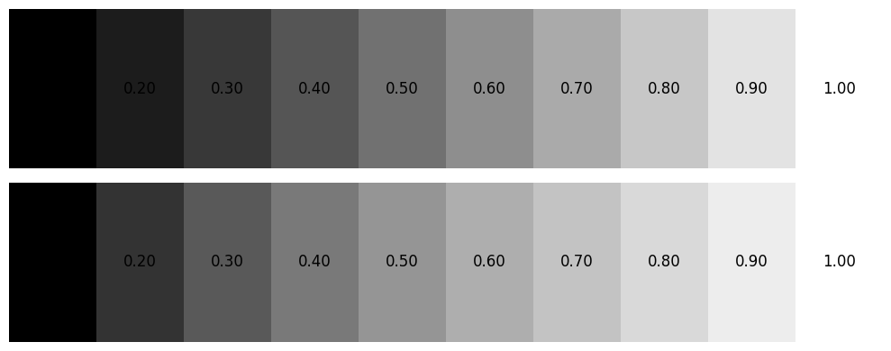
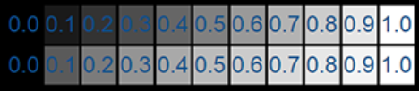
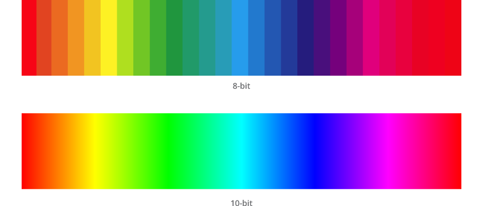
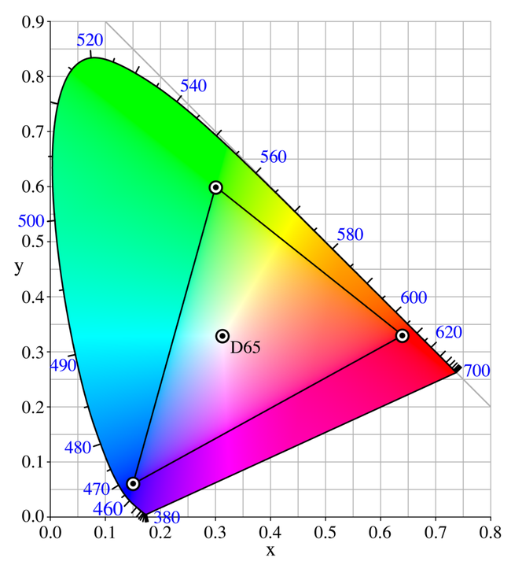
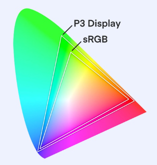
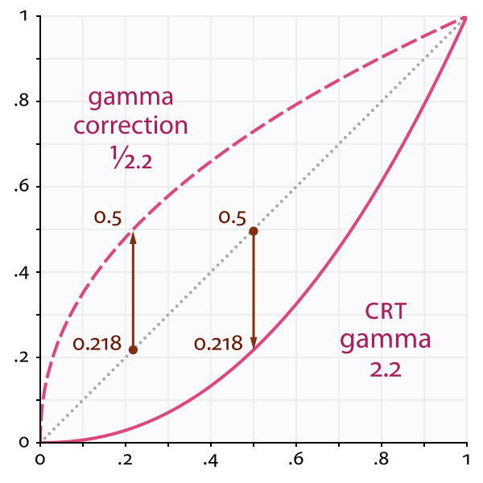
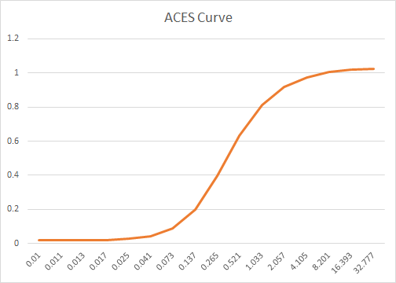
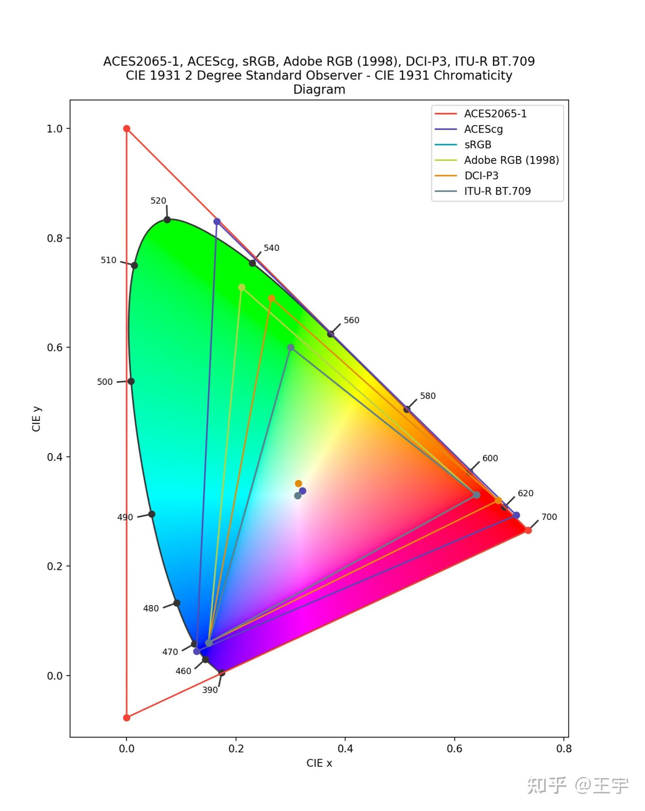
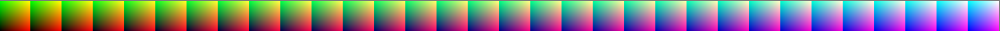

# 从人眼说起
人眼的感知能力是非常复杂的，主要由视网膜中的锥体细胞和杆体细胞共同作用。 锥体细胞负责色彩感知，而杆体细胞则对光线强度敏感。

人眼对不同波长的光有不同的敏感度，这种敏感度可以用**光谱敏感函数**来描述。
人眼的感知范围大约在380nm到750nm之间，这个范围内的光线被称为可见光。人眼对不同波长的光有不同的敏感度，这种敏感度可以用**光谱敏感函数**来描述。

人眼的感知能力是非线性的，这意味着我们对光线强度的变化的感知并不是线性的。例如，当光线强度增加时，人眼对这种变化的感知并不会以相同比例增加。这种非线性特性使得人眼在处理高动态范围（HDR）图像时具有独特的优势。

## 显示器和亮度
显示器的工作原理是将电信号转换为光信号。又分为LCD和OLED两种类型。

LCD（液晶显示器）的工作原理是通过液晶分子的排列来控制光线的透过率。液晶分子在电场作用下会改变其排列方式，从而改变光线的透过率。LCD显示器通常使用背光源来提供光线，通过滤光板来遮掉RGB分量的一部分，从而显示颜色

OLED则是每个像素点都能独立发光的技术。每个像素点由红、绿、蓝三种有机材料组成，当电流通过时，这些材料会发出相应颜色的光。由于OLED不需要背光源，因此可以实现更高的对比度和更广的色域。

显示器的亮度单位是**尼特**(nit)，对应的物理量是辐射亮度（Luminance），显示器的亮度范围通常在100到1000尼特之间。
当一个像素点显示为纯白色时，亮度最大，纯黑色时亮度最小。

光辐射相关的物理量都是线性的，可以进行加减乘除运算。

### 从颜色到显示器的亮度

理论上，假设有一个显示器的亮度范围是50～200，color = (0.5,0.5,0.5) 在显示器上的亮度应该是 50 + (200 - 50) * 0.5 = 125

实际上，color=(0.5,0.5,0.5) 在显示器上的亮度是  $ 50 + (200 - 50) * 0.5^{2.2} = 82.64  $ 

$$
L = L_{min} + (L_{max} - L_{min}) \cdot C^{\gamma}
$$

通过逆运算可以绘制出进行了Gamma校正和没有进行Gamma校正的图像，上面一行做没有做处理，显示器会进行Gamma校正，下面一行做了逆运算，抵消了显示器Gamma校正的结果。 肉眼观察下，下面一行的图像看起来更亮一些。

### 人眼和显示器亮度(Gamma)
前面说到，人眼的感知能力是非线性的。观察下面一组图像，上面是非线性变化的亮度，下面是线性变化的亮度。

研究表明，人眼对于亮度的感知是对数(2.2~3)的，也就是说人眼对低亮度的变化更敏感，而对高亮度的变化不那么敏感。

### 巧合?
CRT的原理是通过电子束扫描荧光屏来产生图像，对于典型的CRT荧光粉，其电压和亮度之间的关系  $ L = V^{2.2~2.6} $ ，这与人眼的感知能力非常接近。

现代显示器已经能过做到手动调整gamma值了,但是通常gamma还是2.2。

## 显示器和颜色
不同品牌和价位的显示器，能够显示的颜色范围是不同的。

### 色深
色深指的是显示器能够显示的颜色数量，通常用位数来表示。常见的色深有6bit,8bit, 10bit等。表示RGB每个通道从最暗到最亮有多少档位
8bit色深的显示器每个通道有256个档位，RGB三通道总共有256^3=16777216种颜色。

### 色域
色域指的是显示器能够显示的颜色范围。从光的角度理解，光是一种电磁波，不同波长的光在人眼中就是不同的颜色。
有人制作了一个图，来表示所有人眼可见的颜色

x轴和y轴分别表示红色和绿色的感知程度，红绿蓝三种颜色程度的感知总和为1,坐标$(1/3,1/3)$表示白色

色域就是在色度图选三个点R,G,B（表示最红，最绿，最蓝），画一个三角形

我们经常说的sRGB色域选取的三个点是 R(0.64, 0.33), G(0.30, 0.60), B(0.15, 0.06)，它们形成的三角形就是sRGB色域。

不同的显示器，支持的色域不同，输入相同的RGB值，显示的颜色在人眼看来也会不同，比如（1，0，0）对应的红色，在DCI-P3色域显示器中就比sRGB色域显示器中更红，因为是sRGB下最红(1,0,0)在DCI-P3对应的位置是(0.91,0.2,0.13)

可以看到sRGB是DCI-P3的一个子集，DCI-P3色域比sRGB色域更广，能够显示更多的颜色。

### 色准

色准指的是显示器在其色域标准下，某个RGB颜色对应的理论物理颜色和其实际显示的颜色之间的差异。色准越高，显示器显示的颜色越接近真实颜色。
色准通常用Delta E（ΔE）来表示，ΔE值越小,表示色准越高。

理所应当的，计算颜色的欧式距离就可以表示色准，但是我们不能使用R，G，B来计算，因为R，G，B色彩空间不具有感知均匀性。实际计算中要转换到Lab颜色模型下做计算(L明度，a红绿度，b黄蓝度)

$$
\Delta E = \sqrt{(L_1 - L_2)^2 + (a_1 - a_2)^2 + (b_1 - b_2)^2}
$$

## 从图形API到显示器
在图形API里，我们可以创建各种格式的RGB颜色图，其实(r,g,b)的值通常在0~1之间,但是也可以超过1。

查阅资料发现，有的图形API可以支持(R32G32B32A32_FLOAT)格式，每个通道都是32位浮点数，这样就可以表示更广泛的颜色范围。

但是显示器的色深不一定支持这么大的范围，所有图形API提交到操作系统之后，操作系统还会做一次颜色转换，将格式转换为显示器支持的格式（例如超过1的值截断到1，转换到0~255的uint范围）。

我们通常说的HDR（High Dynamic Range）图像，其颜色值就可以超过1，这样可以表示更广泛的亮度范围和颜色范围，但是需要显示器支持HDR才可以显示出目标效果。

现代操作系统通常会提供HDR支持，允许应用程序提交HDR图像，并在支持HDR的显示器上正确显示，但是需要调用系统API告诉操作系统使用的颜色空间是什么，才能从高精度的颜色空间转换到显示器支持的颜色空间。

## 相机和Gamma
相机拍摄的原始文件记录了传感器的原始信息包括：光照强度，位深，Meta数据（位置，时间等），色温参考，色彩空间标记（更多详细的相机原理就不多赘述了，比较复杂）

现实世界中的光照是线性的，相机拍摄的照片如果不做处理导出到显示器上观察会变的很暗（没有进行Gamma校正）

相机厂商早就考虑到这个问题了，相机在导出图片时会做  $ 1 /gamma = 1/2.2 $ 的处理

# Gamma与线性空间

如果我们让超高水平美术在PS对着现实绘制一个鸡蛋，会发生什么呢？

鸡蛋的颜色在显示器上看着和现实中的鸡蛋颜色是一样的！

还记得么，显示器会对颜色做Gamma较正，也就是说，显示器上鸡蛋的颜色的亮度会比现实中的鸡蛋亮度更高！

如果我们按照美术绘制的图片中的RGB值在现实中把这个鸡蛋造出来，造出来的鸡蛋会比真鸡蛋更亮！

其实这并不是一个问题，因为我们看的是显示器，所以只需要显示器上的鸡蛋和现实中的鸡蛋颜色一致就可以了。

## 问题是什么？

现在，我们想要在游戏引擎里渲染出一个真实光照的鸡蛋，使用线性空间（因为现实世界是线性的）来处理光照计算，如果不加处理的使用美术绘制的鸡蛋图片，就会计算出不真实的结果

如果我们希望有一个物理正确的结果，对于所有“颜色”图片，在采样前都要做Gamma逆运算，将图片的颜色从Gamma空间转换到线性空间。

## 对于UI
对于UI，我们通常不需要考虑Gamma，因为UI是平面的，不涉及光照计算，直接使用美术绘制的图片就可以了。

但是有时候UI可能也在线性空间渲染，这个时候还是需要做转换

# Tonemapping 和 ACES

## Tonemapping
前面提到，图形API可以用超大范围的图片提交给操作系统，操作系统会进行空间转换，将图片转换为显示器支持的格式。

如果渲染时用的是HDR，但是显示器不支持HDR，只能显示[0,1]的范围，想要在LDR显示器上显示HDR图像，就需要进行Tonemapping（色调映射）。

Tonemapping的本质是将大范围压缩到小范围，这意味着要丢弃一些信息。要使用有限的颜色表达出需要的内容。

刚发明电影的时候，胶片能表达的亮度范围有限，所以摄影师会把高亮区域和阴影区域向中等亮度方向压缩，发展出了S曲线的映射关系。这些都是tone mapping。

Tonemapping有各种各样的算法（看着OK就OK），但是现在被ACES一统了

## ACES

ACES(Academy Color Encoding System)是由美国电影艺术与科学学院（Academy of Motion Picture Arts and Sciences）开发的一个色彩管理系统，旨在提供一个统一的色彩空间和工作流程，以便在电影和电视制作中实现一致的色彩表现。

ACES本质是一个新的颜色空间，任意颜色空间都可以转到ACES颜色空间，ACES颜色空间可以转到任意颜色空间。
或者说它是一个通用的数据交换格式，一方面可以不同的输入设备转成ACES，另一方面可以把ACES在不同的显示设备上正确显示

可以看到 ACES2065-1直接把人眼看的到的看不到的颜色都包含了

管你什么颜色空间，统统到我最大的范围里来，重新算个RGB给你就是来

## LUT 
做Tonemapping需要进行曲线拟合（多项式计算），还是比较复杂的，尤其是对于实时渲染来说。
LUT（Look-Up Table）是一种预计算的表格，可以用来快速进行颜色转换和Tonemapping，只需要一次采样即可。

[参考]

https://zhuanlan.zhihu.com/p/21983679

https://zhuanlan.zhihu.com/p/609569101

